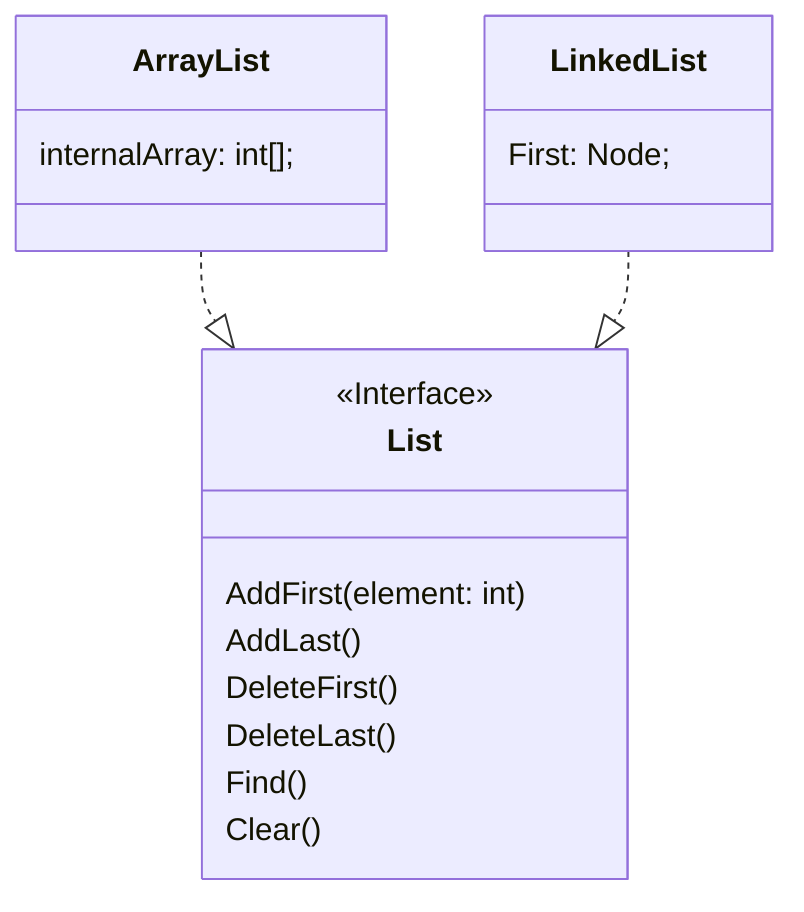

# Programación Orientada a Objetos
En esta sección se introducen algunos conceptos esenciales sobre tipos de datos que será esencial para la compresión de la programación orientada a objetos.

## Conceptos esenciales

### Tipos de Datos
Un *tipo de dato* es una clasificación que especifica qué tipo de valores puede tomar una variable, así como las operaciones que se pueden realizar con esos valores. Los tipos de datos se utilizan en la declaración de variables y en la definición de funciones, entre otros usos.

Por ejemplo, en `Python`, los tipos de datos más comunes son:

- **Enteros (int)**: Números enteros como 1, 20, -5.
- **Flotantes (float)**: Números con decimales como 3.14
- **Cadenas (str)**: Secuencias de caracteres como "Hola, mundo!"
- **Booleanos (bool)**: Valores de verdad como True o False

Con respecto a las operaciones que se pueden realizar con estos tipos de datos, por ejemplo, se pueden realizar operaciones aritméticas con enteros y flotantes, concatenar cadenas, y realizar operaciones lógicas con booleanos.

### Tipo de dato simple 
Un *tipo de dato simple* es un tipo de dato que representa un único valor. Los tipos de datos simples son los tipos de datos básicos que se utilizan para representar valores individuales. No tiene sentido práctico separalos en partes más pequeñas.

### Tipo de dato compuesto
Un *tipo de dato compuesto* es un tipo de dato que representa una colección de valores. Los tipos de datos compuestos se utilizan para representar estructuras de datos más complejas que contienen múltiples valores de otros tipos de datos. Por ejemplo, un tipo de dato Cliente, puede contener los datos de nombre, edad, dirección, etc.

### Tipo referencia y tipo valor
Un *tipo de referencia* es un tipo de dato que almacena una referencia a un objeto en memoria. Los tipos de referencia se utilizan para representar objetos que pueden ser compartidos y modificados por múltiples partes de un programa. Por ejemplo, en `Python`, las listas y los diccionarios son tipos de referencia.

Un *tipo de valor* es un tipo de dato que almacena un valor directamente en la memoria. Los tipos de valor se utilizan para representar valores que no pueden ser compartidos ni modificados por múltiples partes de un programa. Por ejemplo, en `Python`, los enteros y los flotantes son tipos de valor.

"Usualmente" los tipos de datos simples son tipos de valor, mientras que los tipos de datos compuestos son tipos de referencia.

### Tipos de Datos Abstractos
Un *tipo de dato abstracto (TDA)* es un modelo matemático que define un conjunto de valores y un conjunto de operaciones que se pueden realizar con esos valores. Los TDAs son una forma de abstracción que permite a los programadores trabajar con datos de manera más abstracta y genérica.

Un TDA especifica una interfaz que define las operaciones que se pueden realizar con los datos, **pero no especifica cómo se implementan esas operaciones**. Esto permite a los programadores utilizar los TDAs sin tener que preocuparse por los detalles de implementación subyacentes. Por tanto, se puede decir que un TDA tiene una vista lógica y una vista física o de implementación. 


En el diagrama anterior, se ilustra como un TDA Lista, puede ser implementado mediante Nodos con memoria dinámica o mediante un arreglo con memoria estática. El API expuesto por el tipo Lista, no debe dar detalles de cómo se implementa internamente.

Una estructura de datos se puede entender como la implementación de TDA. En Programación Orientada a Objetos, un TDA + implementación forman una clase. Algunos lenguajes permiten definir *interfaces* que son un TDA puro.

## Conceptos de programación orientada a objetos
Paradigma de programación que modela conceptos del mundo real como _objetos_ que tienen atributos y comportamientos. Los objetos son ciudadanos de primera clase en la programación orientada a objetos (POO), lo que significa que pueden ser manipulados y pasados como argumentos a funciones.

Construir software orientado a objetos implica definir clases que representan tipos de objetos y crear instancias de esas clases (objetos) para interactuar entre sí.

### Definición de Objeto
Estructura de datos que agrupa atributos (datos) y métodos (funciones) que operan sobre esos datos. Los objetos son instancias de clases, que definen la estructura y comportamiento de los objetos.
- La estructura o características de un objeto se define mediante sus **atributos**.
- El comportamiento de un objeto se define mediante sus **métodos**.

La **interfaz** de un objeto se define por los métodos y atributos públicos (considerado como una mala practica) que son accesibles desde fuera del objeto.

La mayoría de lenguajes de programación orientados a objetos, requieren la definición de clases para crear objetos. 


### Definición de Clase
Las clases son _plantillas que definen la estructura y comportamiento de los objetos_. Por ejemplo, la clase Televisor en C# se puede definir de la siguiente manera:

```csharp
class Televisor
{
    // Atributos
    string marca;
    int pulgadas;
    bool encendido;

    // Métodos
    void Encender()
    {
        encendido = true;
    }

    void Apagar()
    {
        encendido = false;
    }
}
```
Para generar objetos a partir de la clase Televisor, se utilizan las siguientes instrucciones:

```csharp
Televisor samsung = new Televisor();
Televisor lg = new Televisor();
lg.Encender();
Console.WriteLine(samsung.encendido); // Imprime false
```

Un objeto opera sobre sus propios datos y no afecta la memoria de otros objetos diferentes. Cada objeto es un bloque de memoria independiente que contiene sus propios datos y métodos.

## Principios de programación orientada a objetos
Prinicipios de POO se refiere a los conceptos fundamentales que rigen la programación orientada a objetos. Estos conceptos son la base para entender cómo se estructura y cómo se trabaja con la programación orientada a objetos. Son los elementos distintivos que diferencian la programación orientada a objetos de otros paradigmas de programación.

Los principios de POO son los siguientes:
- Abstracción
- Encapsulamiento
- Herencia
- Polimorfismo

### Abstracción
Es la principal característica de POO. Permite modelar el problema por resolver en términos de objetos de alto nivel que ocultan los detalles de su implementación. La abstracción se logra a través de la creación de clases y objetos que representan entidades del mundo real. Por ejemplo, una clase `Persona` puede representar a una persona en el mundo real, con atributos como nombre, edad, etc., y métodos que permiten interactuar con la persona.

Al interactuar con objetos, pensamos en términos de su comportamiento y atributos en vez de variables y procedimientos.

> La abstracción permite que los objetos se comporten como piezas de LEGO que tienen una interfaz específica para interactuar con ellos, pero no necesitamos saber cómo están construidos internamente. En cambio, al trabajar con plasticina, no hay una clara separación, sino que todo forma part de un todo.

### Encapsulamiento
Los objetos son módulos autocontenidos que asocian código con sus datos. Los datos dentro de los objetos pueden o no exponerse según el programador lo decida. El **encapsulamiento** permite ocultar los detalles de implementación de un objeto y exponer solo la interfaz necesaria para interactuar con él.

```csharp
// Example of encapsulation in C#

public class BankAccount
{
    private string accountNumber;
    private decimal balance;

    public BankAccount(string accountNumber)
    {
        this.accountNumber = accountNumber;
        this.balance = 0;
    }

    public decimal GetBalance()
    {
        return balance;
    }

    public void Deposit(decimal amount)
    {
        balance += amount;
    }

    public void Withdraw(decimal amount)
    {
        if (amount <= balance)
        {
            balance -= amount;
        }
        else
        {
            Console.WriteLine("Insufficient funds");
        }
    }
}

public class Program
{
    public static void Main(string[] args)
    {
        BankAccount account = new BankAccount("1234567890");
        account.Deposit(1000);
        account.Withdraw(500);
        decimal balance = account.GetBalance();
        Console.WriteLine("Account balance: " + balance);
    }
}
```

Los lenguajes orientados a objetos permiten establecer el nivel de visibilidad que tiene un atributo o método con respeto a otros objetos o clases. Por ejemplo, C# soporta muchos modificadores de acceso, entre los que se incluyen:

- `public`: Accesible desde cualquier parte del código.
- `private`: Accesible solo desde la misma clase.
- `protected`: Accesible desde la misma clase y sus clases derivadas.

Por ejemplo, considera la siguiente clase Persona:

```csharp
public class Persona
{
    private string nombre;

    public string GetNombre()
    {
        return nombre;
    }

    public void SetNombre(string nombre)
    {
        this.nombre = nombre;
    }
}
```

En este ejemplo, el atributo nombre está declarado como private, lo que significa que solo es accesible desde la misma clase. Sin embargo, se proporcionan métodos públicos `GetNombre()` y `SetNombre()` para acceder y modificar el valor de nombre de manera controlada.

### Herencia
- La herencia permite definir jerarquías de objetos con el objetivo de reutilizar código. 
- Cada clase puede tener máximo una clase padre de la que hereda atributos y métodos. 
- La clase padre se llama superclase y la clase hija se llama subclase. La superclase provee comportamiento general, mientras que las subclases proveen comportamiento especializado. 
- La herencia define una relación de tipo "es un/a" entre la superclase y la subclase. Por ejemplo, si tenemos una clase `Vehículo` y una clase `Automóvil`, podemos decir que un automóvil es un vehículo.


```csharp
// Definición de la clase base
public class Animal
{
    public string Nombre { get; set; }
    public int Edad { get; set; }

    public void Comer()
    {
        Console.WriteLine("El animal está comiendo");
    }
}

// Definición de una subclase que hereda de Animal
public class Perro : Animal
{
    public void Ladrar()
    {
        Console.WriteLine("El perro está ladrando");
    }
}

// Uso de la herencia en el programa principal
public class Program
{
    public static void Main(string[] args)
    {
        // Creación de una instancia de la clase base
        Animal animal = new Animal();
        animal.Nombre = "Animal";
        animal.Edad = 5;
        animal.Comer();

        // Creación de una instancia de la subclase
        Perro perro = new Perro();
        perro.Nombre = "Firulais";
        perro.Edad = 3;
        perro.Comer();
        perro.Ladrar();
    }
}
```

### Polimorfismo
Etimológicamente significa _"muchas formas"_ y se refiere a la capacidad de un objeto de comportarse de diferentes maneras. Hay dos tipos: _run-time_ y _compile time_.

#### Run-time (tiempo de ejecución)

* Cuando una clase hija anula (override) un método public/protected de la clase padre. Por ejemplo:

```csharp
public class Shape
{
    public virtual void Draw()
    {
        Console.WriteLine("Drawing a shape");
    }
}

public class Circle : Shape
{
    public override void Draw()
    {
        Console.WriteLine("Drawing a circle");
    }
}

public class Square : Shape
{
    public override void Draw()
    {
        Console.WriteLine("Drawing a square");
    }
}

public class Program
{
    public static void Main(string[] args)
    {
        Shape shape1 = new Circle();
        Shape shape2 = new Square();

        shape1.Draw(); // Output: Drawing a circle
        shape2.Draw(); // Output: Drawing a square
    }
}
```
* Cuando el código cliente llama el método, el método se "resuelve" en ese mmomento invocando el método correcto. Para encontrar el método correcto, el compilador busca en la clase real del objeto en tiempo de ejecución y en caso de no estar, sigue subiendo por la jerarquía de clases.

* Polimorfismo permite tratar la clase hija como si fuera la padre.

* Cualquier metodo visible de la clase Padre se puede acceder a traves de la Hija.

``` java
Hija h= new Hija;
   _____ 
h.|     | -> Aparece todo lo visible del Padre
  |     |
  |_____|

```

* Al revés no. A través de la Padre, sólo lo que es visible de la hija que es común con la del Padre se puede acceder.


``` java

Padre p = new Hija;
   _____ 
p.|     | -> Aparece solo lo común del padre e hija
  |     |
  |_____|

```

* Algunos lenguajes permiten crear claes abstractas que son útiles para polimorfismo.

```csharp
abstract class Animal{ 
    void respirar(){
        Console.Write("Respirando")
    }
    abstract void(); //no tiene definición
}

class Perro : Animal {
    void comer(){  
    }
}

```
* Algunos lenguajes tambien permiten crear _interfaces_ las cuales proveen polimorfismo sin formar parte de una jerarquía.

``` java
interface Alimentable{
    void alimentar();
}

class Persona : Alimentable {
    void alimentar();
}

```

#### Compile-time

* La habilidad para sobrecargar (overload) métodos, es decir, crear varios métodos con el mismo nombre pero diferentes parámetros.
 
 ``` java
 class TestClass {
    void foo() {
    }
    
    void foo(int x) {
    }

    void foo(string s, int x) {
    }
 }

```
 ### Abstraccion

* La abstracción es la capacidad de ignorar los detalles de partes para enfocarse en un nivel de mayor importancia. En programación orientada a objetos, la abstracción se logra a través de la creación de clases y objetos que representan entidades del mundo real. Por ejemplo, una clase `Persona` puede representar a una persona en el mundo real, con atributos como nombre, edad, etc., y métodos que permiten interactuar con la persona.

