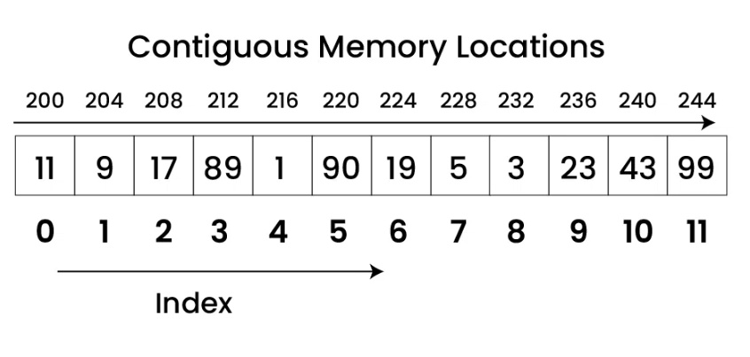
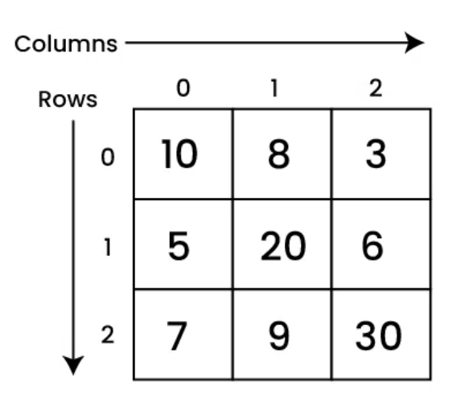

# Estructuras de Datos Lineales

> **¿Qué es una estructura de datos?**
>
> Una estructura de datos es una forma particular de organizar datos en una computadora para que puedan ser utilizados de manera eficiente. Se utilizan para procesar, recuperar y almacenador datos. Existe una colección minima de estructuras de datos comunes que son utilizadas en la mayoría de los lenguajes de programación.

Las estructuras de datos lineales son estructuras de datos cuyos elementos se organizan secuencialmente, uno tras de otro. Hay un solo nivel de lementos y se recorren en una sola pasada. Cada elemento de la estructura tiene un predecesor y un sucesor, excepto el primer y el último elemento.

## Arreglos y Matrices

### Arreglos
Los *arreglos* son colecciones de elementos del mismo tipo. Los elementos se almacenan en posiciones contiguas de memoria. Es la estructura de datos más básica y se utiliza en la mayoría de los lenguajes de programación.

Terminología básica de arreglos incluye:

- *Índice*: los elementos en un array se identifican por su índice (empieza en cero usualmente). Por ejemplo, el primer elemento de un array tiene índice 0, el segundo tiene índice 1, y así sucesivamente.
- *Longitud*: el número de elementos en un array. Por ejemplo, un array con 5 elementos tiene longitud 5 y sus índices van de 0 a 4.
- *Elemento*: un valor almacenado en una posición específica del array. Por ejemplo, el elemento en la posición 0 del array es el primer elemento del array.

Visualmente, un arreglo se puede representar con la imagen siguiente. Nótese que cada elemento tiene una posición de memoria contigua (en la imagen se muestran direcciones de memoria en decimal). Cada "espacio" del arreglo es del mismo tamaño según el tipo de dato que se almacene (por ejemplo, un `int` ocupa 4 bytes, por eso observe como las direcciones aumentan de cuatro en cuatro).



En C# una arreglo se declara de la siguiente manera:

```csharp
// Arreglo de enteros. Cada posición es de 4 bytes
int[] arr;

// Arreglo de enteros. Cada posición es de 1 byte
char[] arr2;

// Arreglo de flotantes. Cada posición es de 4 bytes
float[] arr3;

// Ejemplo de inicialización en línea
int[] arr = { 1, 2, 3, 4, 5 };
char[] arr = { 'a', 'b', 'c', 'd', 'e' };
float[] arr = { 1.4f, 2.0f, 24f, 5.0f, 0.0f };

// Ejemplo de inicialización con tamaño
int[] arr = new int[5];

// Ejemplo de acceso a elementos
arr[0] = 1;
int x = arr[0];

```

> **¿ArrayList?**
>
> Algunos lenguajes como C# proveen la clase ArrayList o similar. Esto corresponde a una implementación de una lista que se verá más adelante en este documento. No se debe confundir con un arreglo estático de posiciones contiguas

#### Ventajas y desventajas de los arreglos
Algunas de las ventajas de los arreglos son:

1. Tiene acceso aleatorio a los elementos. Es decir, se puede acceder a cualquier elemento en tiempo constante.

2. Es fácil de implementar y usar.

3. Cero overhead de memoria. No se necesita almacenar información adicional para mantener la estructura.

Por su parte, algunas de las desventajas de los arreglos son:

1. El tamaño del arreglo es fijo. No se puede cambiar el tamaño del arreglo una vez que se ha creado. Si se ocupa espacio adicional, se tiene que crear un nuevo arreglo y copiar los elementos del arreglo original al nuevo arreglo.

2. Es difícil de insertar y eliminar elementos. Se necesita mover todos los elementos que están después del elemento que se quiere insertar o eliminar.

> ¿Acceso rápido?
>
> Acceder un elemento de un arreglo, se reduce a realizar una operación de suma y una operación de acceso a memoria. Por ejemplo, si queremos acceder al elemento en la posición 3 de un arreglo de enteros, se realiza la siguiente operación: `arr + 3 * sizeof(int)`. Donde `arr` es la dirección de memoria del primer elemento del arreglo y `sizeof(int)` es el tamaño en bytes de un entero. Esta operación se realiza en tiempo constante, es decir, no importa el tamaño del arreglo, la operación siempre se realiza en el mismo tiempo.

### Matrices 
Son arreglos de dos dimensiones. Es decir, son arreglos de arreglos. Se utilizan para representar datos en forma de tabla. Por ejemplo, una matriz de 3x3 se puede representar gráficamente como:



Para declarar e inicializar una matríz en Java, se utiliza la siguiente sintaxis:

```java
int[][] matriz = {
    {1, 2, 3},
    {4, 5, 6},
    {7, 8, 9}
};

// También se puede declarar sin inicializar
int[][] matriz = new int[3][3];

// Y luego inicializar
matriz[0][0] = 1;
matriz[0][1] = 2;    
```

C# provee una forma más compacta de declarar e inicializar matrices:

```csharp
int[,] matriz = {
    {1, 2, 3},
    {4, 5, 6},
    {7, 8, 9}
};
```

Dado que son arreglos de arreglos, se puede acceder a los elementos de la matriz utilizando dos índices. Por ejemplo, para acceder al elemento en la fila 1 y columna 2 de la matriz anterior, se utiliza la siguiente sintaxis: `matriz[1][2]`.

> **¿Memoria contigua en las matrices?**
> 
> Las matrices no necesariamente se almacenan en memoria contigua. Por ejemplo, en C# las matrices se almacenan en memoria contigua, pero en Java no. En Java, las matrices se almacenan como un arreglo de arreglos, es decir, un arreglo de referencias a otros arreglos. Por lo tanto, no se puede acceder a un elemento de la matriz utilizando una sola operación de suma y una operación de acceso a memoria. Se necesita realizar dos operaciones de acceso a memoria y una operación de suma. Esto se debe a que primero se necesita acceder a la referencia del arreglo que contiene el elemento y luego acceder al elemento dentro de ese arreglo.

Aunque el término matríz se utiliza comúnmente para referirse a arreglos de dos dimensiones, también se puede utilizar para referirse a arreglos de más de dos dimensiones. Por ejemplo, un arreglo de tres dimensiones se puede inicializar en Java de la siguiente manera:

```java
int[][][] matriz3D = {
    {
        {1, 2, 3},
        {4, 5, 6},
        {7, 8, 9}
    },
    {
        {10, 11, 12},
        {13, 14, 15},
        {16, 17, 18}
    },
    {
        {19, 20, 21},
        {22, 23, 24},
        {25, 26, 27}
    }
};

// También se puede declarar sin inicializar
int[][][] matriz3D = new int[3][3][3];

// Y luego inicializar
matriz3D[0][0][0] = 1;
matriz3D[0][0][1] = 2;
```
## Listas
Son colecciones de elementos del mismo tipo. A diferencia de los arreglos, las listas no tienen un tamaño fijo. Se pueden agregar y eliminar elementos de la lista. El orden de inserción de los elementos se respeta.

### Tipo de Dato Abstracto Lista
Las operaciones básicas que se pueden realizar en una lista son:

- **Obtener (get)**: devuelve el elemento en una posición específica.
- **Agregar (add)**: añade un elemento a la lista.
- **Eliminar (remove)**: elimina un elemento de la lista.
- **Contiene (contains)**: verifica si un elemento está en la lista.
- **Tamaño (size)**: devuelve el número de elementos en la lista.

Pueden implementarse se muchas formas. Las más comunes son:

- **ArrayList**: Implementación mediante arreglos
- **SinglyLinkedList**: Implementación mediante listas simples enlazadas
- **DoubleLinkedList**: Implementación mediante listas doblemente enlazadas
- **CircularLinkedList**: Implementación mediante listas enlazadas circulares

### Implementación mediante arreglos

```java
public class ArrayList implements List {
    private int maxSize;
    private int currentSize;
    private int[] storage;

    public ArrayList(int size) {
        this.maxSize = size;
        this.currentSize = 0;
        this.storage = new int[size];
    }

    public void clear() {
        this.currentSize = 0;
    }

    public boolean isEmpty() {
        return this.currentSize == 0;
    }

    public int size() {
        return this.currentSize;
    }

    public boolean contains(int element) {
        for (int i = 0; i < this.maxSize; i++) {
            if (this.storage[i] == element) {
                return true;
            }
        }
        return false;
    }

    public boolean add(int element) {
        if (this.currentSize > this.maxSize) {
            return false;
        }
        this.storage[currentSize++] = element;
        return true;
    }

    public int remove(int element) {
        int i;
        for (i = 0; i < this.currentSize; i++) {
            if (this.storage[i] == element) {
                indexToRemove = i;
            }
        }
        if (i == this.maxSize) {
            throw new NoSuchElementException();
        }
        for (int j = i; j < this.currentSize - 1; j++) {
            this.storage[j] = this.storage[j + 1];
        }
        this.currentSize--;
    }
}
```

- Algunos lenguajes explicitamente proveen soporte para ArrayList
- **La principal ventaja** que proveen en vez de usar directamente es la abstracción de más alto nivel. El programador no tiene que lidiar con _shifts_, re-sizes u otros problemas de usar arreglos directamente
- Una estrategia que se puede utilizar para evitar lanzar una excepción al llegar al tamaño máximo, es crear un nuevo array de mayor tamaño y copiar los elementos del array actual. Pero si tendrá un _hit_ de performance.

### Implementación mediante listas simples enlazadas

> Todos los enfoques utilizando listas enlazadas utilizan memoria dinámica en vez de un arreglo, es decir, asigna memoria en el _heap_ cada vez que un elemento se agrega
>
> Dado que crea la memoria _justo en el momento_, cada elemento de la lista está separado en la memoria (a diferencia de un array donde todos los elementos están en memoria contigua)

- Cada elemento de la lista es un _nodo_. Cada nodo tiene dos partes:
  - El **valor**: es el elemento relevante para el programador. El valor que solicitó registrar en la lista. Por ejemplo, `add(3)`, el 3 es el valor de interés para el programador
  - Una **referencia** al nodo siguiente que actua como el elemento que encadena la lista.
- Visualmente, una lista enlazada se puede representar como:
  
  

  - Como se puede notar, el último elemento apunta a _null_ indicando el fin de la lista
  - Es esencial llevar y mantener una referencia a la cabeza de la lista. Si la cabeza de la lista se pierde, se pierde toda la lista.
  - Opcionalmente y para mejorar la eficiencia de la inserción al final, se puede llevar una referencia a la cola de la lista. Este tipo se conoce como _DoubleEndedLinkedList_.

#### Estructura general en Java

```java
// No es public, es una clase interna para no exponer la clase nodo a
// otras clases fuera del paquete
class Node {
    int value;
    Node next;

    public Node(int value) {
        this.value = value;
        this.next = null;
    }
}

public class SinglyLinkedList implements List {
    private Node head;
    private int size;

    public SinglyLinkedList() {
        this.head = null;
        this.size = 0;
    }

    public void clear() {
        this.head = null;
        this.size = 0;
    }

    public boolean isEmpty() {
        return this.size == 0;
    }

    public int size() {
        return this.size;
    }

    public boolean contains(int element) {
        Node current = this.head;
        while (current != null) {
            if (current.value == element) {
                return true;
            }
            current = current.next;
        }
        return false;
    }

    public boolean add(int element) {
        Node newNode = new Node(element);
        if (this.head == null) {
            this.head = newNode;
        } else {
            Node current = this.head;
            while (current.next != null) {
                current = current.next;
            }
            current.next = newNode;
        }
        this.size++;
        return true;
    }

    public int remove(int element) {
        if (this.head == null) {
            throw new NoSuchElementException();
        }
        if (this.head.value == element) {
            this.head = this.head.next;
            this.size--;
            return element;
        }
        Node current = this.head;
        while (current.next != null) {
            if (current.next.value == element) {
                current.next = current.next.next;
                this.size--;
                return element;
            }
            current = current.next;
        }
        throw new NoSuchElementException();
    }
}

```

### Implementación mediante lista doblemente enlazada

- La lista doblemente enlazada es similar a la lista simple enlazada, pero cada nodo tiene una referencia al nodo anterior y al siguiente
- Visualmente, una lista doblemente enlazada se puede representar como:


- La ventaja sobre la lista simple enlazada es que se puede recorrer la lista en ambas direcciones. La desventaja es que cada nodo tiene que mantener una referencia adicional al nodo anterior, lo que consume más memoria e implica mayor complejidad en la implementación.

#### Estructura general en Java

```java
class Node {
    int value;
    Node next;
    Node prev;

    public Node(int value) {
        this.value = value;
        this.next = null;
        this.prev = null;
    }
}

public class DoubleLinkedList implements List {
    private Node head;
    private int size;

    public DoubleLinkedList() {
        this.head = null;
        this.size = 0;
    }

    public void clear() {
        this.head = null;
        this.size = 0;
    }

    public boolean isEmpty() {
        return this.size == 0;
    }

    public int size() {
        return this.size;
    }

    public boolean contains(int element) {
        Node current = this.head;
        while (current != null) {
            if (current.value == element) {
                return true;
            }
            current = current.next;
        }
        return false;
    }

    public boolean add(int element) {
        Node newNode = new Node(element);
        if (this.head == null) {
            this.head = newNode;
        } else {
            Node current = this.head;
            while (current.next != null) {
                current = current.next;
            }
            current.next = newNode;
            newNode.prev = current;
        }
        this.size++;
        return true;
    }

    public int remove(int element) {
        if (this.head == null) {
            throw new NoSuchElementException();
        }
        if (this.head.value == element) {
            this.head = this.head.next;
            if (this.head != null) {
                this.head.prev = null;
            }
            this.size--;
            return element;
        }
        Node current = this.head;
        while (current.next != null) {
            if (current.next.value == element) {
                current.next = current.next.next;
                if (current.next != null) {
                    current.next.prev = current;
                }
                this.size--;
                return element;
            }
            current = current.next;
        }
        throw new NoSuchElementException();
    }
}

```

#### Aplicabilidad

- Cuando se necesita recorrer la lista en ambas direcciones, por ejemplo, en un editor de texto, donde se necesita recorrer el texto hacia adelante y hacia atrás o en un navegador web, donde se necesita recorrer el historial de navegación hacia adelante y hacia atrás.

### Implementación mediante lista enlazada circular

- La lista enlazada circular es similar a la lista simple enlazada, pero el último nodo apunta al primer nodo
- Visualmente, una lista enlazada circular se puede representar como:


- Usualmente se implementan como cirular doblemente enlazada.
- Para mejorar las inserciones, en vez de mantener la referencia a _head_ se utiliza una referencia a _tail_ únicamente:


#### Estructura general en Java

```java
class Node {
    int value;
    Node next;

    public Node(int value) {
        this.value = value;
        this.next = null;
    }
}
public class CircularSinglyLinkedList {
    private Node tail;
    private int size;

    public CircularSinglyLinkedList() {
        this.tail = null;
        this.size = 0;
    }

    public void clear() {
        this.tail = null;
        this.size = 0;
    }

    public boolean isEmpty() {
        return this.size == 0;
    }

    public int size() {
        return this.size;
    }

    public boolean contains(int element) {
        if (this.tail == null) {
            return false;
        }
        Node current = this.tail.next;
        while (current != this.tail) {
            if (current.value == element) {
                return true;
            }
            current = current.next;
        }
        return current.value == element;
    }

    public boolean add(int element) {
        Node newNode = new Node(element);
        if (this.tail == null) {
            newNode.next = newNode;
            this.tail = newNode;
        } else {
            newNode.next = this.tail.next;
            this.tail.next = newNode;
            this.tail = newNode;
        }
        this.size++;
        return true;
    }

    public int remove(int element) {
        if (this.tail == null) {
            throw new NoSuchElementException();
        }
        Node current = this.tail.next;
        Node prev = this.tail;
        while (current != this.tail) {
            if (current.value == element) {
                prev.next = current.next;
                this.size--;
                return element;
            }
            prev = current;
            current = current.next;
        }
        if (current.value == element) {
            if (this.size == 1) {
                this.tail = null;
            } else {
                prev.next = current.next;
                if (current == this.tail) {
                    this.tail = prev;
                }
            }
            this.size--;
            return element;
        }
        throw new NoSuchElementException();
    }
}
```

#### Aplicabilidad

Cuando se necesita una lista que no tenga un final o un principio, por ejemplo, una lista de reproducción de música, donde la última canción apunta a la primera o una lista de tareas pendientes, donde la última tarea apunta a la primera.

### Tabla comparativa de implementaciones

| Implementación | Acceso | Insertar/Eliminar | Uso de Memoria | 
| - | - | - | - |
| ArrayList | Rápido | Costoso | Siempre ocupa todo el espacio. No tiene overhead | 
| LinkedList | Lento | Rápido | Solo usa lo que ocupa. Tiene overhead. | 

## Pilas

Una pila es una estructura de datos lineal que sigue el principio de LIFO (del inglés Last In, First Out), es decir, el último elemento en entrar es el primero en salir.

### Tipo de dato abstracto Pila

La pila tiene dos operaciones básicas:

- **Apilar (push)**: añade un elemento a la pila.
- **Desapilar (pop)**: elimina el último elemento apilado.
- **Tope (top)**: permite ver el elemento que está en la cima de la pila sin desapilarlo.

<pre>
| Before Push | After Push 3 | After Push 5 | After Pop | After Pop |
|-------------|--------------|--------------|-----------|-----------|
|             |              |   +---+      |           |           |
|             |              |   | 5 |      |           |           |
|             |   +---+      |   +---+      |   +---+   |           |
|   +---+     |   | 3 |      |   | 3 |      |   | 3 |   |   +---+   |
|   +---+     |   +---+      |   +---+      |   +---+   |   +---+   |
</pre>


```java
public interface IStack {
    void push(int element);
    int pop();
    int top();
}
```

Al igual que en el caso de las listas, se pueden implementar pilas con arreglos o con listas enlazadas.

### Implementación de pilas con arreglos

En la implementación de pilas con arreglos, se utiliza un arreglo unidimensional para almacenar los elementos de la pila.

```java
public class ArrayStack implements IStack {
    private int[] stack;
    private int top;
    private int size;

    public ArrayStack(int size) {
        this.size = size;
        stack = new int[size];
        top = -1;
    }

    public void push(int element) {
        if (top == size - 1) {
            System.out.println("Stack Overflow");
        } else {
            stack[++top] = element;
        }
    }

    public int pop() {
        if (top == -1) {
            System.out.println("Stack Underflow");
            return -1;
        } else {
            return stack[top--];
        }
    }

    public int top() {
        if (top == -1) {
            System.out.println("Stack Underflow");
            return -1;
        } else {
            return stack[top];
        }
    }
}
```

### Implementación de pilas con listas enlazadas

```java
public class LinkedListStack implements IStack {
    private Node top;

    public void push(int element) {
        Node newNode = new Node(element);
        newNode.next = top;
        top = newNode;
    }

    public int pop() {
        if (top == null) {
            System.out.println("Stack Underflow");
            return -1;
        } else {
            int element = top.data;
            top = top.next;
            return element;
        }
    }

    public int top() {
        if (top == null) {
            // Preguntar a los estudiantes, que es mejor, este enfoque o
            // lanzar excepciones como se vio en ejemplos pasados
            System.out.println("Stack Underflow");
            return -1;
        } else {
            return top.data;
        }
    }

    // Otro enfoque para que la clase nodo solo pueda usarse dentro de
    // la clase Stack
    private class Node {
        int data;
        Node next;

        public Node(int data) {
            this.data = data;
        }
    }
}
```
## Colas

Es una estructura de datos que sigue el principio de FIFO (del inglés First In, First Out), es decir, el primer elemento en entrar es el primero en salir. Respeta el orden de llegada de los elementos.

### Tipo de dato abstracto Cola

```java
public interface IQueue {
    void enqueue(int element);
    int dequeue();
    int front();
}
```

Cola vacía:

<pre>
Frente -->  Cola Vacía  <-- Final
</pre>

Agregando elementos 1, 2, 3, 4 y 5:

<pre>
Frente --> [ 1 ] --> [ 2 ] --> [ 3 ] --> [ 4 ] --> [ 5 ] <-- Final
</pre>

Quitando un elemento:

<pre>
Frente --> [ 2 ] --> [ 3 ] --> [ 4 ] --> [ 5 ] <-- Final
</pre>

Agregando el elemento 6:

<pre>
Frente --> [ 2 ] --> [ 3 ] --> [ 4 ] --> [ 5 ] --> [ 6 ] <-- Final
</pre>

Quitando dos elementos:

<pre>
Frente --> [ 4 ] --> [ 5 ] --> [ 6 ] <-- Final
</pre>

### Implementación de colas con arreglos

```java
public class ArrayQueue implements IQueue {
    private int[] queue;
    private int front;
    private int rear;
    private int size;

    public ArrayQueue(int size) {
        this.size = size;
        queue = new int[size];
        front = -1;
        rear = -1;
    }

    public void enqueue(int element) {
        if (rear == size - 1) {
            System.out.println("Queue Overflow");
        } else {
            if (front == -1) {
                front = 0;
            }
            queue[++rear] = element;
        }
    }

    public int dequeue() {
        if (front == -1) {
            System.out.println("Queue Underflow");
            return -1;
        } else {
            int element = queue[front];
            if (front == rear) {
                front = -1;
                rear = -1;
            } else {
                front++;
            }
            return element;
        }
    }

    public int front() {
        if (front == -1) {
            System.out.println("Queue Underflow");
            return -1;
        } else {
            return queue[front];
        }
    }
}
```

Esta implementación tiene un problema conocido como "drifting" que ocurre cuando se hacen muchas operaciones de inserción y eliminación. La cola se desplaza hacia la izquierda y se desperdicia espacio. Para solucionar este problema se puede implementar una cola circular.

```java
public class CircularArrayQueue implements IQueue {
    private int[] queue;
    private int front;
    private int rear;
    private int size;

    public CircularArrayQueue(int size) {
        this.size = size;
        queue = new int[size];
        front = -1;
        rear = -1;
    }

    public void enqueue(int element) {
        if ((rear + 1) % size == front) {
            System.out.println("Queue Overflow");
        } else {
            if (front == -1) {
                front = 0;
            }
            rear = (rear + 1) % size;
            queue[rear] = element;
        }
    }

    public int dequeue() {
        if (front == -1) {
            System.out.println("Queue Underflow");
            return -1;
        } else {
            int element = queue[front];
            if (front == rear) {
                front = -1;
                rear = -1;
            } else {
                front = (front + 1) % size;
            }
            return element;
        }
    }

    public int front() {
        if (front == -1) {
            System.out.println("Queue Underflow");
            return -1;
        } else {
            return queue[front];
        }
    }
}
```

Con una cola circular, el frente y el final no necesariamente estan al principio y al final del arreglo, respectivamente. En lugar de eso, el frente y el final se mueven a lo largo del arreglo. Cuando el final llega al final del arreglo, se mueve al principio del arreglo.

### Implementación de colas con listas enlazadas

```java
public class LinkedListQueue {
    private Node front;
    private Node rear;

    public LinkedListQueue() {
        front = null;
        rear = null;
    }

    public void enqueue(int element) {
        Node newNode = new Node(element);
        if (rear == null) {
            front = newNode;
            rear = newNode;
        } else {
            rear.next = newNode;
            rear = newNode;
        }
    }

    public int dequeue() {
        if (front == null) {
            System.out.println("Queue Underflow");
            return -1;
        } else {
            int element = front.data;
            front = front.next;
            if (front == null) {
                rear = null;
            }
            return element;
        }
    }

    public int front() {
        if (front == null) {
            System.out.println("Queue Underflow");
            return -1;
        } else {
            return front.data;
        }
    }

    private class Node {
        private int data;
        private Node next;

        public Node(int data) {
            this.data = data;
            this.next = null;
        }
    }
}
```
## Colas de prioridad

Una cola de prioridad es una estructura de datos que almacena elementos en una cola, pero en lugar de seguir un orden de llegada, los elementos se organizan de acuerdo a su prioridad. Los elementos con mayor prioridad se desencolan antes que los elementos con menor prioridad.

### Tipo de dato abstracto Cola de prioridad

```java
public interface IPriorityQueue {
    void enqueue(int element, int priority);
    int dequeue();
    int front();
}
```

- **Encolar (enqueue)**: Cuando un elemento se añade a la cosa, se mantiene el orden de acuerdo a su prioridad, reorganizando los elementos si es necesario.
- **Desencolar (dequeue)**: Se elimina el elemento con mayor prioridad primero.
- **Tope (front)**: Permite ver el elemento con mayor prioridad sin desencolarlo.

### Tipos de colas de prioridad

- Orden ascendente: el elemento con menor valor numérico tiene mayor prioridad.
- Orden descendente: el elemento con mayor valor numérico tiene mayor prioridad.

### Implementación de colas de prioridad con listas enlazadas

Las colas de proridad se pueden implementar de muchas maneras:

- Con arreglos
- Con listas enlazadas
- Con montículos (heaps)

Más adelante en el curso, veremos la implementación con heap. Por ahora, vamos a ver una implementación con listas enlazadas.

```java
public class LinkedListPriorityQueue implements IPriorityQueue {
    private Node front;
    private Node rear;

    public LinkedListPriorityQueue() {
        front = null;
        rear = null;
    }

    public void enqueue(int element, int priority) {
        Node newNode = new Node(element, priority);
        if (front == null) {
            front = newNode;
            rear = newNode;
        } else if (priority < front.priority) {
            newNode.next = front;
            front = newNode;
        } else {
            Node current = front;
            while (current.next != null && current.next.priority <= priority) {
                current = current.next;
            }
            newNode.next = current.next;
            current.next = newNode;
            if (newNode.next == null) {
                rear = newNode;
            }
        }
    }

    public int dequeue() {
        if (front == null) {
            System.out.println("Queue Underflow");
            return -1;
        } else {
            int element = front.element;
            front = front.next;
            return element;
        }
    }

    public int front() {
        if (front == null) {
            System.out.println("Queue Underflow");
            return -1;
        } else {
            return front.element;
        }
    }
}
```
## Generics
> Generics es aplicable a cualquier estructura de datos, no solo a las lineales.

Hasta ahora, los ejemplos vistos de las estructuras de datos, han sido únicamente para el tipo de dato `integer`. ¿Qué pasa si queremos implementar una estructura de datos para otro tipo de dato? Por ejemplo, si queremos implementar una pila para `String` o para `double`. En este caso, tendríamos que implementar una pila para cada tipo de dato que necesitemos. Esto no es eficiente y no es escalable.

Otra opción es utilizar el tipo de dato `Object` que es la superclase de todos los tipos de datos en Java/C#. Sin embargo, esto no es una solución óptima ya que se pierde el tipo de dato específico y se tendría que hacer un _casting_ cada vez que se quiera utilizar el dato. Esto puede resultar en errores en tiempo de ejecución.

Java y muchos otros lenguajes, proveen el concepto de **generics** para solucionar este problema. Los **generics** permiten definir clases, interfaces y métodos con un tipo de dato que se especifica en el momento de la creación de la instancia.

```java
public class LinkedList<T> {
    private Node<T> head;

    private static class Node<T> {
        private T data;
        private Node<T> next;

        public Node(T data) {
            this.data = data;
            this.next = null;
        }
    }

    public void add(T data) {
        Node<T> newNode = new Node<>(data);
        if (head == null) {
            head = newNode;
        } else {
            Node<T> current = head;
            while (current.next != null) {
                current = current.next;
            }
            current.next = newNode;
        }
    }

    // Other methods for LinkedList implementation...
}

/// Ejemplo de instanciación

public static void main(String[] args) {
    LinkedList<String> list = new LinkedList<>();
    list.add("Hello");
    list.add("World");
    list.add("Java");

    LinkedList<Integer> numbers = new LinkedList<>();
    numbers.add(1);
    numbers.add(2);

    LinkedList<Double> decimals = new LinkedList<>();
    decimals.add(3.14);
    decimals.add(2.71);
}

```

Una consideración importante al utilizar generics es al comparar los elementos en la estructura. Se puede aprovechar la interfaz `Comparable` de Java para forzar que los elementos de tipo T sean comparables entre sí.

```java
public class LinkedList<T extends Comparable<T>> {
    // ...

    private class Node<T extends Comparable<T>> {
        public int compareTo(T other) {
            return this.data.compareTo(other);
        }
    }
}

```

Para cualquier tipo de datos _personalizado_, se debe implmentar la interfaz `Comparable` y definir las reglas de comparación que tengan sentido dentro del contexto de la aplicación.

- Clase `Persona`: comparar por cédula
- Clase `Estudiante`: comparar por número de carné

## Referencias adicionales
- https://www.geeksforgeeks.org/introduction-to-arrays-data-structure-and-algorithm-tutorials/