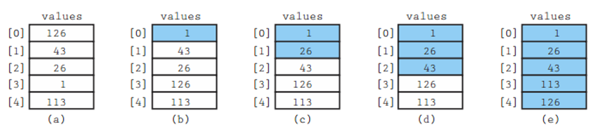
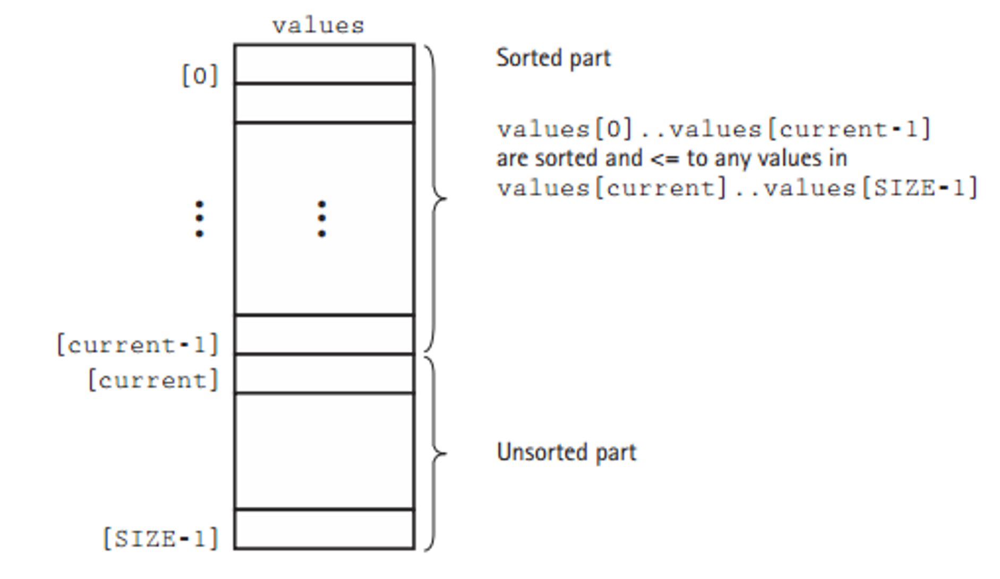
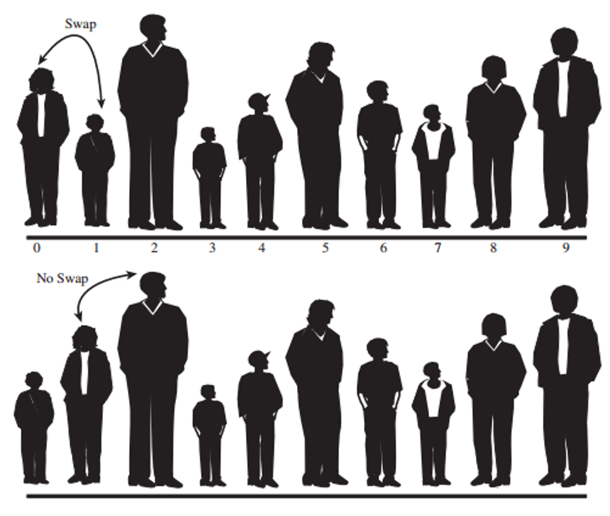
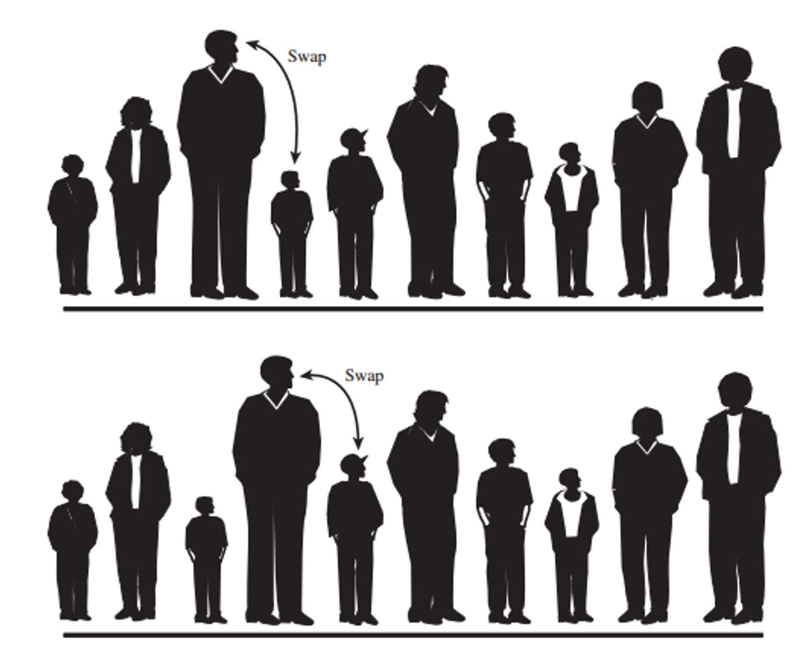
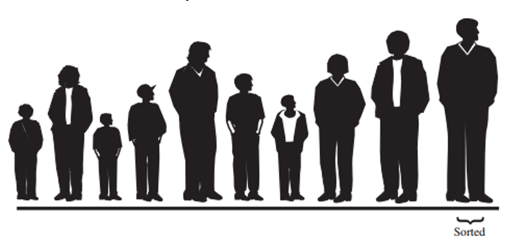

# Algoritmos de búsqueda y ordenamiento

## Algoritmos de búsqueda
Como lo indica su nombre, permiten buscar un elemento dentro de una colección de datos. La colección puede ser sobre arreglos o listas enlazadas, sin embargo, en este curso se enfocará en arreglos.

### Búsqueda lineal
La búsqueda lineal es el método más sencillo para buscar un elemento en un arreglo (o una lista). Consiste en recorrer el arreglo desde el primer elemento hasta el último, comparando cada elemento con el valor que se busca.

Cuando el arreglo **no está ordenado**, la búsqueda lineal es la **única opción**. Sin embargo, cuando el arreglo está ordenado, existen algoritmos más eficientes para realizar la búsqueda, como la búsqueda binaria.

Dado el siguiente arreglo:

```
| Indices   | 0 | 1 | 2 | 3 | 4 | 5 | 6 | 7 | 8 |
| Elementos | 5 | 3 | 8 | 6 | 2 | 7 | 1 | 4 | 9 |
```
Para buscar el número 7, se sigue el siguiente proceso:

```
| Indices   | 0 | 1 | 2 | 3 | 4 | 5 | 6 | 7 | 8 |
| Elementos | 5 | 3 | 8 | 6 | 2 | 7 | 1 | 4 | 9 |
    5 != 7    ^
    3 != 7        ^
    8 != 7            ^
    6 != 7                ^
    2 != 7                    ^
    7 == 7                        ^              
```
#### Implementación

```csharp
public static int linearSearch(int[] arr, int target) {
    for (int i = 0; i < arr.length; i++) {
        if (arr[i] == target) {
            return i;
        }
    }
    return -1;
}
```

### Búsqueda binaria
Es un algoritmo de búsqueda que encuentra la posición de un valor en un arreglo ordenado. A diferencia de la búsqueda lineal, que recorre el arreglo desde el primer elemento hasta el último, la búsqueda binaria divide el arreglo en dos mitades y compara el valor buscado con el elemento en el medio. 

- Si el valor buscado _es menor_ que el elemento en el medio, la búsqueda continúa en la mitad **izquierda** del arreglo. 

- Si el valor buscado _es mayor_ que el elemento en el medio, la búsqueda continúa en la mitad **derecha** del arreglo. 

Este proceso se repite hasta que el valor buscado sea encontrado o hasta que el subarreglo de búsqueda sea vacío.

Dado el siguiente arreglo:

```
| Indices   | 0 | 1 | 2 | 3 | 4 | 5 | 6 | 7 | 8 |
| Elementos | 1 | 2 | 3 | 4 | 5 | 6 | 7 | 8 | 9 |
```
Para buscar el número 9:

```
| Indices   | 0 | 1 | 2 | 3 | 4 | 5 | 6 | 7 | 8 |
| Elementos | 1 | 2 | 3 | 4 | 5 | 6 | 7 | 8 | 9 |
            |-----------------------------------|
    5 < 9                     ^
                                |---------------|
    7 < 9                             ^  
                                        |-------|  
    8 < 9                                 ^
                                             |--|
    9 == 9                                    ^
```

#### Implementación
Puede implementarse recursivamente o iterativamente. A continuación se muestra la implementación iterativa:

```csharp
public static int binarySearch(int[] arr, int target) {
    int left = 0;
    int right = arr.length - 1;

    while (left <= right) {
        int mid = left + (right - left) / 2;

        if (arr[mid] == target) {
            return mid;
        }

        if (arr[mid] < target) {
            left = mid + 1;
        } else {
            right = mid - 1;
        }
    }

    return -1;
}
```

### Búsqueda Hash
Para buscar en grandes colecciones de datos, no necesariamente ordenados, _hashing_ (dispersión) provee una técnica para buscar de una forma más eficiente. La función de _hash_ se utiliza para transformar una o más características de cada elemento del universo de búsqueda en un valor numérico que corresponde a un índice de un array. La búsqueda con _hash_, tiene un mejor rendimiento promedio que otros algoritmos de búsqueda.

#### Hash tables
Es una estructura de datos que almacena datos en pares _llave-valor_:

- _Llave_: llave única para identificar un valor

- _Valor_: dato asociado con la llave

La llave _k_ se utiliza como entrada para una función de hashing _h(k)_ que genera un índice _i_ donde el valor se almancenará dentro de la tabla. Visualmente se puede representar de esta forma:


Por ejemplo, suponga que se tiene un conjunto de datos que representan ciudadadanos costarricenses, donde cada registro, contiene una cédula numérica que identifica cada registro.

| Cédula    | Nombre | Apellido  | Dirección |
| --------- | ------ | --------- | --------- |
| 123456789 | Juan   | Pérez     | San José  |
| 987654321 | María  | Rodríguez | Heredia   |
| 456789123 | Carlos | Sánchez   | Alajuela  |

Para buscar un ciudadano en particular, se puede utilizar la cédula como llave y almacenar los datos en una tabla _hash_. Si la función de hash es _h(cédula) = cédula % 10_, se puede almacenar los datos de la siguiente forma:

| Índice | Cédula    | Nombre | Apellido  | Dirección |
| ------ | --------- | ------ | --------- | --------- |
| 0      |           |        |           |           |
| 1      | 987654321 | María  | Rodríguez | Heredia   |
| 2      |           |        |           |           |
| 3      | 456789123 | Carlos | Sánchez   | Alajuela  |
| 4      |           |        |           |           |
| 5      |           |        |           |           |
| 6      |           |        |           |           |
| 7      |           |        |           |           |
| 8      |           |        |           |           |
| 9      | 123456789 | Juan   | Pérez     | San José  |

La función de hash seleccionada, determina la cantidad de _buckets_ (espacios de almacenamiento) que se utilizarán para almacenar los datos. En este caso, se utilizó el módulo 10 para determinar el índice de almacenamiento.

El reto de las funciones hash es generar un índice único para cada llave. Si dos llaves generan el mismo índice, se produce una colisión. Las colisiones se pueden resolver de diferentes formas:

- **Separate chaining**: Cada índice de la tabla _hash_ almacena una lista enlazada de elementos que colisionan. Visualmente se puede ver de la sigueinte forma:


- **Open addressing**: Se busca un índice alternativo para almacenar el elemento que colisiona.

## Algoritmos de ordenamiento
Son algoritmos que reciben una colección de elementos en desorden y la ordenan ascendente o descendentemente. Hay muchos algoritmos, y la razón de su existencia es que cada uno tiene diferentes características de rendimiento.

### Ordenamiento por selección
Este algoritmo es el más sencillo de implementar. Funciona de la siguiente manera:

1. Busca el elemento más pequeño (o el más grande si es orden descendente) en el arreglo.
2. Intercambia el elemento más pequeño con el primer elemento del arreglo.
3. Busca el segundo elemento más pequeño en el arreglo.
4. Intercambia el segundo elemento más pequeño con el segundo elemento del arreglo.
5. Repite el proceso hasta que el arreglo esté ordenado.

Visualmente se puede ver de la siguiente forma:



El arreglo se "divide" en dos arreglos "lógicos":



La implementación en C# es la siguiente:

```csharp
public static void selectionSort(int[] arr) {
    for (int i = 0; i < arr.length - 1; i++) {
        int minIndex = i;
        for (int j = i + 1; j < arr.length; j++) {
            if (arr[j] < arr[minIndex]) {
                minIndex = j;
            }
        }
        int temp = arr[minIndex];
        arr[minIndex] = arr[i];
        arr[i] = temp;
    }
}
```
#### Ventajas y desventajas
| Ventajas | Desventajas |
|----------|-------------|
| Es fácil de entender e implementar. | Tiene una complejidad de tiempo O(n^2), lo que lo hace ineficiente para grandes conjuntos de datos. |
| No requiere memoria adicional significativa. | Siempre realiza el mismo número de comparaciones, independientemente de cómo estén ordenados los datos. |
| Funciona bien con listas pequeñas. |  |

### Ordenamiento de burbuja
El algoritmo de burbuja es otro algoritmo de ordenamiento simple. Funciona de la siguiente manera:

1. Compara el primer elemento con el segundo. Si el primer elemento es mayor que el segundo, los intercambia.
2. Compara el segundo elemento con el tercero. Si el segundo elemento es mayor que el tercero, los intercambia.
3. Repite el proceso hasta que el arreglo esté ordenado.

Visualmente se puede ver de la siguiente forma:





Al final de la primera pasada:



La implementación en C# es la siguiente:

```csharp
public static void bubbleSort(int[] arr) {
    for (int i = 0; i < arr.length - 1; i++) {
        for (int j = 0; j < arr.length - i - 1; j++) {
            if (arr[j] > arr[j + 1]) {
                int temp = arr[j];
                arr[j] = arr[j + 1];
                arr[j + 1] = temp;
            }
        }
    }
}
```
#### Ventajas y desventajas
Igual que el ordenamiento por selección, el ordenamiento de burbuja es fácil de entender e implementar. Sin embargo, tiene una complejidad de tiempo O(n^2), lo que lo hace ineficiente para grandes conjuntos de datos.

### Ordenamiento por inserción (Insertion sort)

### Quick sort

### Shellsort

Fue propuesto por Donald Shell en 1959.

La idea básica de Shellsort es que los elementos de un arreglo se ordenan en incrementos cada vez más pequeños. El último incremento es 1, que es el tamaño del arreglo. El algoritmo de Shellsort es una generalización del algoritmo **InsertionSort** y busca aprovechar al máximo el mejor caso de este, es decir, cuando los elementos ya están _casi_ ordenados.

Shellsort trabaja realizando sus Insertion Sorts en sublistas cuidadosamente seleccionadas, primero en sublistas pequeñas y luego en sublistas cada vez más grandes.

Shellsort rompe la lista en subconjuntos disjuntos, donde un subconjunto está definido por un "incremento", I. Cada registro en un subconjunto dado está separado por I posiciones. Por ejemplo, si el incremento fuera 4, entonces cada registro en el subconjunto estaría separado por 4 posiciones.

Usando un enfoque sencillo, podemos definir los gaps (o incrementos) de la siguiente manera:

```
size / 2, size / 4, size / 8, ..., 1
```

Rendondeando hacia el entero más cercano hacia arriba. Entonces, dado un array de 9 elementos, los gaps serían:

```
5, 3, 1
```

Dado el siguiente arreglo:

```java
| Indices   | 0 | 1 | 2 | 3 | 4 | 5 | 6 | 7 | 8 |  
| Elementos | 5 | 3 | 8 | 6 | 2 | 7 | 1 | 4 | 9 |
=================================================
| gap=5     | 5 | 3 | 8 | 6 | 2 | 7 | 1 | 4 | 9 |
|           | ^-------------------^             |
|           | 5 | 3 | 8 | 6 | 2 | 7 | 1 | 4 | 9 |
|           |     ^-------------------^         |
|           | 5 | 1 | 8 | 6 | 2 | 7 | 3 | 4 | 9 |
|                     ^-------------------^     |
|           | 5 | 1 | 4 | 6 | 2 | 7 | 3 | 8 | 9 |
|                         ^-------------------^ |
|           | 5 | 1 | 4 | 6 | 2 | 7 | 3 | 8 | 9 |
=================================================
| gap de 3  | ^-----------^                     |
|           | 5 | 1 | 4 | 6 | 2 | 7 | 3 | 8 | 9 |
|           |     ^-----------^                 |
|           | 5 | 1 | 4 | 6 | 2 | 7 | 3 | 8 | 9 |
|           |         ^-----------^             |
|           | 5 | 1 | 4 | 6 | 2 | 7 | 3 | 8 | 9 |
|           |             ^-----------^         |
|           | 5 | 1 | 4 | 3 | 2 | 7 | 6 | 8 | 9 |
|           | ^-----------^                     |
|           | 3 | 1 | 4 | 5 | 2 | 7 | 6 | 8 | 9 |
|           |                 ^-----------^     |
|           | 3 | 1 | 4 | 5 | 2 | 7 | 6 | 8 | 9 |
|           |                     ^-----------^ |
|           | 3 | 1 | 4 | 5 | 2 | 7 | 6 | 8 | 9 |
=================================================
| gap de 1  | 1 | 3 | 8 | 7 | 2 | 5 | 6 | 4 | 9 |
|           | ^---^                             |
|           | 1 | 3 | 8 | 7 | 2 | 5 | 4 | 6 | 9 |
|           |     ^---^                         |
|           | 1 | 3 | 8 | 7 | 2 | 5 | 4 | 6 | 9 |
|           |         ^---^                     |
|           | 1 | 3 | 7 | 8 | 2 | 5 | 4 | 6 | 9 |
|           |             ^---^                 |
|           | 1 | 3 | 7 | 2 | 8 | 5 | 4 | 6 | 9 |
|           |         ^---^                     |
|           | 1 | 3 | 2 | 7 | 8 | 5 | 4 | 6 | 9 |
|           |     ^---^                         |
|           | 1 | 2 | 3 | 7 | 8 | 5 | 4 | 6 | 9 |
|           |                 ^---^             |
|           | 1 | 2 | 3 | 7 | 5 | 8 | 4 | 6 | 9 |
|           |             ^---^                 |
|           | 1 | 2 | 3 | 5 | 7 | 8 | 4 | 6 | 9 |
|           |                     ^---^         |
|           | 1 | 2 | 3 | 5 | 7 | 4 | 8 | 6 | 9 |
|           |                 ^---^             |
|           | 1 | 2 | 3 | 5 | 4 | 7 | 8 | 6 | 9 |
|           |             ^---^                 |
|           | 1 | 2 | 3 | 4 | 5 | 7 | 8 | 6 | 9 |
|           |                         ^---^     |
|           | 1 | 2 | 3 | 4 | 5 | 7 | 6 | 8 | 9 |
|           |                     ^---^         |
|           | 1 | 2 | 3 | 4 | 5 | 6 | 7 | 8 | 9 |
|           |                             ^---^ |
=================================================
```

### Radix sort