# Grafos

Los grafos son estructuras de datos no lineales que consisten de  vértices (o nodos) y aristas (o bordes). Un grafo G agrupa entidades físicas o conceptuales. Un grafo está denotado como `G = {V,A}` donde V es el conjunto de vértices y A es el conjunto de aristas.

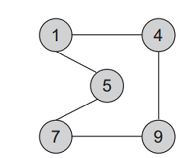

Del grafo anterior, podemos decir que:

- `V = { 1, 4, 5, 7, 9 }`

- `A = { (1,4), (4,1), (1,5), (5,1), (4,9), (9,4), (5,7),(7,5) (7,9),(9,7) }`

Un grafo puede  dirigido y no dirigido:

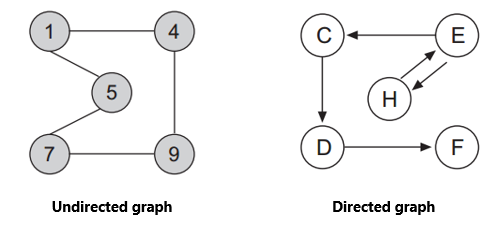

- En los dirigidos se muestra la dirección de la relación entre los nodos.

- En los no dirigidos los nodos conectados son adyacentes.

## Conceptos importantes
- Una arista puede tener un peso asociado denotando la magnitud asociada a la relación. Este tipo de grafos se les llama *Grafos ponderados*

- El grado de v es una cualidad de un nodo de un grafo. En un grafo no dirigido es el número de aristas que contiene v.

- En un grafo dirigido, el grado de entrada es el número de extremos de cola adyacentes a v. El grado de salida es el número de extremos de cabeza adyacentes a v.

- La ruta P = (v~0~, v~1~, v~2~, … , v~n~) es una serie de vertices que forman la ruta desde v~0~ hasta v~n~. v~n~ y v~0~ pueden ser iguales. Si los vértices entre v~0~ y v~n~ son diferentes, la ruta se llama ruta simple.

- Un ciclo es una ruta simple que empieza y termina en el mismo nodo.

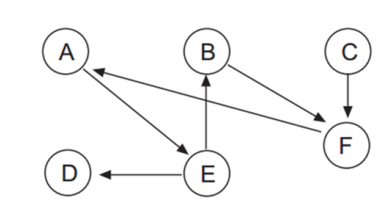

- Un DAG es un grafo acíclico dirigido, o sea que no existen ciclos.

- Un grafo es conexo si existe un camino entre cualquier par de nodos que lo componen. Un grafo es fuertemente conexo si el grafo es conexo y es dirigido.

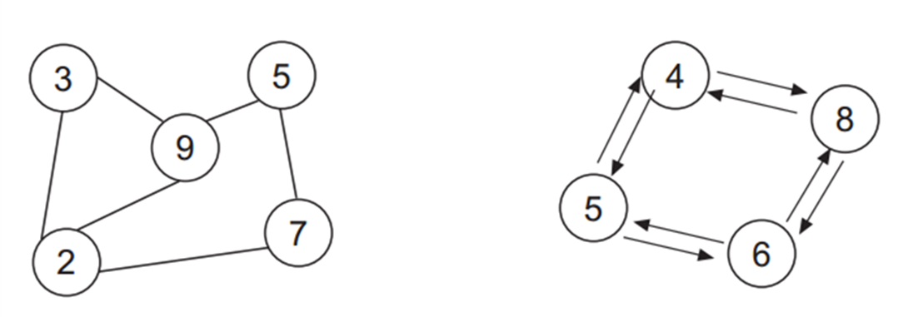

## Representación 

Los grafos se pueden representar utilizando dos enfoques diferentes:

- Usando una matriz bidimensional conocida como matriz de adyacencia

- Usando una representación dinámica conocida como lista de adyacencia

Elegir entre una representación u otra depende del tipo de array y de las operaciones que se realizarán:

- Si el grafo es denso (muchas aristas), lo mejor es escoger la matriz.

- Si el grafo es disperso, lo mejor es escoger la lista enlazada.

### Matriz de adyacencia

Sea G = {V, A} donde V = {v~0~, v~1~, v~2~,…, v~n-1~} y A = {(vi, vj)}. Los nodos se pueden representar mediante la matriz A de nxn conocida como matriz de adyacencia. Cada elemento de aij puede tomar uno de los siguientes valores:

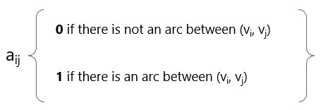

- Por ejemplo, digamos que los nodos son {D, F, K, L , R} la matriz sería:

```
    |0  1  1  0  0 |
    |1  0  1  0  0 |
A = |0  0  0  0  0 |
    |0  1  1  0  0 |
    |1  0  0  0  0 |
```

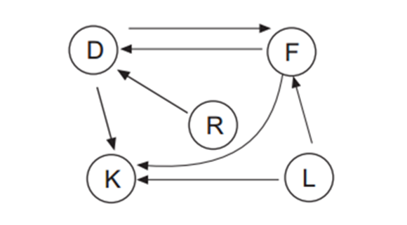

- Si el grafo es ponderado:

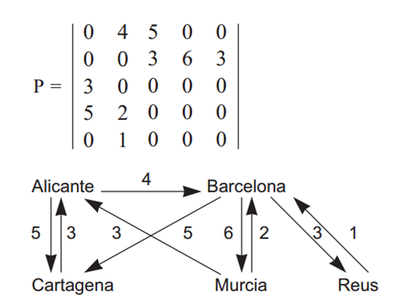

### Lista de adyacencia

Una lista de adyacencia es una lista vinculada donde cada elemento representa un nodo del grafo. Cada elemento contiene una lista de relaciones con otros nodos, siendo el nodo del elemento, el origen.

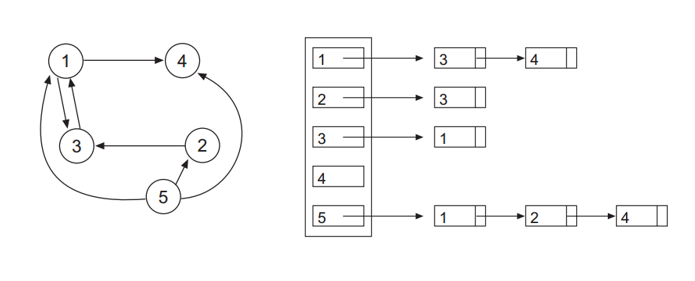

## Recorridos de un grafo
Atravesar un grafo implica visitar todos los nodos accesibles comenzando desde un nodo específico

Algoritmo de recorrido básico:

- Sea V el conjunto de vértices del gráfico.

- Sea W el conjunto de nodos no visitados. Inicialmente solo contiene el nodo inicial v

- Sea Y el conjunto de nodos visitados.

- En cada paso del algoritmo, se elimina un nodo w del conjunto W, se procesa y para cada nodo adyacente de w, si no se ha visitado, se agregará a w. El nodo w se agrega a Y.

- El algoritmo termina cuando W está vacío

### Breadth-First 

Utiliza una cola que mantiene los vértices marcados.

FIFO logra que a partir de v, primero se procesen todos los vértices adyacentes, luego todos los adyacentes de los adyacentes de v...y así sucesivamente

Algoritmo:

1. Marque el nodo de inicio v

2. Poner en cola el nodo de inicio v

3. Repita los pasos 4 y 5 hasta que la cola esté vacía.

4. Sacar de cola el nodo w de la cola, procesar w

5. Ponga en cola todos los nodos adyacentes a w que no estén marcados, nodos en cola marcados

6. Fin

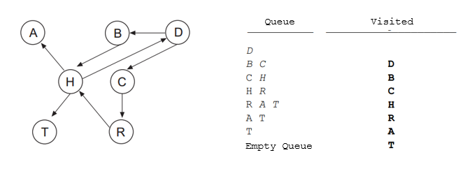

### Depth-First
En Depth-First, el orden de procesamiento viene dado por un enfoque LIFO

Atravesar el grafo con un nodo v. v se marca como visitado y se empuja a la pila. La parte superior de la pila está reventada. 

Cada nodo adyacente de v no visitado se empuja a la pila.

Esto continua hasta que no haya más elementos en la pila.

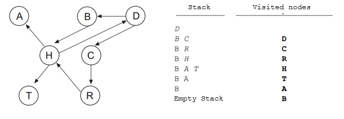

## Camino más corto: Dijkstra

Uno de los problemas más comunes es determinar el camino más corto entre un par de nodos.
Para este tipo de problema consideramos un grafo dirigido y ponderado.

La longitud del camino más corto es la suma del peso de cada arista.
El algoritmo de Dijkstra encuentra el camino más corto desde un nodo de origen a todos los demás nodos en un gráfico con pesos positivos

Edsger Dijkstra (1930 - 2002) fue un informático holandés que dio forma a la programación informática como una ciencia reconocida.

¿Cómo funciona?

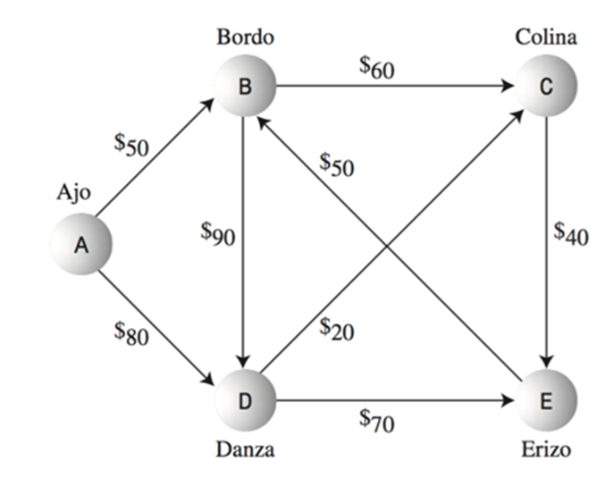

1. Se utilizará una tabla donde la primera columna es el vertice, la segunda es el peso temporal que se le dará a un camino y en la tercera columna el peso final. 


| Vertice | Temporal | Final |
|---------|----------|-------|
|   A     |    0     |   0   |
|   B     |   50     |  50   |
|   C     |  110     | 110   |
|   D     |   80     |  80   |
|   E     |  150     | 150   |


2. Escoger un punto de salida y otro de entrada. A -> E.
3. Empezar por los nodos adyacentes al de salida y analizando su peso, este se coloca en la columna temporal.
4. Se debe escoger el de magnitud más corta y se coloca este número en peso final. A partir de este nodo se le analizan sus adyacentes pero la magnitud es la suma del peso final + el peso que exista en las aristas.
5. Se analiza cual es el menor y a partir de ahí se sigue analizando.
*En este caso la distancia mas corta es A -> D -> E*

### Estructura general 

```
Foreach node set distance [node] = HIGH
SettledNodes = empty
UnSettledNodes = empty

Add sourceNode to UnsettledNodes
distance[sourceNode] = 0
while (UnSettledNodes is not empty) {
    evaluationNode = getNodeWithLowestDistance(UnSettledNodes)
    remove evaluationNode from UnsettledNodes
        add evaluationNode to SettledNodes    evaluatedNeighbors(evaluationNode)
}
getNodeWithLowestDistance(UnSettledNodes){  
    find the node with the lowest distance in UnSettledNodes and return it 
}
evaluatedNeighbors(evaluationNode){  
    Foreach destinationNode which can be reached via an edge from evaluationNode AND which is not in SettledNodes {    
        edgeDistance = getDistance(edge(evaluationNode, destinationNode))    
        newDistance = distance[evaluationNode] + edgeDistance    
        if (distance[destinationNode]  > newDistance) {      
            distance[destinationNode]  = newDistance 
        evaluation.predecessor = evaluationNode      
            add destinationNode to UnSettledNodes    
        }  
    }
}
```

## Camino más corto: Floyd

¿Cómo calcular el camino más corto de cada nodo a cada nodo?
Existe una solucón más directa que usar dijsktra de nodo en nodo.

El algoritmo de Floyd calcula mediante programación dinámica el camino más corto de cada nodo a cada nodo.

El algoritmo de Floyd representa el gráfico como una matriz ponderada. Cada arco (vi, vj) tiene un peso c~ij~. Si el arco no existe, el valor es infinito.
La diagonal de la matriz es igual a cero.

El algoritmo de Floyd determina una nueva matriz D de nxn elementos, donde cada D~ij~ es el camino mínimo de v~i~ a v~j~

- En cada paso desde D~0~ se genera una nueva matriz D~1~, D~2~, ..., D~k~, D~n~. En cada paso se incluye un nuevo vértice para determinar si ese vértice mejora los caminos para que sean más cortos. 

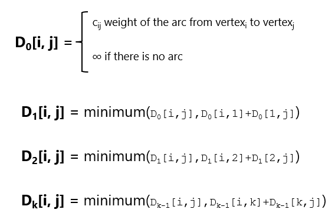

- Otra matriz Q~1~, Q~2~,..., Q~k~, Qn se genera en cada paso desde Q~0~. Q es la matriz predecesora.

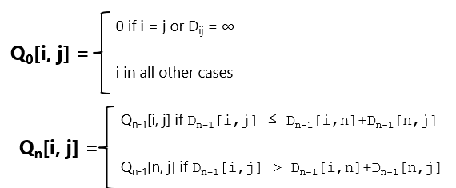

----------------------------

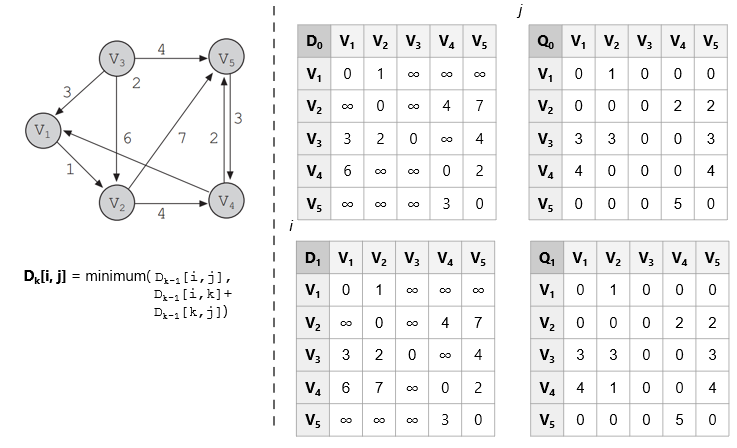


## Warshall

Similar al algoritmo de Floyd. Calcula la matriz de camino P (también llamada cierre transitivo) de un grafo G de n vértices, representado por su matriz de adyacencia A.

Define una secuencia de matrices nxn P~0~, P~1~, P~2~, P~3~,… P~n~

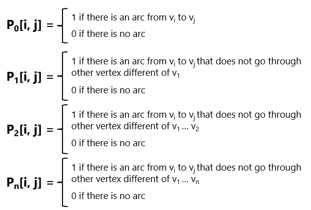

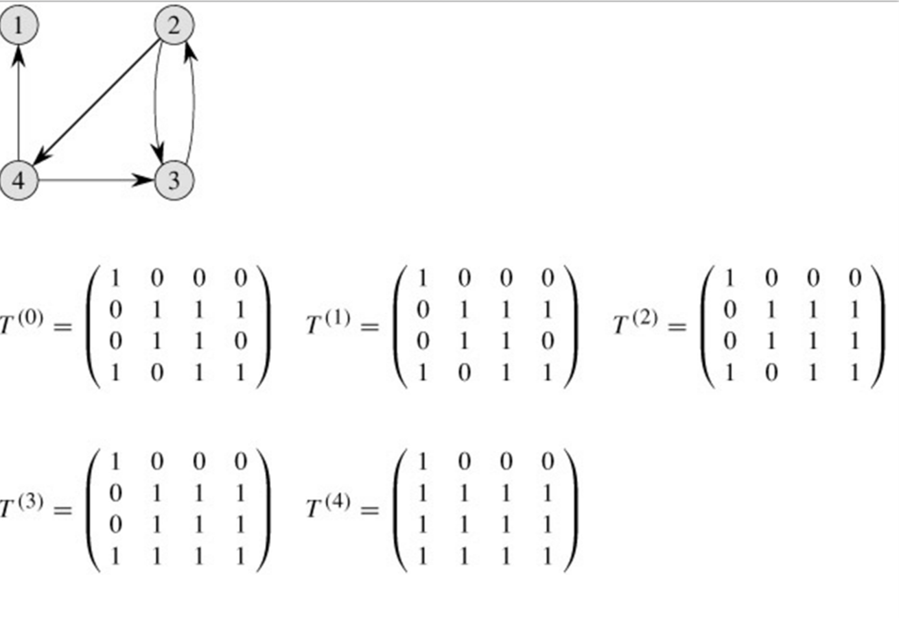

## Minimal Spanning tree

Se utiliza un grafo no dirigido para modelar relaciones simétricas entre vértices del gráfico. Cualquier arco (v,w) de un grafo no dirigido es igual que el arco de (w,v).

Una tarea común es determinar si para cualquier par de vértices existe un camino que los conecte, es decir, **si es un grafo conexo**.

Un *árbol de expansión mínimo* es un subconjunto del grafo que cubre todos los vértices y cuyos bordes tienen una suma de los pesos mínimos.
- Aplicado en redes

Un **árbol** es un subconjunto del grafo que está conexo y no tiene ciclos.
- Si tiene n vértices, entonces tiene n-1 aristas.
- Existe un camino único entre dos vértices cualesquiera de un árbol.
- Si se agrega una ventaja, se produce un ciclo.

Si todos los vértices están en el árbol, entonces es un grafo conexo.

Dado un grafo no dirigido, encuentre el árbol de expansión mínimo

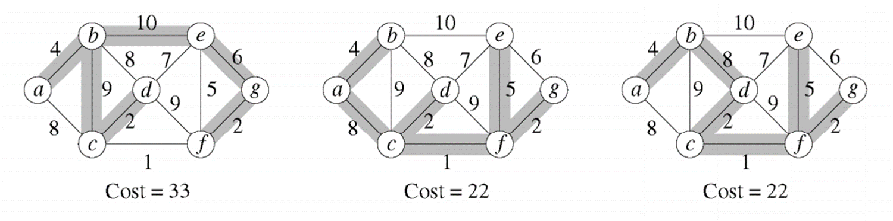

- El mismo grafo puede tener varios arboles de expansión, pero no todos son el mínimo.

¿Como conseguirlo?

- Prim algorithm

- Kruskal algorithm
    
### Prim

El árbol crece en etapas sucesivas. En cada etapa, se elige un nodo como raíz y agregamos un borde y el vértice asociado al árbol.

En cualquier punto tenemos un conjunto de vértices que ya han sido incluidos en el árbol.

El algoritmo encuentra un nuevo vértice para agregar al árbol eligiendo el borde (u,v), tal como el costo de (u,v) es el más pequeño entre todos los bordes donde u está en el árbol y v no.

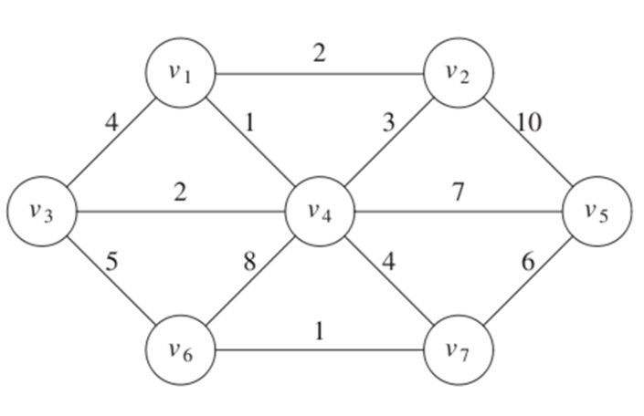

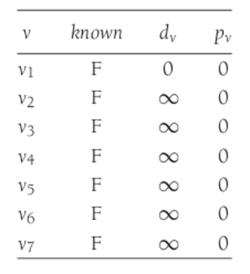

*Peso mínimo conectado a un nodo conocido*

Al realizar todo el algoritmo el resultado se vería así:

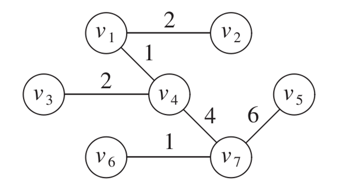

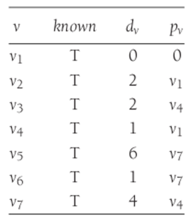


### Kruskal

Selecciona bordes si el orden es de menor peso y acepta un borde si no causa un ciclo

Mantiene un bosque (colección de árboles). Inicialmente todos son árboles de un solo nodo. Agregar un borde fusiona dos árboles en uno

Si u y v están en el mismo conjunto, la arista (u,v) se rechaza, porque sumarla causaría un ciclo. u y v están en el mismo conjunto si están conectados.

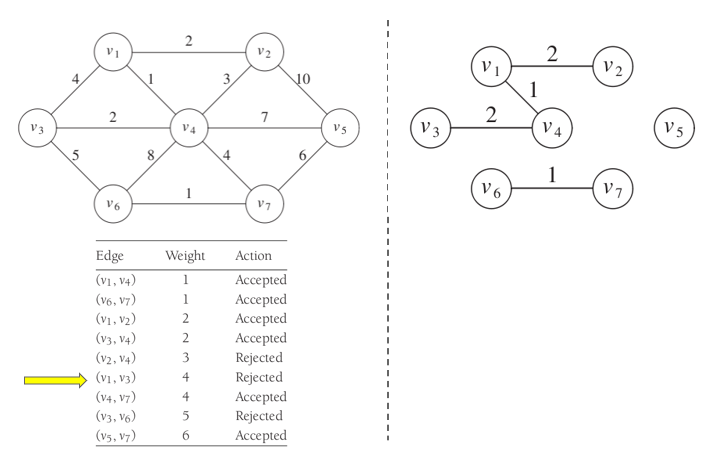