# Administración de Memoria
La administración de memoria conlleva diferentes ideas según el contexto. En el caso de los sistemas operativos, la administración de memoria se refiere a la gestión de la memoria principal de un sistema informático. En el caso del desarrollo de software, la administración de memoria se refiere a la gestión de la memoria de un programa en ejecución. Para lograr existosamente la segunda, se requiere comprender la primera.

En este capítulo, se abordarán los conceptos básicos de la administración de memoria en sistemas operativos y se entra en detalle a la administración de memoria en programas en ejecución.

## Breve introducción a sistemas operativos
Capa de software que interactúa directamente con el hardware, intermediario entre el hardware que posee una computadora y las aplicaciones de software, facilitando la gestión de recursos del sistema.

### El sistema operativo como API para los developers

API corresponde a las siglas de la palabra _Application Programming Interface_, concepto aplicable a varios contextos: API web, API del sistema operativo, API class libraries, etc; en nuestro caso, nos interesa el API del sistema operativo. Sea cual sea el contexto, la idea es la misma: _proveer una capa de abstracción para que los desarrolladores puedan interactuar con un sistema sin necesidad de conocer los detalles de su implementación_.

> Un estándar para las API de los S.O es el **posix**. El posix son las siglas de la palabra en inglés _portable operative interface for unix_. Es un **estándar del IEEE para los APIS del S.O**.

Un ejemplo de API por ejemplo para abrir un archivo, se utiliza la función `fopen` que retorna un  _pointer_ o _handler_ al archivo.

`fptr = fopen("archivo.txt")`

### El sistema operativo como administrador de los recursos de la máquina.
El hardware es complejo. Si no hubiera un ente especializado en la administración de los recursos de la máquina, los desarrolladores tendrían que lidiar con la complejidad del hardware directamente. El sistema operativo se encarga de la administración de los recursos de la máquina, permitiendo a los desarrolladores interactuar con la máquina de forma más sencilla. _El sistema operativo, hace transparentes los recursos de la máquina_.

Los recursos administrados son: 

- CPU
- Memoria Principal
- Discos
- I/O

> **Thread vs Process**
> 
> Un programa es un archivo ejecutable que contiene el código o el conjunto de instrucciones del procesador, que se almacena como un archivo en el disco. Cuando un programa se ejecuta, se carga en memoria y se convierte en un **proceso**. Un proceso activo incluye los recursos administrados por el sistema operativo que el programa necesita para ejecutarse: registros de procesador, contadores de programas. punteros de pila, páginas de memoria, etc.
> 
> Un **thread (hilo)** es un flujo de control dentro de un proceso, y cada hilo tiene su propia pila de llamadas, registros de procesador y estado de ejecución. Multiples hilos comparten el mismo espacio de direcciones de memoria, archivos abiertos, etc. 

## Definición de Administración de Memoria
Es el conjunto de tareas que realiza el sistema operativo para gestionar la memoria principal de una computadora. La administración de memoria es una parte fundamental de los sistemas operativos modernos, ya que permite a los programas ejecutarse sin tener que preocuparse por la gestión de la memoria.

Algunas de las responsabilidades de la administración de memoria son:

- Asignar/Liberar memoria al inicio/fin de un proceso.
- Controlar la memoria asignada a un proceso.
- Minimizar la fragmentación.
- Mantener la integridad de los datos.

La idea de controlar la memoria asignada a un proceso, tiene como fin hacer que el mismo tenga un límite y aislamiento, para que así no afecte a otros procesos en la memoria que se estén ejecutando.

### Las direcciones de memoria
Antes de continuar con el resto de este capítulo, es clave entender el concepto de direcciones de memoria. Para esto utilizaremos un  cotidiano. 

Imagine un edificio de apartamentos, en el que todos los apartamentos son exactamente del mismo tamaño y están numerados de manera consecutiva. Cada apartamento únicamente puede alojar a una sola persona. Una familia por lo tanto, ocupará varios apartamentos contiguos. El edificio puede continuar creciendo con el tiempo conforme se construyan nuevos pisos, pero la constructora tendrá un máximo de apartamentos que puede construir. La recepción del edificio puede llevar correspondencia a cualquier apartamento, incluso cuando se construyan nuevos apartamentos, pero siempre limitado por el número de apartamentos que se pueden construir y por el número de apartamentos que ya están construídos.

Aplicando el ejemplo a la computadora, un sistema operativo (_la recepción_) tiene la capacidad de generar direcciones de memoria de _n_ bits (usualmente 32 o 64 bits). Por ejemplo, si es son direcciones de 32 bits, el sistema operativo puede generar 2^32^ direcciones de memoria, desde la dirección 0 hasta la dirección 2^32^ - 1. Cada dirección de memoria corresponde a una casilla (_un apartamento_) que puede alojar 1 byte (_una persona_). Las variables (_familias_) puede ser de 1 o más bytes, siempre contiguos.

Si el usuario (_la constructora_) instala más RAM, el sistema operativo podrá accederlo hasta el máximo que sus direcciones lo permitan. Por ejemplo, si el sistema operativo tiene direcciones de 32 bits, podrá acceder a 2^32^ bytes de memoria, es decir 4GB. Si el usuario instala 8GB de RAM, el sistema operativo solo podrá acceder a 4GB, ya que no tiene direcciones para más.

Suponiendo un sistema operativo con direcciones de 16 bits, el sistema operativo podrá acceder a 2^16^ bytes de memoria, es decir 64KB. El rango de direcciones sería de 0 a 65535.

## Evolución de la Administración de memoria
La memoria ha sido un componente fundamental en las computadoras desde sus inicios y por ende ha necesitado del sistema operativo para administrarla. Conforme los recursos computacionales se adaptan a las necesidades de los usuarios y las prestaciones de hardware, la  administración de memoria se adapta para reducir el _overhead_ y mejorar la eficiencia.

A continuación se presenta la evolución de la abstracción de la memoria en los sistemas operativos.

### Ninguna abstracción de memoria

La abstracción más simple es no tener ninguna. Las computadoras mainframe de los años 60, minicomputadoras de los 70s y computadoras personales en los 80s, no tenían abstracción de memoria. Los programas accedían directamente a la memoria **física**. Un programa con la instrucción `MOV REGISTER1, 1000` en realidad accedía a la dirección de memoria 1000.

Había cierta organización de la memoria:

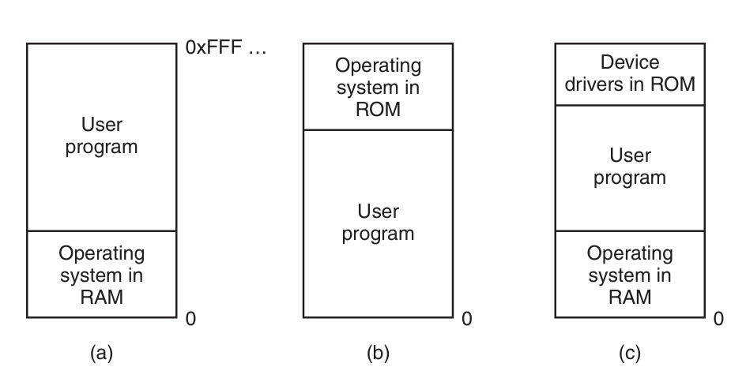

Bajo estas condiciones, era imposible ejecutar más de un programa a la vez (_multiprogramación_), ya que cada programa accedía directamente a la memoria física. Dos o más programas cargados en memoria, podían afectarse entre sí causando errores en la ejecución. El uso de threads era posible dado que compartían la misma memoria, pero de poco valor.

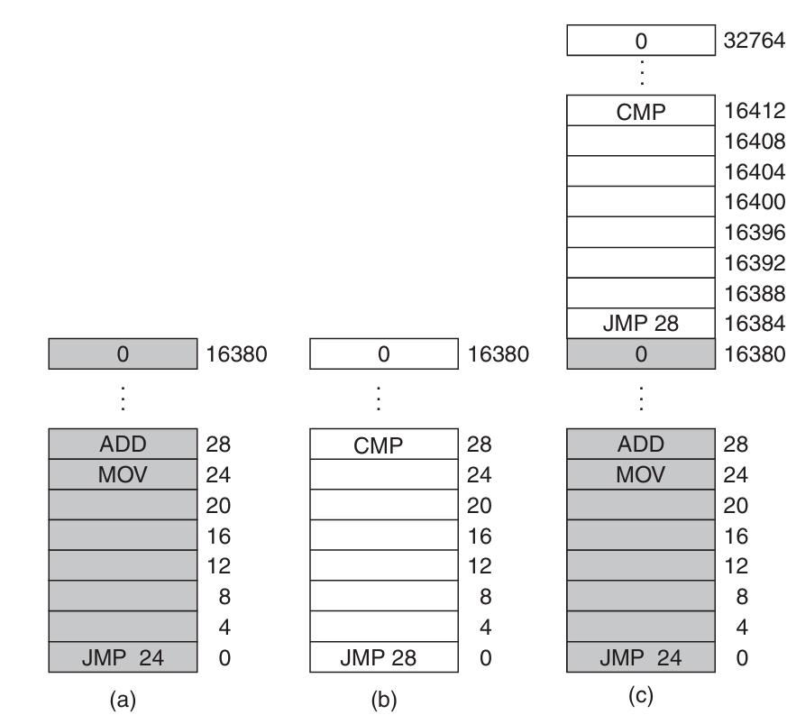

El _swapping_ se introduce como técnica para "pausar" la ejecución de un, guardar su estado en disco y cargar otro programa en memoria. Esta técnica permitió la multiprogramación _a cierto grado_, dado que solo un programa podía estar cargado en memoria en un momento dado. La idea era que mientras un programa estaba esperando por una operación de I/O, otro programa podía ejecutarse.

La computadora _IBM 360_, introduce una técnica para poder tener dos programas en memoria: _static relocation_. Cuando un programa se cargaba en memoria, se le asignaba una dirección base (la dirección inicial en la que se carga) y se modificaban todas las referencias a memoria para sumarles la dirección base. Esto funcionaba pero claramente no era eficiente puesto que entre más grande fuera el programa, más tarda en cargarse.

> Multiprogramación
>
> Se denomina multiprogramación a una técnica por la que dos o más procesos pueden alojarse en la memoria principal y ser ejecutados concurrentemente por el procesador o CPU. [...] la ejecución de los procesos (o hilos) se va solapando en el tiempo a tal velocidad, que causa la impresión de realizarse en paralelo (simultáneamente)
> 
> [...] En los antiguos sistemas monoprogramados, cuando un proceso en ejecución requería hacer uso de un dispositivo de E/S, el procesador quedaba ocioso mientras el proceso permaneciese en espera y no retomara su ejecución 
> _de Wikipedia_

### Espacios de direcciones
Constituye una abstracción para la memoria física. Cada programa tiene su propio espacio de direcciones, que va desde 0 a un valor máximo. El sistema operativo se encarga de mapear las direcciones virtuales a direcciones físicas. Dos programas puede ver la dirección `28`, pero en realidad se refieren a direcciones físicas diferentes.

Bajo este enfoque, el hardware provee dos registros llamados _base_ y _limite_. Cuando un programa específico se ejecuta, el sistema operativo carga el _base_ y _limite_ con los valores correspondientes al espacio de direcciones del programa. Cada vez que el programa accede a una dirección de memoria, el hardware verifica que la dirección esté dentro del rango permitido por el _base_ y _limite_ y genera la dirección física correspondiente.

Una limitante de este enfoque es que el programa completo debe caber en la memoria, lo cual es claramente poco práctico para los programas modernos con requerimientos de memoria cada vez más agresivos y que compiten con muchos otros programas ejecutándose concurrentemente.

> Concurrencia vs Paralelismo
> 
> La concurrencia se refiere a la capacidad de un sistema de llevar a cabo múltiples tareas en un mismo periodo de tiempo traslapándose entre sí, pero no implica que se ejecuten a la misma vez. En paralelismo, las tareas se ejecutan al mismo tiempo. Paralelismo implica múltiples núcleos de procesamiento. La concurrencia puede lograrse con un solo núcleo bajo multiprogramación.

### Memoria virtual
La memoría virtual es la solución para poder ejecutar programas que no caben en la memoria física. La idea básica es que cada programa tiene su propio espacio de direcciones dividido en bloques llamados _páginas_. Cada página es es un rango contiguo de direcciones. 

Las páginas se mapean a bloques de memoria física llamados _frames_, pero no notas las páginas necesitan estar cargadas. Cuando un programa referencia una página que está cargada en memoria (_page-hit_), el hardware mapea la dirección virtual a la dirección física correspondiente. Si la página no está cargada, el sistema operativo la carga desde el disco a un frame libre en memoria y re-ejecuta la instrucción que causó el fallo de página (_page-fault_).

Entonces, cuando un programa tiene una instrucción `MOV REGISTER1, 1000`, la dirección 1000 es una dirección virtual parte de su espacio de direcciones virtuales.

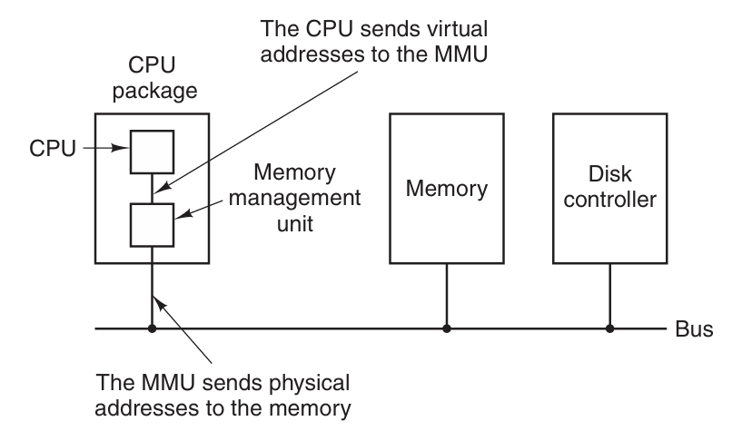

Como se nota en la imagen anterior, hay hardware especializado, el _Memory Management Unit (MMU)_ que se encarga de mapear las direcciones virtuales a direcciones físicas. El MMU tiene una tabla de páginas que mapea las direcciones virtuales a direcciones físicas. La tabla de páginas se mantiene en memoria y el MMU la consulta cada vez que necesita mapear una dirección virtual a una dirección física.


El MMU tiene una tabla que lleva el inventario de páginas cargadas y su correspondiente frame. Dicha tabla aloja información estadística sobre las páginas, como la frecuencia de uso, para poder tomar decisiones sobre qué páginas mantener en memoria y cuáles sacar. Dado que los frames son limitados, se utilizan algoritmos de reemplazo de páginas para decidir cuál página sacar de memoria cuando se necesita cargar una nueva y no hay espacio.

## Administración de memoria a nivel de proceso
Para un proceso (programa en ejecución con recursos asignados), la administración de memoria se refiere a la gestión de la memoria asignada. La abstracción utilizada por el sistema operativo, es transparente para el proceso, el cuál únicamente utiliza los mecanismos disponibles para manupular la memoria.

Dependiendo del lenguaje y compilador, el layout de memoria puede variar. Un programa en C, usualmente tiene el siguiente layout de memoria:

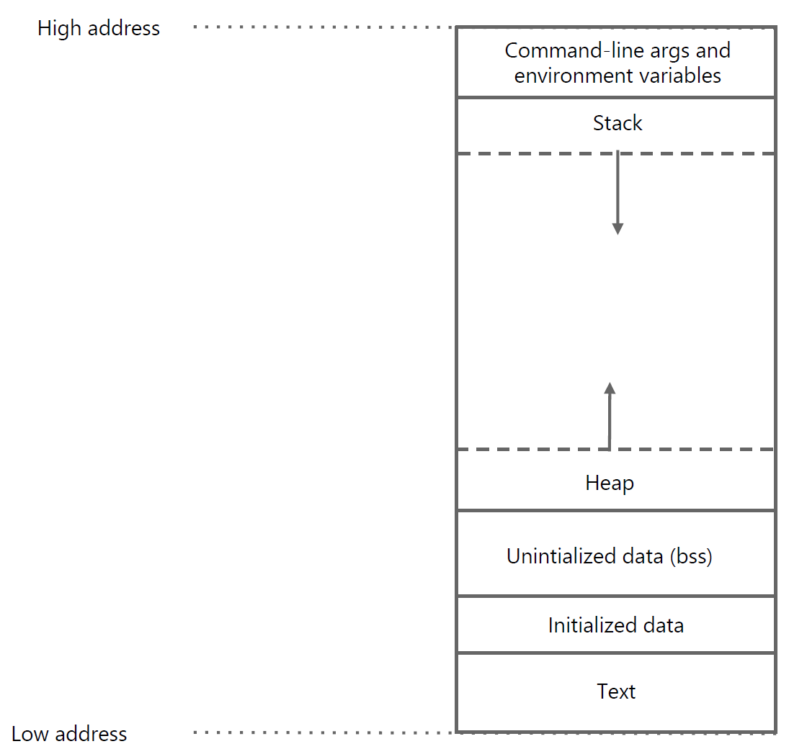

A continuación se describen a mayor detalle cada una de estas partes.

> Se recomienda leer [este](https://www.geeksforgeeks.org/memory-layout-of-c-program/) artículo de GeeksForGeeks con detalles sumamente relevantes del memory layout 

### Secciones del memory layout

#### Text
Contiene el código **ejecutable**. Usualmente es compartido entre procesos de un mismo programa. Es de solo lectura.

#### Initialized Data
Llamado también el segmento de datos. Contiene las variables **globales y/o estáticas** inicializadas. Es de lectura y escritura. Tiene dos áreas: una para variables read-only y otra para variables read-write. Por ejemplo

```c
int x = 10; //read-write
const int y = 20; //read-only
char s[] = "hola"; //read-write


int main() {
  // Código principal
}
```
> **¿static en C?**
> Al usarlo sobre variables que están dentro de una función, permite que el valor de las mismas persista entre llamadas Al usarlo sobre funciones o variables de ámbito global, garantiza que dicho elemento sólo exista en la unidad de compilación en la que se encuentre declarado.
> _fuente: [stackoverflow](https://es.stackoverflow.com/questions/297656/para-que-sirve-static-en-c)_


#### Uninitialized Data Segment
Usualmente llamado el segmento bss (block started by symbol). Contiene las variables **globales y/o estáticas** no inicializadas. Es de lectura y escritura. Los datos en este segmento, son inicializados en cero por el compilador antes de que el programa empiece a ejecutarse.

Por ejemplo, 

```c
int x; //uninitialized
int y; //uninitialized

int main() {
  // Código principal

  static int z; //uninitialized
}
```
#### Command-line arguments and environment variables
Esta seccion de la memoria se carga con los argumentos de la línea de comandos y las variables de entorno. Por _argumentos de la línea de comandos_ se entiende los argumentos que se pasan al programa al momento de ejecutarlo. Por ejemplo, `./programa -a -b -c`_. Estos argumentos se pueden acceder programáticamente mediante:

```c
int main(int argc, char* argv[]) {
  // argc es el número de argumentos
  // argv es un arreglo de strings con los argumentos
  // argv[0] es el nombre del programa
  // argv[1] es el primer argumento
  // argv[2] es el segundo argumento

  // Ejemplo
  printf("El primer argumento es %s\n", argv[1]);
}
```
Las _variables de entorno_ son variables que se definen en el sistema operativo y que pueden ser accedidas por los programas. Cuando se ejecuta un programa en la terminal, se pueden definir variables de entorno. Por ejemplo (en bash), `export MYVAR="Ejemplo de variable"`. Estas variables se pueden acceder programáticamente mediante la variable global `environ`.

```c
extern char** environ;

int main() {
  // Iterar sobre las variables de entorno
  for (int i = 0; environ[i] != NULL; i++) {
    printf("%s\n", environ[i]);
  }
}
```

#### Stack
Es una sección de la memoria que se utiliza para almacenar las variables locales de las funciones y los argumentos de las mismas. Es de tamaño fijo y se expande y contrae dinámicamente. Utilizar el stack es transparente (e inevitable) para el programador, por lo que el manejo de la memoria es menos propenso a errores.

El stack es _LIFO_ (Last In, First Out). Cada vez que se llama a una función, se crea un _stack frame_ que contiene las variables locales de la función, los argumentos y el _return address_ (la dirección a la que se debe regresar una vez que la función termina). Cuando dicha función termina, el _stack frame_ se elimina (se marca la memoria como libre). Es por tal razón que las variables locales se les llama _automáticas_.

> Las variables locales almacenables en el stack deben ser de tamaño conocido al momento de la compilación. Por esta razón, memoria dinámica como listas enlazadas no puede almacenarse en el stack.

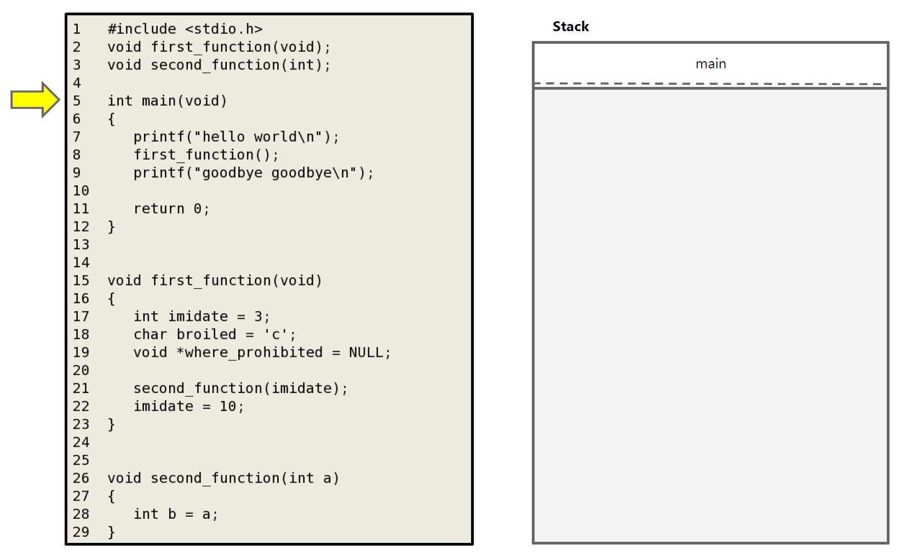

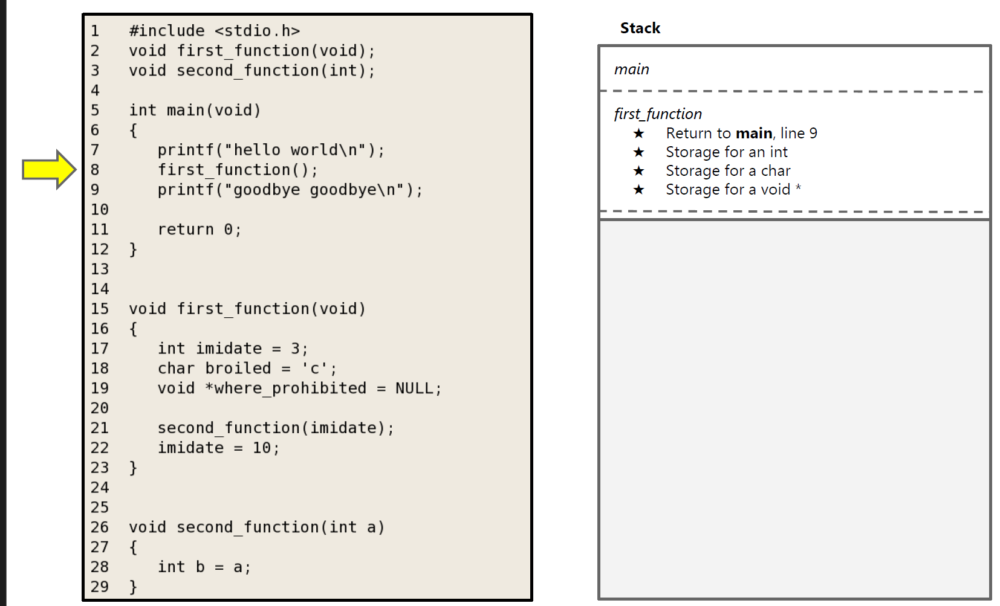

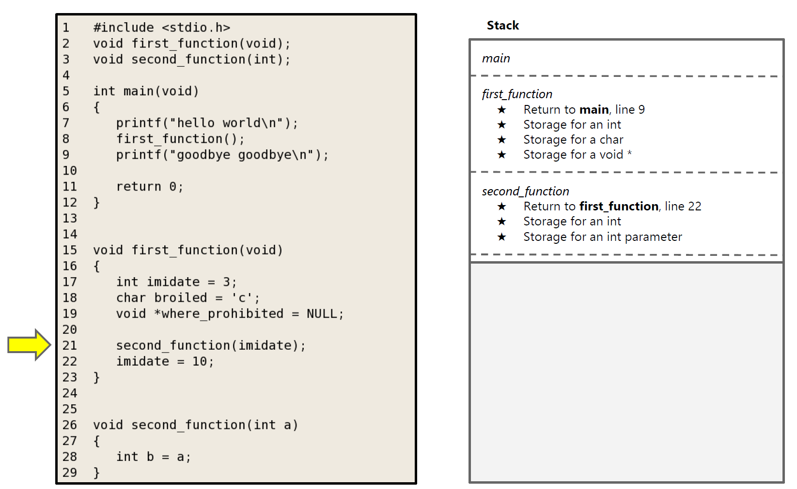

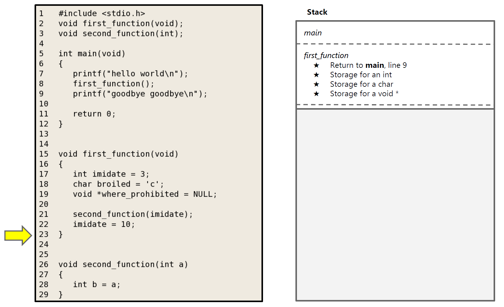

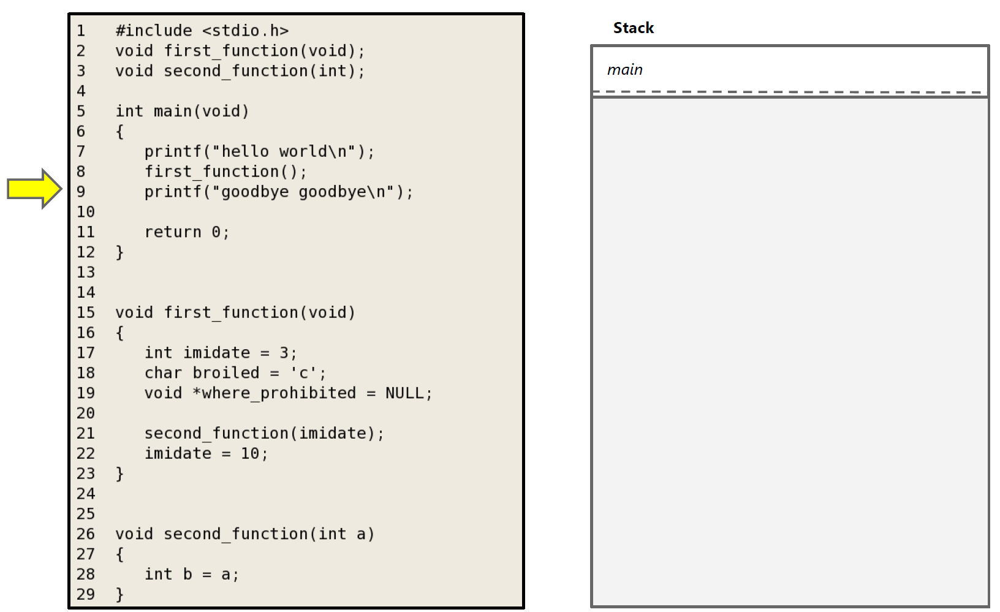

#### Heap
Es una sección de la memoria que se utiliza para almacenar datos que no tienen un tamaño conocido al momento de la compilación y cuyo tiempo de vida es controlado por el programador. Por ejemplo, listas enlazadas, árboles, etc. El heap es de tamaño variable y se expande y contrae dinámicamente. El programador es responsable de manipular la memoria en el heap, es decir, asignar, des-asignar y re-dimensionarla.

Para interactuar con la memoria, el programador utiliza funciones como `malloc`, `free`, `realloc`, `calloc` y `new`/`delete` (en C++). Estas funciones conforman el API del heap en C/C++.

> **¿Es posible evitar usar el Heap?**
>
> Sí, es posible evitar usar el heap. Sin embargo, esto implica que el programador únicamente podrá utiliza variables de tamaño conocido en tiempo de compilación, limitando la flexibilidad y el alcance de lo que el programa puede realizar.

El siguente código muestra un ejemplo de cómo se puede utilizar el heap en C:

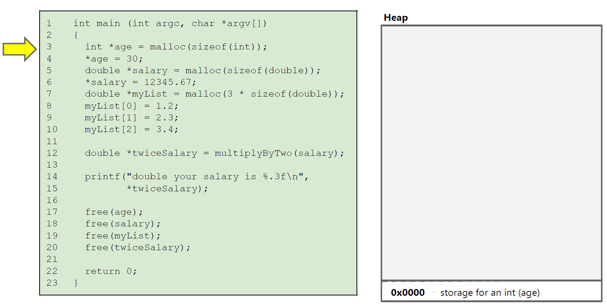

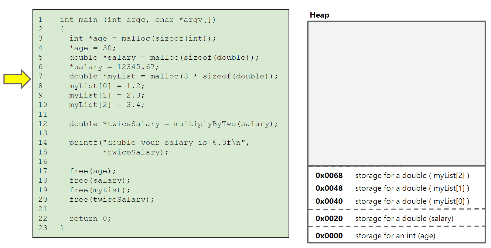

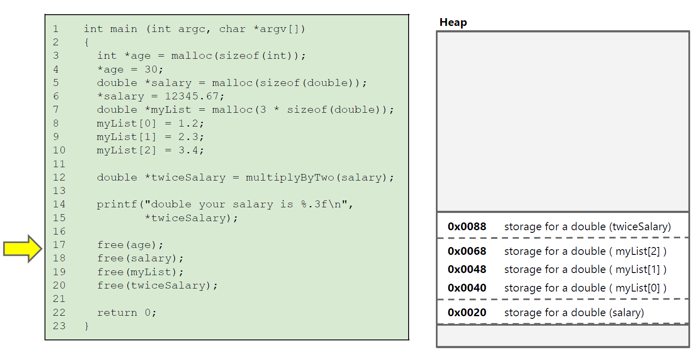

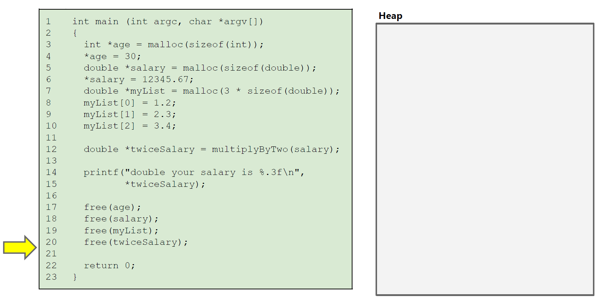

> **¿Qué pasa si no se libera la memoria en el heap?**
>
> Si no se libera la memoria en el heap, se produce una fuga de memoria (_memory leak_). Esto significa que la memoria asignada al programa no se libera y se pierde. Con el tiempo, el programa puede quedarse sin memoria y fallar.

En los ejemplos de código anteriores se utilizan punteros, por ejemplo `int* age = malloc(sizeof(int))`. En la siguiente sección se abordarán los punteros en mayor detalle.

#### Heap vs Stack
| Heap | Stack |
| ---- | ----- |
| Memoria dinámica | Memoria estática |
| Tamaño variable | Tamaño fijo |
| Programador es responsable de la memoria | Programador no es responsable de la memoria |
| No es transparente | Transparente |
| Propenso a errores (bugs introducidos por el programador) | Menos propenso a errores (bugs del sistema operativo) | 

### Punteros
Es un tipo de datos especial definido como parte del API del Heap. Al ser un tipo de datos, define un rango posible de valores que puede contener y un conjunto de operaciones que soporta.

- Rango de valores de un puntero: direcciones de memoria
- Operaciones soportadas: asignación, des-asignación, aritmética de punteros, acceso a memoria

Para declarar un puntero se utiliza código similar al siguiente:

```c
int* ptr = malloc(sizeof(int));
char* cptr = malloc(sizeof(char));
double* dptr = malloc(sizeof(double));
MyClass* myptr = new MyClass(); // En C++, dado que C no soporta clases
void* vptr = malloc(100);

// Si NULL no estuviera definido, se podría usar 0 o definirlo manualmente
int* nPtr = NULL;

// 0 es el único valor literal que se puede asignar a un puntero en C. 
// Equivalente a NULL
int* nPtr2 = 0; 
int* nPtr3 = nullptr; // En C++ 14

```
Si visualizamos la memoria como una tabla con columnas y filas, para el código anterior tendríamos:

| Dirección | Alias  | Valor | Tamaño  | Ubicación | Tipo    |
| --------- | ------ | ----- | ------- | --------- | ------- |
| 0x0       | ptr    | 0x64  | 4B      | Stack     | Pointer |
| 0x4       | cptr   | 0x68  | 4B      | Stack     | Pointer |
| 0x8       | dptr   | 0x69  | 4B      | Stack     | Pointer |
| 0x12      | myptr  | 0x72  | 4B      | Stack     | Pointer |
| 0x16      | vptr   | 0x92  | 4B      | Stack     | Pointer |
| 0x1A      | nPtr   | 0x0   | 4B      | Stack     | Pointer |
| 0x1E      | nPtr2  | 0x0   | 4B      | Stack     | Pointer |
| 0x22      | nPtr3  | 0x0   | 4B      | Stack     | Pointer |
| 0x64      |        | 0     | 4B      | Heap      | int     |
| 0x68      |        | ''    | 1B      | Heap      | char    |
| 0x69      |        | 0     | 8B      | Heap      | double  |
| 0x72      |        | 0     | 20B     | Heap      | MyClass |
| 0x92      |        | 0     | 100B    | Heap      | ?       |

> Las direcciones de la tabla son ficticias y no corresponden a direcciones reales de memoria. Asumimos que el heap empieza en la dirección hexadecimal 64. Asumimos que cada direcciónes de 32 bits, es decir 4 bytes. Asumimos que la clase `MyClass` tiene un tamaño de 20 bytes.

Como se puede notar, para acceder a la memoria, se necesita dos componentes: la llamada al API (en este caso malloc) y un puntero para poder acceder a la memoria creada por el API. El puntero siempre estará en el stack, y es una variable automática como cualquier otra. Sin embargo, al liberarse junto con el frame, la memoria en el Heap no se libera.

Una llamada a malloc sin asignar un puntero, por ejemplo 
```c
malloc(sizeof(int));
```
Resulta en una tabla de memoria como:

| Dirección | Alias  | Valor | Tamaño  | Ubicación | Tipo    |
| --------- | ------ | ----- | ------- | --------- | ------- |
| 0x64      |        | 0     | 4B      | Heap      | int     |

Pero al no haber ningún pointer en el stack que almacene la dirección `0x64`, dicha memoria es inaccesible y se produce una fuga de memoria.

No hay nada "mágico" con respecto a los punteros. Son simplemente un tipo de dato como cualquier otro. La diferencia es que los punteros contienen direcciones de memoria en lugar de valores.

> ¿Cuál es el proposito de declarar pointers con tipo si todos ocupen el mismo espacio?
>
> _Type check_: El compilador pueda hacer type checking. Por ejemplo, si se declara un puntero de tipo `int`, el compilador no permitirá asignarle una dirección de memoria de un `char`. 
>
> _Read/Write size_: El compilador sabe cuántos bytes leer o escribir al acceder a la memoria a través de un puntero.
>
> _Aritmética de pointers_: El compilador sabe cuántos bytes sumar o restar al hacer aritmética de punteros.

A continuación se describen las operaciones más comunes con punteros.

#### Operador Address-Of (&)
El operador **unario** `Address-Of`, designado por `&` (no confundir con el operador binario `&` para boolean) se utiliza para obtener la dirección de memoria de una variable. Por ejemplo, si se tiene una variable `int x = 10`, se puede obtener la dirección de memoria de `x` mediante `&x`. Se puede aplicar a memoria en el stack o en el heap.

```c
int x = 10;
int* ptr = &x;

```
Para el código anterior, la tabla de memoria sería:

| Dirección | Alias  | Valor | Tamaño  | Ubicación | Tipo    |
| --------- | ------ | ----- | ------- | --------- | ------- |
| 0x0       | x      | 10    | 4B      | Stack     | int     |
| 0x4       | ptr    | 0x0   | 4B      | Stack     | Pointer |

Considere el siguiente código:

```c
#include <iostream>
using namespace std;
 
int main()
{
 
    int x = 20;
 
    // Pointer pointing towards x
    int* ptr = &x;
 
    cout << "The address of the variable x is :- " << ptr;
    return 0;
}
```
Dicho programa generará la siguiente salida (espacio de direcciones de 48b):

```
The address of the variable x is: 0x7fffbf7b3b7c
```

#### Operador de indirección/de-referencia (*)
El operador **unario** `de-referencia`, designado por `*` (no confundir con el operador binario `*`), se utiliza para acceder al valor almacenado en la dirección de memoria apuntada por un puntero. Por ejemplo, si se tiene un puntero `int* ptr` que apunta a la dirección de memoria de una variable `x`, se puede acceder al valor de `x` mediante `*ptr`.

Por ejemplo, el siguiente código:

```c
#include <bits/stdc++.h>
using namespace std;
 
int main()
{
    int x = 3899;
    int* price;
 
    price = &x;
 
    cout << "The address of x is : " << &x;
    cout << "The value of price : " << price;
    cout << "The value stored at the variable pointed by price is: " << (*price);
    cout << "The value x is: " << x;
    return 0;
}
``` 
Genera la siguiente salida:
```
The address of x is : 0x7fffbf7b3b7c
The value of price : 0x7fffbf7b3b7c
The value stored at the variable pointed by price is: 3899
The value x is: 3899
```

El operador de indirección también sirve para modificar el valor de la variable apuntada por el puntero. Por ejemplo, el siguiente código:

```c
#include <bits/stdc++.h>
using namespace std;

int main()
{
    int x = 3899;
    int* price;

    price = &x;

    cout << "The value of x is: " << x << endl;
    cout << "The value of price is: " << *price << endl;

    *price = 1000;

    cout << "The value of x is: " << x << endl;
    cout << "The value of price is: " << *price << endl;

    return 0;
}
```
Genera la siguiente salida:

```
The value of x is: 3899
The value of price is: 3899
The value of x is: 1000
The value of price is: 1000
```
La tabla de memoria para el código anterior sería inicialmente:

| Dirección | Alias  | Valor | Tamaño  | Ubicación | Tipo    |
| --------- | ------ | ----- | ------- | --------- | ------- |
| 0x0       | x      | **3899**  | 4B      | Stack     | int     |
| 0x4       | price  | 0x0   | 4B      | Stack     | Pointer |

y luego de la instrucción  `*price = 1000;`, 

| Dirección | Alias  | Valor | Tamaño  | Ubicación | Tipo    |
| --------- | ------ | ----- | ------- | --------- | ------- |
| 0x0       | x      | **1000**  | 4B      | Stack     | int     |
| 0x4       | price  | 0x0   | 4B      | Stack     | Pointer |


#### Sharing
Es un concepto que se refiere a la posibilidad de tener dos o más punteros que apunten a la misma dirección de memoria. Por ejemplo, si se tiene un puntero `int* ptr` que apunta a la dirección de memoria de una variable `x`, se puede tener otro puntero `int* ptr2` que apunte a la misma dirección de memoria de `x`.

```c
int x = 20;
int* ptr = &x;
int* ptr2 = ptr;
```
La tabla de memoria para el código anterior sería:

| Dirección | Alias  | Valor | Tamaño  | Ubicación | Tipo    |
| --------- | ------ | ----- | ------- | --------- | ------- |
| 0x0       | x      | 10    | 4B      | Stack     | int     |
| 0x4       | ptr    | 0x0   | 4B      | Stack     | Pointer |
| 0x8       | ptr2   | 0x0   | 4B      | Stack     | Pointer |

Mediante cualquiera de los punteros `ptr` o `ptr2`, se puede leer/modificar el valor de `x`. Por ejemplo:

```c
int x = 20;
int* ptr = &x;
int* ptr2 = ptr;

*ptr = 30;
cout << x; // Imprime 30
cout << *ptr2; // Imprime 30
cout << *ptr; // Imprime 30
```

#### Shallow-copy vs Deep-copy
_Shallow-copy_ implica copiar el puntero, pero no el valor al que apunta. Por ejemplo, para el siguiente código:

```c
int x = 20;
int* ptr = &x;
int* ptr2 = ptr;
```

La tabla de memoria para el código anterior sería:

| Dirección | Alias  | Valor | Tamaño  | Ubicación | Tipo    |
| --------- | ------ | ----- | ------- | --------- | ------- |
| 0x0       | x      | 10    | 4B      | Stack     | int     |
| 0x4       | ptr    | 0x0   | 4B      | Stack     | Pointer |
| 0x8       | ptr2   | 0x0   | 4B      | Stack     | Pointer |

Nótese que solo hay un espacio con el valor 10. Ambos pointers "apuntan" a la misma dirección. Se pueden crear _n_ copias de punteros, pero solo abrá un espacio de memoria al que todos apuntan.

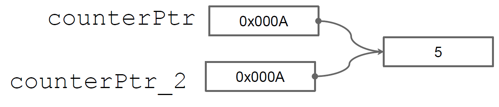

Por otro lado, _Deep-copy_ implica copiar el valor al que apunta el puntero. Por ejemplo, el siguiente código:

```c
int x = 20;
int* ptr = &x;
int* ptr2 = malloc(sizeof(int));
*ptr2 = *ptr;
```
En este caso, la tabla de memoria sería:

| Dirección | Alias  | Valor | Tamaño  | Ubicación | Tipo    |
| --------- | ------ | ----- | ------- | --------- | ------- |
| 0x0       | x      | 20    | 4B      | Stack     | int     |
| 0x4       | ptr    | 0x0   | 4B      | Stack     | Pointer |
| 0x8       | ptr2   | 0x64  | 4B      | Stack     | Pointer |
| 0x64      |        | 20    | 4B      | Heap      | int     |

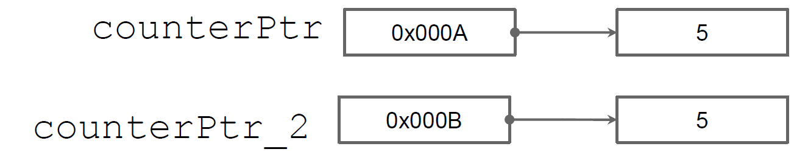

Deep-copy puede implicar más trabajo que un simple `malloc`. Por ejemplo, al copiar una estructura de datos a otra, si alguno de los campos de la estructura es un puntero, se debe copiar el valor al que apunta el puntero, no el puntero en sí.

#### Aritmética de punteros
Permite sumar o restar un número entero a un puntero. La aritmética de punteros es útil para acceder a elementos de un array o para moverse a través de una estructura de datos. Por ejemplo, considere el siguiente código:

```c
int arr[5] = {10, 20, 30, 40, 50};
int* ptr = arr;

cout << *ptr; // Imprime 10
cout << *(ptr + 1); // Imprime 20
cout << *(ptr + 2); // Imprime 30

```
En este caso, `ptr` apunta al primer elemento del array `arr`. Al sumar 1 a `ptr`, se mueve al siguiente **elemento** del array. Al sumar 2 a `ptr`, se mueve dos elementos hacia adelante. Nótese que la aritmética de punteros es en términos de elementos, no de bytes. Dado que el pointer tiene un tipo, el compilador sabe cuántos bytes sumar o restar al hacer aritmética de punteros. El array `arr` ocupa 50 bytes contiguos en memoria y cada elemento ocupa 4 bytes. Por lo tanto, `ptr + 1` salta de 4 en 4 bytes.

Para efectos de arrays en C/C++, `arr[i]` es equivalente a `*(arr + i)`. Por ejemplo, el siguiente código:

```c
int arr[5] = {10, 20, 30, 40, 50};

cout << arr[0]; // Imprime 10
cout << arr[1]; // Imprime 20
cout << arr[2]; // Imprime 30
```

> Dado que acceder cualquier elemento de un array es equivalente a acceder a la dirección de memoria del primer elemento y sumarle un offset, los arrays son muy eficientes en términos de acceso a memoria. Es `O(1)` acceder a cualquier elemento de un array .

#### Tipo referencia (C/C++)
En C++, se puede utilizar el tipo `&` para definir una referencia a una variable. Una referencia es similar a un puntero, pero más seguro y más fácil de usar. Una referencia no puede ser nula y no puede ser reasignada. Una referencia es simplemente un alias para una variable.

```c++
int x = 10;
int& ref = x;

cout << x; // Imprime 10
cout << ref; // Imprime 10
```
Son muy útiles para pasar argumentos a funciones por referencia.

#### Paso de parámetros por valor vs por referencia
En C/C++, los parámetros de una función pueden pasarse por valor o por referencia. Es decir, una función puede recibir una copia del valor de una variable o la dirección de memoria de la variable.

- **Por valor**: Se pasa una copia del valor de la variable. Los cambios a la variable dentro de la función no afectan a la variable original.

```c++
void foo(int x) {
  x = 20;
}

int main() {
  int x = 10;
  foo(x);
  cout << x; // Imprime 10
}
```
- **Por referencia**: Se pasa la dirección de memoria de la variable. Los cambios a la variable dentro de la función afectan a la variable original.

```c++
void foo(int& x) {
  x = 20;
}

int main() {
  int x = 10;
  foo(x);
  cout << x; // Imprime 20
}
```
o bien, en C:

```c
void foo(int* x) {
  *x = 20;
}

int main() {
  int x = 10;
  foo(&x);
  cout << x; // Imprime 20
}
```

#### Buenas prácticas al usar punteros

- **Inicializar punteros**: Siempre inicializa los punteros. Un puntero no inicializado puede contener cualquier valor (random value) y puede causar errores difíciles de depurar o causar un segmentation fault al de-referenciarlo.

  ```c
  int* ptr = NULL; // Correcto
  int* ptr; // Incorrecto
  ```

- **Verificar punteros antes de usarlos**: Antes de usar un puntero, verifica que no sea NULL.
  ```c
  if (ptr != NULL) {
    // Usar el puntero
  }
  ```

- **Liberar memoria**: Siempre libera la memoria asignada dinámicamente cuando ya no la necesites para evitar fugas de memoria.

- **Evitar punteros colgantes (dangling pointers) **: Después de liberar memoria, establece el puntero a NULL para evitar el uso accidental de punteros colgantes.
  ```c
  free(ptr);
  ptr = NULL;
  ```

- **Usar `const` cuando sea posible**: Si un puntero no debe modificar los datos a los que apunta, decláralo como `const`.
  ```c
  const int* ptr = &x;
  ```

- **Evitar aritmética de punteros compleja**: La aritmética de punteros puede ser propensa a errores. Evítala si es posible o úsala con cuidado.
  ```c
  int arr[10];
  int* ptr = arr;
  ptr += 2; // Apunta al tercer elemento del array
  ```

- **No retornar desde una función, un puntero a una variable del stack**: Si retornas un puntero a una variable del stack, la variable se libera cuando la función termina y el puntero se convierte en un puntero colgante.

  ```c
  int* foo() {
      int temp = 50;
      return &temp;
  }
  void bar() {
      int temp = 66;
      return;
  }

  int main() {
      int* r = foo();
      cout << *r; // Imprime 50
      bar();
      cout << *r; // Imprime 60
  }
  ``` 

### Punteros en lenguajes manejados

En lenguajes manejados como Java, C# y Python, los punteros no son accesibles directamente. En su lugar, se utilizan referencias. Una referencia es similar a un puntero, pero más seguro y más fácil de usar. Una referencia no puede ser nula y no puede ser reasignada. Una referencia es simplemente un alias para un objeto.

En Java, por ejemplo, se utilizan referencias para acceder a objetos. Por ejemplo:

```java
class MyClass {
  int x;
}

public class Main {
  public static void main(String[] args) {
    MyClass obj = new MyClass();
    obj.x = 10;

    MyClass obj2 = obj; // Shallow-Copy
    System.out.println(obj.x); // Imprime 10
  }
}
```
La mayoría de los lenguajes manejados tienen recolección de basura, lo que significa que no es necesario liberar la memoria manualmente. El recolector de basura se encarga de liberar la memoria automáticamente cuando un objeto ya no es accesible. Utiliza un algoritmo de marcado y barrido para determinar qué objetos son accesibles y cuáles no. Los objetos inaccesibles se marcan para ser liberados. Para determinar si un objeto es accesible, el recolector de basura sigue las referencias a través de los objetos. 

Otros lenguajes modernos como Rust, tienen un sistema de tipos que garantiza la seguridad de la memoria sin necesidad de un recolector de basura. Rust utiliza un sistema de tipos basado en el concepto de _ownership_ y _borrowing_ para garantizar la seguridad de la memoria. Por ejemplo:

```rust
fn main() {
    let mut x = 10;
    let y = &x;
    let z = &x;
    println!("{}", x); // Imprime 10
}
```

El código anterior no compilará en Rust. Rust garantiza que no haya referencias múltiples a un objeto mutable. En este caso, `x` es mutable, pero `y` y `z` son referencias inmutables. Rust garantiza que no haya referencias múltiples a un objeto mutable para evitar condiciones de carrera y errores de memoria.

## Referencias adicionales
- Modern Operating Systems, Andrew S. Tanenbaum, Herbert Bos, Pearson, 2014.
- https://www.geeksforgeeks.org/memory-layout-of-c-program/
- https://www.geeksforgeeks.org/cpp-pointer-operators/