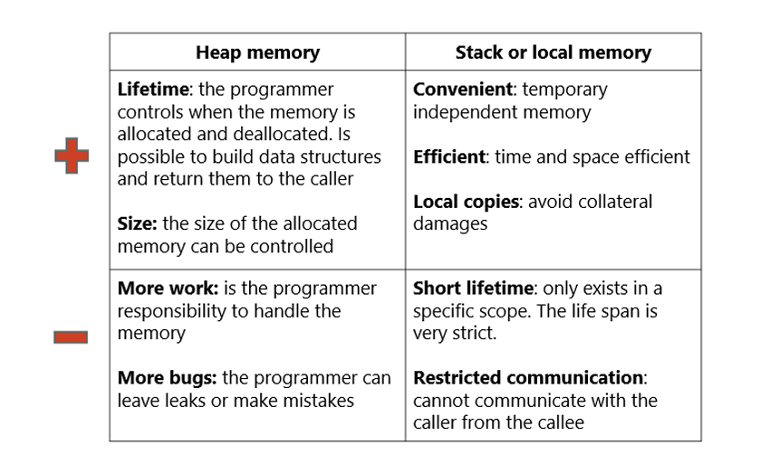

# Memory Management

## Sistema Operativo

**Capa de software que interactúa indirectamente con el hardware.**

### Funciones:
- API para los developers (Application Programming Interface).
- Una interface para los recursos del hardware: API web, API S.O., API class libraries.
- Un estándar del IEEE para API S.O. es POSIX (portable operative interface for UNIX).
- Administrar los recursos de la máquina.
- Los recursos del S.O. buscan la transparencia con los componentes del hardware. Poder interactuar con ellos de forma directa sin necesidad de verlos/usarlos físicamente.

### Procesos (CPU)
- Programas en ejecución con recursos asignados.
- Memoria Principal: RAM (Random Access Memory).
- Archivos: Discos.
- I/O (Input/Output): Entrada y salida del sistema, como por ejemplo el teclado, mouse, red, entre otros.

Dentro de los procesos están los threads y procesos como tal. Los threads son pequeñas tareas que se realizan por aparte y el procesador puede dedicarle tiempo. Un proceso corresponde al programa que se encuentra en “acción”.

Respecto a la memoria principal, se tienen las abstracciones del heap y stack.

### Administración de Memoria (ADM)
Cómo el sistema operativo distribuye el RAM entre los distintos procesos de ejecución. Además, incluye la gestión del RAM y disco (memoria virtual).

#### Funciones:
- Asignar/Liberar memoria al inicio/fin de un proceso.
- Controlar la memoria asignada a un proceso.
- Minimizar la fragmentación.
- Mantener la integridad de los datos.

### Multiprocesamiento
- Multiprogramación: capacidad de ejecutar varios programas al mismo tiempo.

El objetivo de controlar la memoria asignada a un proceso es hacer que tenga un límite y aislamiento para que no afecte a otros procesos que se están ejecutando en memoria. Al ser disminuida la fragmentación, se puede brindar memoria continua a los procesos (desfragmentación).

## Evolución de la Administración de Memoria

La evolución de la administración de memoria en los sistemas operativos ha sido un proceso de mejora continua para satisfacer las crecientes necesidades de los usuarios. A lo largo del tiempo, se han implementado varios enfoques para manejar la memoria de manera más eficiente:

1. **Ninguna Abstracción:** Inicialmente, los sistemas operativos no tenían ninguna abstracción sobre la memoria. Los programas accedían directamente a la memoria física con direcciones generadas de manera estática durante la compilación o la carga. Este enfoque no permitía la multiprogramación, pero más adelante se introdujo la técnica de _static relocation_, que ajustaba las direcciones de memoria en el momento de cargar un programa, permitiendo así la multiprogramación al hacer posible que varios programas compartieran la memoria física de manera más eficiente.

2. **Espacios de Direcciones:** Con el tiempo, se introdujo la idea de asignar un grupo específico de direcciones de memoria a cada programa, similar a cómo se asignan bloques de números telefónicos a ciertas áreas. Este enfoque, conocido como _Dynamic Relocation_, ajustaba las direcciones de memoria en tiempo real. Sin embargo, el programa completo aún debía caber en la RAM para poder ejecutarse.

3. **Memoria Virtual:** El siguiente gran avance fue la introducción de la memoria virtual, que permite ejecutar programas más grandes que la memoria física disponible. Aquí, la memoria virtual agrega una capa de traducción mediante una unidad de hardware especializada llamada _Memory Mapping Unit_ (MMU). Esta unidad divide el espacio de direcciones del programa en pequeñas partes llamadas "frames". Cuando la memoria física se llena, un algoritmo de reemplazo guarda los datos de un frame en el disco y carga nuevos datos, un proceso conocido como SWAP.

### Static relocation vs Dynamic relocation

- **Static Relocation:** Ajusta las direcciones de memoria de un programa en el momento de su carga. Una vez realizado, estas direcciones no cambian durante la ejecución del programa.

- **Dynamic Relocation:** Ajusta las direcciones de memoria de un programa en tiempo real durante su ejecución, utilizando hardware especializado para traducir las direcciones virtuales en físicas de manera continua.

## Memory Layout de un Programa en C/C++

El layout depende del lenguaje/compilador que el sistema operativo respeta. No es un bloque contiguo; la estrategia/enfoque de administración de memoria se aplica sobre todo el layout transparentemente.

### Stack

- Utiliza un stack (estructura de datos) cuya naturaleza es _LIFO_.
- Cada entrada se llama _STACK FRAME_.
- Hay un stack frame por cada llamada a una función (_Call stack_).
- Al terminar la función, se elimina el frame.

Relacionado con llamada a métodos.

#### Cada stack frame incluye al menos:
- Espacio de almacenamiento para todas las variables automáticas (locales) para la nueva función llamada.
- Número de línea de la función que llama (adónde regresar).
- Argumentos o parámetros de la función llamada.

El stack maneja la memoria de manera transparente hacia el programador. Cuando se extrae un stack frame del stack, todo el almacenamiento se libera automáticamente. Existe un límite bien conocido en el tamaño variable. El alcance de la variable puede ayudar a comprender cómo funciona la pila.

### Heap

El heap es una sección del layout de memoria de un proceso que no se gestiona automáticamente, por lo que el programador debe manejarla directamente. Esto implica asignar, liberar y redimensionar memoria de manera manual. En C, por ejemplo, esto se hace mediante funciones como `malloc`, `calloc`, `realloc` y `free`.

Aunque es posible evitar el uso del heap, algunos lenguajes de programación no permiten al programador interactuar con él, lo que limita la creación de estructuras de datos complejas y reduce la flexibilidad.

### Heap vs Stack:

- **Usa el heap si:**
  - Necesitas asignar bloques grandes de memoria (grandes arreglos/estructuras).
  - La variable debe persistir por mucho tiempo.
  - Necesitas una estructura que crezca dinámicamente.

- **Usa el stack si:**
  - Solo necesitas pequeñas variables de tipos bien definidos.
  - Las variables no van a crecer dinámicamente.
  - Solo necesitas que las variables persistan dentro de su ámbito de uso.

