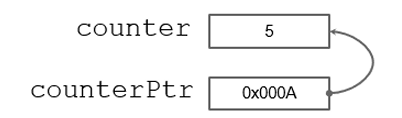
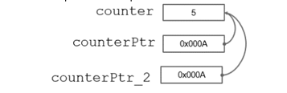
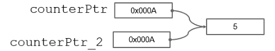
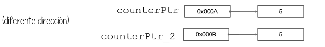
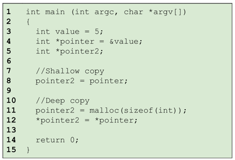

## Punteros

Uno de los _features_ más poderosos de C es que el programador puede manipular la memoria.

El _pointer_, a diferencia del nombre de una variable que puede leer o escribir el valor en memoria, lo que hace es guardar una referencia hacia otro valor que está en memoria. Son variables con un tipo: `int*`, `char*`, `long*`, `void*`. Esto es para saber cuánto leer y cuánto escribir.

- Todos tienen el mismo tamaño: 1 dirr = 1 Byte.
- Un pointer es usado normalmente para lidiar con las variables en el heap, pero también se pueden usar en el stack.
- Para asignar un valor a un pointer se usa el operador `&`.
- Para obtener el valor apuntado por el pointer se usa el operador `*`. Este operador accede a la dirección de memoria contenida en la variable pointer.

### Lectura 🡪 rvalue
### Escritura 🡪 lvalue

Para liberar memoria se usa `free(ptr)`. Siempre se deben de inicializar los pointers con el objetivo de prevenir errores con el manejo de memoria.

- **Sharing** Tener más de un pointer apuntando hacia la misma data.

- **Shallow copy** significa copiar las referencias, no la data.

- **Deep copy** significa también copiar la data (diferente dirección).

Para realizar un _Deep copy_ tal vez se necesite usar `memcpy`, `strcpy`, etc.

### Ejemplo:

En los arrays, un pointer se comporta como la dirección del primer elemento del array. Se puede usar el puntero para acceder a los elementos del array mediante aritmética de punteros. Por ejemplo, `array[i]` es equivalente a `*(array + i)` donde `array` es un puntero al primer elemento del array.

## References

Significa casi lo mismo que la palabra “pointer”, solo que es más usado en otros lenguajes. También reference es más utilizado en el contexto del paso de parámetros.

### Paso de parámetros

- **Pasar un parámetro por valor** significa:
  - El llamador no verá los cambios realizados por el receptor al parámetro pasado.
  - El receptor recibirá una copia independiente del parámetro.

- **Pasar un parámetro por referencia** significa:
  - El receptor recibirá la referencia o el puntero del parámetro.
  - El llamador verá los cambios realizados por el receptor al parámetro pasado.

## Garbage Collector

El garbage collector en lenguajes como Java maneja automáticamente la liberación de memoria. El programador no necesita hacer una desasignación explícita; la memoria que ya no se necesita se libera automáticamente.

El garbage collector mantiene una lista de todas las referencias en el heap y libera las celdas de memoria que ya no están referenciadas. Funciona en dos fases:

1. **Fase de Marcado:** Identifica las celdas de heap en uso verificando si están referenciadas.
2. **Fase de Reclamación:** Devuelve las celdas no marcadas al pool de memoria y realiza un proceso de compactación para evitar la fragmentación.