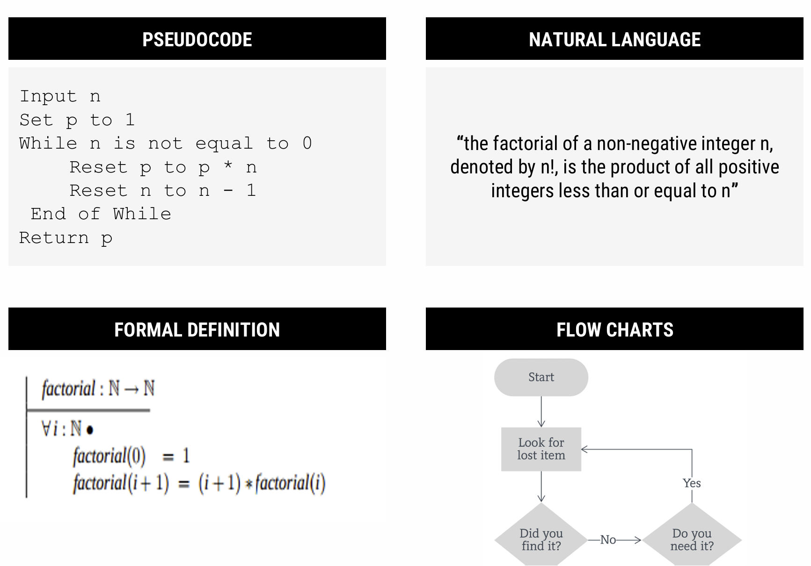
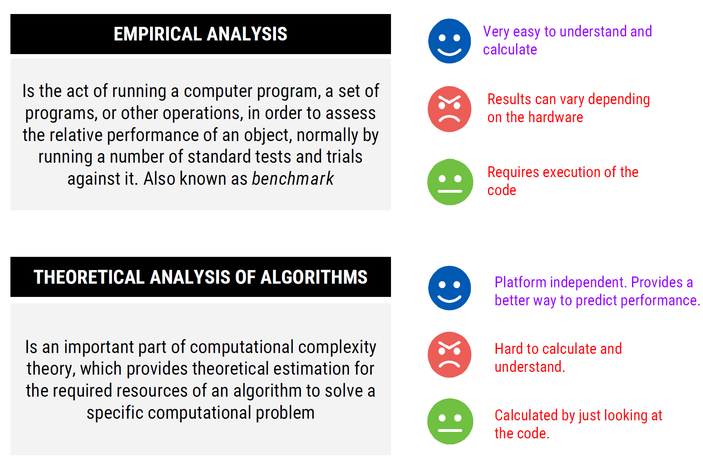
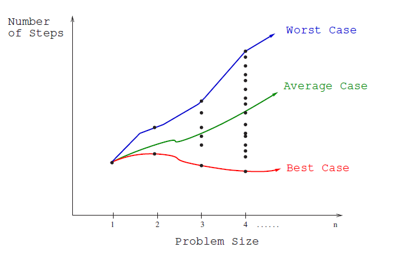
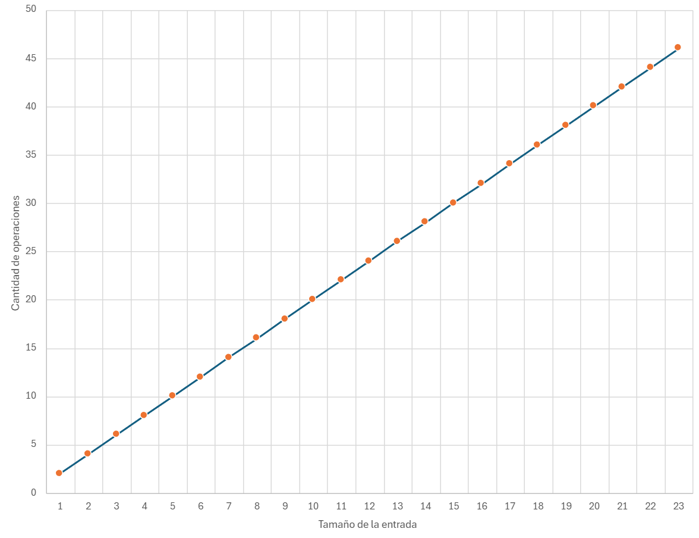
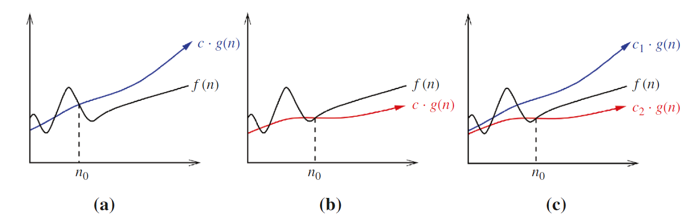
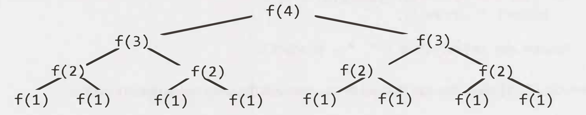

# Análisis de algoritmos
En este capítulo se aborda el tema de análisis de algoritmos. Dicho conocimiento es esencial para el diseño de algoritmos eficientes y para la toma de decisiones en el desarrollo de software. La industria ha hecho estandar las entrevistas enfocadas en algoritmos y estructuras de datos junto con análisis de complejidad.

## Definición de Algoritmo
Es un procedimiento para cumplir una tarea. Es la idea detrás de un programa. 

> **¿Programa vs Algoritmo?**
>
> Un programa es la implementación de un algoritmo en un lenguaje de
> programación.

Opera sobre un problema bien definido, toma un input y lo transforma en un output deseado. Un ejemplo cotidiano puede ser una receta de cocina:

- Input: Ingredientes
- Output: Comida
- Instrucciones: Algoritm

Las características de un algoritmo son:

- No son ambiguos: cada paso tiene un solo significado
- Entrada bien definida: Debe ser clara y consistente
- Salida bien definida: Debe indicar que tipo de output genera
- Finitos: Terminan en un tiempo determinado.
- Factibles: Pueden ser ejecutados con los recursos tecnológicos
  disponibles

Un algoritmo puede ser representado de varias formas:

- Pseudo código
- Lenguaje natural
- Definición formal
- Diagramas de flujo



## Análisis de Algoritmos
En términos simples, analizar un algoritmo es el proceso para determinar la eficiencia de un algoritmo, medida en términos de tiempo y espacio. Esto no es una práctica de tiempos recientes, sino que se remonta a los inicios de la computación. Por ejemplo, Charles Babbage observó que:

>  “As soon as an Analytic Engine exists, it will necessarily guide the future course of the science. Whenever any result is sought by its aid, the question will arise—By what course of calculation can these results be arrived at by the machine in the **shortest** time?”

De manera similar y décadas despúes, Turing observó:

> “It is convenient to have a measure of the amount of work involved in a computing process, even though it be a very crude one. We may count up the number of times that various elementary operations are applied in the whole process”

Ambos visionarios se referían a la necesidad de determinar la eficiencia de un algoritmo, con el fin de buscar la optimización del mismo o de comparar entre otros algoritmos de la misma "familia".

La realidad es que hay muchos factores que pueden afectar la eficiencia de un algoritmo. Desde aspectos tecnológicos como el hardware, el sistema operativo, el lenguaje de programación, hasta aspectos más abstractos como la complejidad del algoritmo, la cantidad de datos, la pericia del programador, entre otros. Sea cual sea el factor, se desea analizar algoritmos para:

- Predecir comportamiento de un algoritmo y el programa que lo implementa.
- Comparar distintos algoritmos para el mismo propósito.
- Conociendo el comportamiento, podemos optimizar
- Clasificar el algoritmo según complejidad.

En las siguientes secciones se abordan dos forma de análizar algoritmos: _análisis empírico_ y _análisis teórico_.

## Análisis empírico de algoritmos
El término empírico se refiere a algo que se basa en la experiencia y la observación. En el análisis empírico, se evalúa el desempeño de un algoritmo ejecutándolo, conocido como _benchmarking_. El proceso entonces sería:

1. Marcar un tiempo de inicio
1. Ejecutar un programa con un input dado
1. Marcar el tiempo final
1. Calcular el tiempo transcurrido
1. Ejecutar la prueba varias veces, calcular mediana

Aunque pueda parecer contra-intuitivo, el análisis empírico es muy utilizado en la práctica profesional dado a que hay ambientes controlados donde se puede medir el desempeño de un algoritmo.

> _Profiling_ es análisis empírico. Esta una técnica de análisis dinámico para encontrar cuellos de botella o secciones del código de un programa con mal rendimiento. Provee una visión completa: tiempo de ejecución, uso de memoria, uso de CPU, etc.

El problema clave de análisis empírico es que depende de la máquina en la que se ejecuta el algoritmo. Por lo tanto, no es posible generalizar los resultados obtenidos. No es lo mismo ejecutar un algoitmo en una máquina de hace 10 años que en una moderna.

## Análisis teórico de algoritmos
Si el análisis empírico no provee una solución a prueba del tiempo y plataforma, ¿cómo se puede analizar un algoritmo? La respuesta es el análisis teórico.

El análisis teórico asume un modelo computacional en el que:

- Cada operación simple (+, -, *, /, =, ==, etc) toma tiempo constante. Estas son las operaciones elementales a las que se refería Turing.

- Los _loops_ y subrutinas/funciones/métodos/procedimientos no son operaciones simples, sino que son la composición de muchas operaciones simples.

- Cada acceso a memoria toma tiempo constante.

Este modelo es una abstracción de la realidad, pero es perfecto para determinar el comportamiento de un algoritmo. No nos interesan los nano-segundos que toma una operación, sino el comportamiento general del algoritmo, **cual es la tasa de crecimiento de la cantidad de operaciones realizadas conforme el tamaño de la entrada**.



Utilizando este modelo, podemos encontrar una función con base en el tamaño de la entrada. Por ejemplo, para el siguiente algoritmo 

```java
int max(int[] array) {
    int max = array[0];
    for (int i = 1; i < array.length; i++) {
        if (array[i] > max) {
            max = array[i];
        }
    }
    return max;
}
```
la función que describe el tiempo que se requiere para encontrar el máximo de un arreglo de tamaño _n_ es (en el peor caso) sería

```java
int max = array[0]; ------------------------> 3T
for (int i = 1; i < array.length; i++) { ---> T + 2nT
    if (array[i] > max) { ------------------> 2T(n-1)
        max = array[i]; --------------------> 2T(n-1)
    }
}
return max; --------------------------------> T

f(n) = 6Tn + T
```

Encontrar la función a este nivel de detalle no es práctico. Imagínese el trabajo que implicaría una función como _f(n) = 12754n^2^ + 4353n + 834lg~2~n +13546_. Más adelante veremos un enfoque que nos permite simplicar el trabajo.

### Mejor, peor y caso promedio
Cuando se analiza un algoritmo, el **mejor caso** es el escenario en el que se realizan la menor cantidad de operaciones. Por ejemplo, en el algoritmo de búsqueda secuencial, el mejor caso es cuando el elemento buscado es el primer elemento del arreglo.

Al enfocarse en el **peor caso**, nos enfocamos en el escenario que causa que la mayor cantidad de operaciones se ejecute. Por ejemplo, en el algoritmo de búsqueda secuencial, el peor caso es cuando el elemento buscado está al final del arreglo.

En el **caso promedio**, tomamos todos los posibles inputs y calculamos el tiempo promedio que tomaría el algoritmo. Se suman todos los valores calculados y se divide entre el total de entradas. Por ejemplo, para el algoritmo de búsqueda secuencial, el caso promedio es cuando el elemento buscado está en cualquier posición del arreglo. 

- Si el elemento está en la posición _i_ se ejecutan _i_ operaciones.

- Promedio de comparaciones es: `(1 + 2 + 3 + ... + n) / n = n(n+1)/2`

- Promedio por elemento: `n(n+1)/2/n = (n+1)/2`



El **peor caso** es el que resulta más útil para el análisis de algoritmos. Es el que nos da una idea de la eficiencia del algoritmo en el peor escenario posible. Conociendo lo peor que puede llegar, y siendo este aceptable, podemos asumir que el algoritmo es eficiente.

### Análisis asintótico y notaciones comunes
Suponga que usted necesita enviar un archivo a un amigo en Guanacaste. ¿Qué es más rápido, enviarlo por correo/FTP o llevarlo personalmente? Asumiento que ir a Guanacaste sin presas, tarda siempre 3 horas, podríamos tener el siguiente grafico:


No importa que tan grande sea el archivo, llevarlo físicamente siempre tarda lo mismo. Por medio electrónico, el tiempo de transferencia depende del tamaño del archivo (`O(n)`) y en algún momento será mayor que las 3 horas que tarda llevarlo físicamente (`O(3)`).

_Análisis asintótico_ busca encontrar la función que represente el crecimiento con respecto a _n_, sin entrar en detalles abrumadores de la función, es decir, podemos descartar los términos de menor relevancia.

Considere la función que calculamos tiempo atrás: `f(n) = 4T + 6nT`. Enfocándose en _análisis asintótico_, se descartan los términos de menor relevancia, es decir, los que no son significativos para el crecimiento de la función. De igual forma las constantes se eliminan. Por lo tanto, dicha función se puede expresar como
 
 `f(n) = O(n)`
 
Lo que nos interesa en análisis asintótico, es la escalabilidad del algoritmo.
 
 `O(nˆ2 + n) => O(nˆ2)`
 
 `O(n + log(n)) => O(n)`
 
 `O(5 * 2ˆn + 100nˆ2) => O(2ˆn)`

Por ejemplo, considere el siguiente algoritmo:

```java
for (int i = 0; i < vector.length(); i++) {
    foo(vector[i]); //Suponga que foo es tiempo constante
}
```

La gráfica de este algoritmo sería:



En caso que la constante cambie, se la función seguirá siendo lineal. Aunque la pendiente cambien, la tendencia del algoritmo seguirá siendo la misma.

### Notación Big O, Big Omega y Big Theta

Son notaciones para describir la ejecución de un algoritmo en términos de su comportamiento asintótico.

#### Big O 
Describe el límite superior. Por ejemplo O(n^2), O(n), O(2ˆn). El algoritmo es al menos tan rápido como este límite. No sobrepasa el límite dictado por Big O. Se define formalmente como `f(n) = O(g(n))`, donde `c * g(n)` es un límite superior para `f(n)`. Es decir, existe una constante _c_ tal que `f(n) <= c * g(n)` para todo _n_ mayor que un _n_ dado.

`f(n)` es la función que representa el algoritmo con precisión, por ejemplo, `f(n) = 3n^2 - 100n + 6`. `g(n)` es el intento de clasificar nuestra función, por ejemplo, `g(n) = n^2`. La constante que multiplica a `g(n)` la podemos escoger arbitrariamente, por ejemplo, `c = 3`. Si graficamos `g(n) = 3n^2` y `f(n)`, veremos que `3n^2` es siempre mayor que `f(n)`, concluyendo que `f(n) = O(n^2)`.

#### Big Omega 
Describe el límite inferior. Es decir, el algoritmo tendrá un comportamiento al menos tan lento como este límite. Se define formalmente como `f(n) = Omega(g(n))`, donde `c * g(n)` es un límite inferior para `f(n)`. Es decir, existe una constante _c_ tal que `f(n) >= c * g(n)` para todo _n_ mayor que un _n_ dado.

Por ejemplo, dada la función `f(n) = 3n^2 - 100n + 6 = Omega(n^2)`, porque para `c = 2, 2n^2 < f(n)` cuando `n > 100`.

#### Big Theta
Describe el comportamiento exacto del algoritmo. Es decir, el algoritmo se comporta exactamente como esta función. Es el límite ajustado, _Big O_ y _Big Omega_. Se define formalmente como `f(n) = Theta(g(n))`, donde `c1 * g(n)` es un límite inferior y `c2 * g(n)` es un límite superior para `f(n)`. Es decir, existen constantes _c1_ y _c2_ tal que `c1 * g(n) <= f(n) <= c2 * g(n)` para todo _n_ mayor que un _n_ dado.

Por ejemplo, dada la función `f(n) = 3n^2 - 100n + 6 = Theta(n^2)`, porque `O(n^2)` y `Omega(n^2)` aplican..

> El mejor, peor y caso promedio, se puede describir con cualquiera de las notaciones de complejidad asintótica. Es incorrecto que _Big O_ solo se refiere al peor caso, _Big Omega_ es el mejor y _Big Theta_ es el promedio.



#### Sobre la complejidad espacial
Aunque lo visto hasta el momento se enfoca en complejidad en tiempo, la cantidad de memoria que el algoritmo requiere se puede describir con Big-O, Big-Omega y Big-Theta también.

```c
int sum(int n) {
    if (n <= 0) {
        return 0;
    }
    return n + sum(n-1);
}
```

La complejidad espacial de este algoritmo es `O(n)` dado que se requiere almacenar _n_ llamadas recursivas en la pila de llamadas.

¿Cuál es la complejidad espacial de este algoritmo?

```c
int foo(int n) {
    int sum = 0;
    for (int i = 0; i < n; i++) {
        sum += bar(i);
    }
    return sum;
}

int bar(int a, int b) {
    return a + b;
}
```

No hay llamadas anidadas => `O(1)`

#### Big-O conocidas
El siguiente gráfico muestra las complejidades comunes con las que se clasifican muchos de los algoritmos conocidos:


## Determinar la complejidad de un algoritmo
Para determinar la complejidad de un algoritmo, dependerá del tipo de instrucciones que se utilicen en el código. 

### Secuencia de instrucciones
Para código de la forma:

```
statement 1;
statement 2;
...
statement n;
```
El total se calcula sumando la complejidad de cada instrucción: 

`complejidad(statement 1) + complejidad(statement 2) + ... + complejidad(statement n)`

### If-Then-Else
Para código de la forma:

```
if (condition) {
    statement 1;
} else {
    statement 2;
}
```

La complejidad es `max(complejidad(statement 1), complejidad(statement 2))`

### Loops
Para código de la forma:

```
for (int i = 0; i < n; i++) {
    statement;
}
```

La complejidad es `n * complejidad(statement)`. Asumiento que la complejidad de `statement` es `O(1)`, la complejidad del loop es `O(n)`.

Ahora considere el siguiente código con loops secuenciales:

```
for (int i = 0; i < n; i++) {
    statement 1;
}
for (int j = 0; j < m; j++) {
    statement 2;
}
```

La complejidad es `O(n + m)`.

### Anidamiento
Para código de la forma:

```
for (int i = 0; i < n; i++) {
    for (int j = 0; j < m; j++) {
        statement;
    }
}
```

La complejidad es `n * m * complejidad(statement)`. Si ambos loops son de tamaño _n_, la complejidad es `O(n^2)`.

Conforme se anidan más loops, la complejidad crece exponencialmente. Por ejemplo, si se anidan 3 loops, la complejidad es `O(n^3)`.

### Complejidad logarítmica
Para código de la forma:

```
int i = n;
while (i > 0) {
    statement;
    i = i / 2;
}
```

La complejidad es `O(log(n))`. En cada iteración, _i_ se divide por 2. ¿Cómo se llega a esta conclusión?

- En la primera iteración, _i_ es _n_
- En la segunda iteración, _i_ es _n/2_
- En la tercera iteración, _i_ es _n/4_

En general, _i_ es _n/2^k^_ en la _k_-ésima iteración. La complejidad es `O(log2(n))` porque _k_ es el número de veces que se puede dividir _n_ por 2 hasta llegar a 1.

### Recursión
Para la recursión no hay una regla general, dado que depende de lo que haga el código. Por ejemplo, para el siguiente código:

```
int foo(int n) {
    if (n <= 0) {
        return 0;
    }
    return n + foo(n-1);
}
```

La complejidad es `O(n)`. La función se llama _n_ veces, decrementando _n_ en cada llamada.

Para el siguiente código:

```
int foo(int n) {
    if (n <= 0) {
        return 0;
    }
    return n + foo(n-1) + foo(n-1);
}
```

La complejidad es `O(2^n)`. En cada llamada, se hacen dos llamadas recursivas. ¿Cómo se llega a esta conclusión?

Gráficamente, se puede ver que la cantidad de llamadas se duplica en cada nivel de la recursión, como se muestra en la siguiente figura:



Tabulando los datos anteriores:

| Nivel | # de Nodos |         |
|-------|------------|---------|
| 0     | 1          | 2^0     |
| 1     | 2          | 2^1     |
| 2     | 4          | 2^2     |
| 3     | 8          | 2^3     |
| 4     | 16         | 2^4     |

Por lo tanto, hay `2^(n+1)-1` nodos y la complejidad es `O(2^n)`. En muchos casos, la complejidad recursiva se puede generalizar como `O(ramas^profundidad)`, donde _branches_ es el número de llamadas recursivas y _depth_ es la profundidad de la recursión.

### Más ejemplos
#### Ejemplo #1
Para el siguiente código:

```c
void foo(int[] array) { 
    int sum = 0; 
    int product = 1; 
    for (inti= 0; i < array.length; i++) { 
        sum += array[i); 
    } 
    for (int i= 0; i < array.length; i++) { 
        product*= array[i]; 
    } 
    System.out.println(sum + ", " + product)	
}
```
La complejidad sería `O(n)`. Iterar dos veces el arreglo no importa puesto que sería `O(2n) = O(n)`. 

#### Ejemplo #2
Para el siguiente código:

```c
void printUnorderedPairs(int[] array) { 
    for (int i= 0; i < array.length; i++) { 
        for (int j = i + 1; j < array.length; j++) { 
            System.out.println(array[i] + "," + array[j]); 
        } 
    }
}
```
Se realizan `(N-1) + (N-2) + ... + 1 = N(N-1)/2` operaciones. La complejidad es `O(n^2)`.

## Revisitando los algorimos y estructuras de datos


## Referencias
- Skiena S. 2020. The Algorithm Design Manual. Springer.
- https://www.geeksforgeeks.org/what-is-algorithm-and-why-analysis-of-it-is-important/
- Laakmann Gayle L. 2020. Cracking the Coding Interview. 6th Edition. CareerCup.