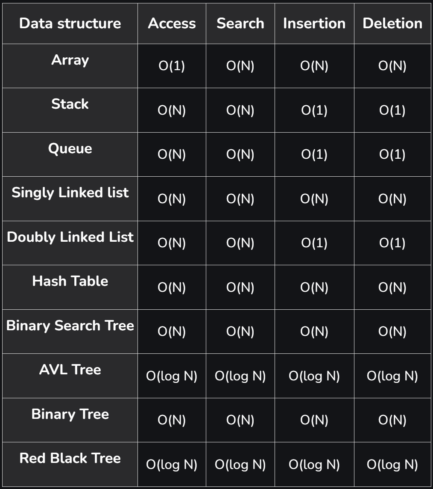

# Análisis de algoritmos
En este capítulo se aborda el tema de análisis de algoritmos. Dicho conocimiento es esencial para el diseño de algoritmos eficientes y para la toma de decisiones en el desarrollo de software. La industria ha hecho estándar las entrevistas enfocadas en algoritmos y estructuras de datos junto con análisis de complejidad.

## Definición de Algoritmo
Es un procedimiento para cumplir una tarea. Es la idea detrás de un programa. 

> **¿Programa vs Algoritmo?**
>
> Un programa es la implementación de un algoritmo en un lenguaje de
> programación.

Opera sobre un problema bien definido, toma un input y lo transforma en un output deseado. Un ejemplo cotidiano puede ser una receta de cocina:

- Input: Ingredientes
- Output: Comida
- Instrucciones: Algoritmo

Las características de un algoritmo son:

- No son ambiguos: cada paso tiene un solo significado
- Entrada bien definida: Debe ser clara y consistente
- Salida bien definida: Debe indicar qué tipo de output genera
- Finitos: Terminan en un tiempo determinado.
- Factibles: Pueden ser ejecutados con los recursos tecnológicos
  disponibles

Un algoritmo puede ser representado de varias formas:

- Pseudo código
- Lenguaje natural
- Definición formal
- Diagramas de flujo


## Análisis de Algoritmos
En términos simples, analizar un algoritmo es el proceso para determinar la eficiencia de un algoritmo, medida en términos de tiempo y espacio. Esto no es una práctica de tiempos recientes, sino que se remonta a los inicios de la computación. Por ejemplo, Charles Babbage observó que:

>  “As soon as an Analytic Engine exists, it will necessarily guide the future course of the science. Whenever any result is sought by its aid, the question will arise—By what course of calculation can these results be arrived at by the machine in the **shortest** time?”

De manera similar y décadas después, Turing observó:

> “It is convenient to have a measure of the amount of work involved in a computing process, even though it be a very crude one. We may count up the number of times that various elementary operations are applied in the whole process”

Ambos visionarios se referían a la necesidad de determinar la eficiencia de un algoritmo, con el fin de buscar la optimización del mismo o de comparar entre otros algoritmos de la misma "familia".

La realidad es que hay muchos factores que pueden afectar la eficiencia de un algoritmo. Desde aspectos tecnológicos como el hardware, el sistema operativo, el lenguaje de programación, hasta aspectos más abstractos como la complejidad del algoritmo, la cantidad de datos, la pericia del programador, entre otros. Sea cual sea el factor, se desea analizar algoritmos para:

- Predecir comportamiento de un algoritmo y el programa que lo implementa.
- Comparar distintos algoritmos para el mismo propósito.
- Conociendo el comportamiento, podemos optimizar
- Clasificar el algoritmo según complejidad.

En las siguientes secciones se abordan dos formas de analizar algoritmos: _análisis empírico_ y _análisis teórico_.

## Análisis empírico de algoritmos
El término empírico se refiere a algo que se basa en la experiencia y la observación. En el análisis empírico, se evalúa el desempeño de un algoritmo ejecutándolo, conocido como _benchmarking_. El proceso entonces sería:

1. Marcar un tiempo de inicio
1. Ejecutar un programa con un input dado
1. Marcar el tiempo final
1. Calcular el tiempo transcurrido
1. Ejecutar la prueba varias veces, calcular mediana

Aunque pueda parecer contra-intuitivo, el análisis empírico es muy utilizado en la práctica profesional dado que hay ambientes controlados donde se puede medir el desempeño de un algoritmo.

> _Profiling_ es análisis empírico. Esta es una técnica de análisis dinámico para encontrar cuellos de botella o secciones del código de un programa con mal rendimiento. Provee una visión completa: tiempo de ejecución, uso de memoria, uso de CPU, etc.

El problema clave de análisis empírico es que depende de la máquina en la que se ejecuta el algoritmo. Por lo tanto, no es posible generalizar los resultados obtenidos. No es lo mismo ejecutar un algoritmo en una máquina de hace 10 años que en una moderna.

## Análisis teórico de algoritmos
Si el análisis empírico no provee una solución a prueba del tiempo y plataforma, ¿cómo se puede analizar un algoritmo? La respuesta es el análisis teórico.

El análisis teórico asume un modelo computacional en el que:

- Cada operación simple (+, -, *, /, =, ==, etc) toma tiempo constante. Estas son las operaciones elementales a las que se refería Turing.

- Los _loops_ y subrutinas/funciones/métodos/procedimientos no son operaciones simples, sino que son la composición de muchas operaciones simples.

- Cada acceso a memoria toma tiempo constante.

Este modelo es una abstracción de la realidad, pero es perfecto para determinar el comportamiento de un algoritmo. No nos interesan los nano-segundos que toma una operación, sino el comportamiento general del algoritmo, **cual es la tasa de crecimiento de la cantidad de operaciones realizadas conforme el tamaño de la entrada**.


Utilizando este modelo, podemos encontrar una función con base en el tamaño de la entrada. Por ejemplo, para el siguiente algoritmo 

```java
int max(int[] array) {
    int max = array[0];
    for (int i = 1; i < array.length; i++) {
        if (array[i] > max) {
            max = array[i];
        }
    }
    return max;
}
```
la función que describe el tiempo que se requiere para encontrar el máximo de un arreglo de tamaño _n_ es (en el peor caso) sería

```java
int max = array[0]; ------------------------> 3T
for (int i = 1; i < array.length; i++) { ---> T + 2nT
    if (array[i] > max) { ------------------> 2T(n-1)
        max = array[i]; --------------------> 2T(n-1)
    }
}
return max; --------------------------------> T

f(n) = 6nT + T
```

Encontrar la función a este nivel de detalle no es práctico. Imagínese el trabajo que implicaría una función como _f(n) = 12754n^2^ + 4353n + 834lg~2~n +13546_. Más adelante veremos un enfoque que nos permite simplificar el trabajo.

### Mejor, peor y caso promedio
Cuando se analiza un algoritmo, el **mejor caso** es el escenario en el que se realizan la menor cantidad de operaciones. Por ejemplo, en el algoritmo de búsqueda secuencial, el mejor caso es cuando el elemento buscado es el primer elemento del arreglo.

Al enfocarse en el **peor caso**, nos enfocamos en el escenario que causa que la mayor cantidad de operaciones se ejecute. Por ejemplo, en el algoritmo de búsqueda secuencial, el peor caso es cuando el elemento buscado está al final del arreglo.

En el **caso promedio**, tomamos todos los posibles inputs y calculamos el tiempo promedio que tomaría el algoritmo. Se suman todos los valores calculados y se divide entre el total de entradas. Por ejemplo, para el algoritmo de búsqueda secuencial, el caso promedio es cuando el elemento buscado está en cualquier posición del arreglo. 

- Si el elemento está en la posición _i_ se ejecutan _i_ operaciones.

- Suma de comparaciones es: `1 + 2 + 3 + ... + n = n(n+1)/2`

- Promedio por elemento: `n(n+1)/2/n = (n+1)/2`


El **peor caso** es el que resulta más útil para el análisis de algoritmos. Es el que nos da una idea de la eficiencia del algoritmo en el peor escenario posible. Conociendo lo peor que puede llegar, y siendo este aceptable, podemos asumir que el algoritmo es eficiente.

### Análisis asintótico y notaciones comunes
Suponga que usted necesita enviar un archivo a un amigo en Guanacaste. ¿Qué es más rápido, enviarlo por correo/FTP o llevarlo personalmente? Asumiendo que ir a Guanacaste sin presas, tarda siempre 3 horas, podríamos tener el siguiente gráfico:


No importa qué tan grande sea el archivo, llevarlo físicamente siempre tarda lo mismo. Por medio electrónico, el tiempo de transferencia depende del tamaño del archivo (`O(n)`) y en algún momento será mayor que las 3 horas que tarda llevarlo físicamente (`O(1)`).

_Análisis asintótico_ busca encontrar la función que represente el crecimiento con respecto a _n_, sin entrar en detalles abrumadores de la función, es decir, podemos descartar los términos de menor relevancia.

Considere la función que calculamos tiempo atrás: `f(n) = 6nT + T`. Enfocándose en _análisis asintótico_, se descartan los términos de menor relevancia, es decir, los que no son significativos para el crecimiento de la función. De igual forma las constantes se eliminan. Por lo tanto, dicha función se puede expresar como
 
 `f(n) = O(n)`
 
Lo que nos interesa en análisis asintótico, es la escalabilidad del algoritmo.
 
 `O(n^2 + n)` => `O(n^2)`
 
 `O(n + log(n))` => `O(n)`
 
 `O(5 * 2^n + 100n^2)` => `O(2^n)`

Por ejemplo, considere el siguiente algoritmo:

```java
for (int i = 0; i < vector.length(); i++) {
    foo(vector[i]); //Suponga que foo es tiempo constante
}
```

La gráfica de este algoritmo sería:


En caso que la constante cambie, la función seguirá siendo lineal, aunque la pendiente cambie, la tendencia del algoritmo seguirá siendo la misma.

### Notación Big O, Big Omega y Big Theta

Son notaciones para describir la ejecución de un algoritmo en términos de su comportamiento asintótico.

#### Big O 
Describe el límite superior. Por ejemplo `O(n^2)`, `O(n)`, `O(2^n)`. El algoritmo no es más lento que esta cota (es una cota superior). No sobrepasa el límite dictado por Big O. Se define formalmente como `f(n) = O(g(n))`, donde `c * g(n)` es un límite superior para `f(n)`. Es decir, existe una constante _c_ tal que `f(n) <= c * g(n)` para todo _n_ mayor que un _n_ dado.

`f(n)` es la función que representa el algoritmo con precisión, por ejemplo, `f(n) = 3n^2 - 100n + 6`. `g(n)` es el intento de clasificar nuestra función, por ejemplo, `g(n) = n^2`. La constante que multiplica a `g(n)` la podemos escoger arbitrariamente, por ejemplo, `c = 3`. Si graficamos `g(n) = 3n^2` y `f(n)`, veremos que `3n^2` es siempre mayor que `f(n)`, concluyendo que `f(n) = O(n^2)`.

#### Big Omega 
Describe el límite inferior. Es decir, el algoritmo tendrá un comportamiento al menos tan lento como este límite. Se define formalmente como `f(n) = Omega(g(n))`, donde `c * g(n)` es un límite inferior para `f(n)`. Es decir, existe una constante _c_ tal que `f(n) >= c * g(n)` para todo _n_ mayor que un _n_ dado.

Por ejemplo, dada la función `f(n) = 3n^2 - 100n + 6 = Omega(n^2)`, porque para `c = 2, 2n^2 < f(n)` cuando `n > 100`.

#### Big Theta
Describe el comportamiento exacto del algoritmo. Es decir, el algoritmo se comporta exactamente como esta función. Es el límite ajustado, _Big O_ y _Big Omega_. Se define formalmente como `f(n) = Theta(g(n))`, donde `c1 * g(n)` es un límite inferior y `c2 * g(n)` es un límite superior para `f(n)`. Es decir, existen constantes _c1_ y _c2_ tal que `c1 * g(n) <= f(n) <= c2 * g(n)` para todo _n_ mayor que un _n_ dado.

Por ejemplo, dada la función `f(n) = 3n^2 - 100n + 6 = Theta(n^2)`, porque `O(n^2)` y `Omega(n^2)` aplican.

> El mejor, peor y caso promedio, se puede describir con cualquiera de las notaciones de complejidad asintótica. Es incorrecto que _Big O_ solo se refiere al peor caso, _Big Omega_ es el mejor y _Big Theta_ es el promedio.


#### Sobre la complejidad espacial
Aunque lo visto hasta el momento se enfoca en complejidad en tiempo, la cantidad de memoria que el algoritmo requiere se puede describir con Big-O, Big-Omega y Big-Theta también.

```c
int sum(int n) {
    if (n <= 0) {
        return 0;
    }
    return n + sum(n-1);
}
```

La complejidad espacial de este algoritmo es `O(n)` dado que se requiere almacenar _n_ llamadas recursivas en la pila de llamadas.

¿Cuál es la complejidad espacial de este algoritmo?

```c
int foo(int n) {
    int sum = 0;
    for (int i = 0; i < n; i++) {
        sum += bar(i);
    }
    return sum;
}

int bar(int a, int b) {
    return a + b;
}
```

No hay llamadas anidadas => `O(1)`

#### Big-O conocidas
El siguiente gráfico muestra las complejidades comunes con las que se clasifican muchos de los algoritmos conocidos:


## Determinar la complejidad de un algoritmo
Para determinar la complejidad de un algoritmo, dependerá del tipo de instrucciones que se utilicen en el código. 

### Secuencia de instrucciones
Para código de la forma:

```
statement 1;
statement 2;
...
statement n;
```
El total se calcula sumando la complejidad de cada instrucción: 

`complejidad(statement 1) + complejidad(statement 2) + ... + complejidad(statement n)`

### If-Then-Else
Para código de la forma:

```
if (condition) {
    statement 1;
} else {
    statement 2;
}
```

La complejidad es `max(complejidad(statement 1), complejidad(statement 2))`

### Loops
Para código de la forma:

```
for (int i = 0; i < n; i++) {
    statement;
}
```

La complejidad es `n * complejidad(statement)`. Asumiendo que la complejidad de `statement` es `O(1)`, la complejidad del loop es `O(n)`.

Ahora considere el siguiente código con loops secuenciales:

```
for (int i = 0; i < n; i++) {
    statement 1;
}
for (int j = 0; j < m; j++) {
    statement 2;
}
```

La complejidad es `O(n + m)`.

### Anidamiento
Para código de la forma:

```
for (int i = 0; i < n; i++) {
    for (int j = 0; j < m; j++) {
        statement;
    }
}
```

La complejidad es `n * m * complejidad(statement)`. Si ambos loops son de tamaño _n_, la complejidad es `O(n^2)`.

Conforme se anidan más loops, el exponente crece, pero la complejidad sigue siendo polinómica `O(n^k)` (para _k_ fijo); el crecimiento exponencial correspondería a `O(k^n)`. Por ejemplo, si se anidan 3 loops, la complejidad es `O(n^3)`.

### Complejidad logarítmica
Para código de la forma:

```
int i = n;
while (i > 0) {
    statement;
    i = i / 2;
}
```

La complejidad es `O(log(n))`. En cada iteración, _i_ se divide por 2. ¿Cómo se llega a esta conclusión?

- En la primera iteración, _i_ es _n_
- En la segunda iteración, _i_ es _n/2_
- En la tercera iteración, _i_ es _n/4_

En general, _i_ es _n/2^k^_ en la _k_-ésima iteración. La complejidad es `O(log2(n))` porque _k_ es el número de veces que se puede dividir _n_ por 2 hasta llegar a 1.

### Recursión
Para la recursión no hay una regla general, dado que depende de lo que haga el código. Por ejemplo, para el siguiente código:

```
int foo(int n) {
    if (n <= 0) {
        return 0;
    }
    return n + foo(n-1);
}
```

La complejidad es `O(n)`. La función se llama _n_ veces, decrementando _n_ en cada llamada.

Para el siguiente código:

```
int foo(int n) {
    if (n <= 0) {
        return 0;
    }
    return n + foo(n-1) + foo(n-1);
}
```

La complejidad es `O(2^n)`. En cada llamada, se hacen dos llamadas recursivas. ¿Cómo se llega a esta conclusión?

Gráficamente, se puede ver que la cantidad de llamadas se duplica en cada nivel de la recursión, como se muestra en la siguiente figura:


Tabulando los datos anteriores:

| Nivel | # de Nodos |         |
|-------|------------|---------|
| 0     | 1          | 2^0     |
| 1     | 2          | 2^1     |
| 2     | 4          | 2^2     |
| 3     | 8          | 2^3     |
| 4     | 16         | 2^4     |

Por lo tanto, hay `2^(n+1)-1` nodos y la complejidad es `O(2^n)`. En muchos casos, la complejidad recursiva se puede generalizar como `O(ramas^profundidad)`, donde _branches_ es el número de llamadas recursivas y _depth_ es la profundidad de la recursión.

### Más ejemplos
#### Ejemplo #1
Para el siguiente código:

```c
void foo(int[] array) { 
    int sum = 0; 
    int product = 1; 
    for (int i = 0; i < array.length; i++) { 
        sum += array[i]; 
    } 
    for (int i= 0; i < array.length; i++) { 
        product*= array[i]; 
    } 
    System.out.println(sum + ", " + product)	
}
```
La complejidad sería `O(n)`. Iterar dos veces el arreglo no importa puesto que sería `O(2n) = O(n)`. 

#### Ejemplo #2
Para el siguiente código:

```c
void printUnorderedPairs(int[] array) { 
    for (int i= 0; i < array.length; i++) { 
        for (int j = i + 1; j < array.length; j++) { 
            System.out.println(array[i] + "," + array[j]); 
        } 
    }
}
```
Se realizan `(N-1) + (N-2) + ... + 1 = N(N-1)/2` operaciones. La complejidad es `O(n^2)`.

#### Ejemplo #3
El siguiente código:
```c
void printUnorderedPairs(int[] arrayA, int[] arrayB) { 
    for (inti= 0; i < arrayA.length; i++) { 
        for (int j = 0; j < arrayB.length; j++) { 
            if (arrayA[i] < arrayB[j]) { 
                System.out.println(arrayA[i] + "," + arrayB[j]); 
            } 
        } 
    } 
} 
```
Tiene una complejidad de `O(ab)`, donde _a_ es el tamaño de _arrayA_ y _b_ es el tamaño de _arrayB_.

#### Ejemplo #4
El siguiente código:
```c
void printUnorderedPairs(int[] arrayA, int[] arrayB) { 
    for (int i= 0; i < arrayA.length; i++) { 
        for (int j = 0; j < arrayB.length; j++) { 
            for (int k = 0; k < 100000; k++) { 
                System.out.println(arrayA[i] + "," + arrayB[j]); 
            } 
        } 
    } 
} 
```
Tiene una complejidad de `O(ab)`, donde _a_ es el tamaño de _arrayA_ y _b_ es el tamaño de _arrayB_. El loop interno no afecta la complejidad dado que es `O(100000)`.

#### Ejemplo #5
```c
void reverse(int[] array) { 
    for (int i= 0; i <array.length/ 2; i++) { 
        int other= array.length - i - 1; 
        int temp= array[i]; 
        array[i] = array[other]; 
        array[other] = temp; 
    } 
}
```
En este caso, se recorre solo la mitad del arreglo. La complejidad es `O(n/2) = O(n)`.

#### Ejemplo #6
Para sumar todos los nodos de un BST:

```c	
int sum(Node node) { 
    if (node == null) { 
        return 0; 
    } 
    return sum(node.left) + node.value + sum(node.right); 
}
```
Dado que se recorren todos los nodos del árbol, la complejidad es `O(n)`.

#### Ejemplo #7
```c
boolean isPrime(int n) { 
    for (int x = 2; x <= sqrt(n); x++) { 
        if (n % X == 0) { 
            return false; 
        } 
    } 
    return true; 
} 
```
La complejidad es `O(sqrt(n))`.

#### Ejemplo #8
```c
int fib(int n) { 
    if (n <= 0) return 0; 
    else if (n == 1) return 1; 
    return fib(n - 1) + fib(n - 2); 
} 
```
La complejidad es `O(2^n)`.

#### Ejemplo #9
```c
int factorial(int n) { 
    if (n < 0) { 
        return -1; 
    } else if (n == 0) {
        return 1; 
    } else { 
        return n * factorial(n - 1); 
    }
} 
```
La complejidad es `O(n)`. Se recorren _n_ llamadas recursivas.

## Recurrencias
En la sección de [Recursión](#recursión) vimos que no existe una regla mecánica para determinar la complejidad de un algoritmo recursivo: depende de lo que hace cada llamada. La herramienta formal para analizar este tipo de algoritmos es la **relación de recurrencia**.

Una **relación de recurrencia** (o simplemente _recurrencia_) es una ecuación que define una función en términos de sus propios valores sobre entradas más pequeñas. Cuando analizamos un algoritmo recursivo, definimos `T(n)` como el tiempo (cantidad de operaciones) que toma resolver un problema de tamaño _n_, y lo expresamos en función del costo de las llamadas recursivas más el trabajo realizado fuera de ellas.

Por ejemplo, _merge sort_ divide el arreglo en dos mitades, ordena cada mitad recursivamente y luego mezcla (_merge_) ambas mitades en tiempo lineal. Su recurrencia es:

```text
T(n) = 2 T(n/2) + O(n)
T(1) = O(1)
```

Donde:

- `2 T(n/2)` representa las **dos llamadas recursivas**, cada una sobre un subproblema de tamaño _n/2_.
- `O(n)` es el **costo de combinar** las soluciones (el _merge_).
- `T(1) = O(1)` es el **caso base**: ordenar un solo elemento es trivial.

Resolver una recurrencia significa encontrar una **forma cerrada** (no recursiva) para `T(n)`, que luego expresamos en notación asintótica. A continuación se describen tres métodos clásicos: **sustitución**, **árbol de recursión** y el **teorema maestro** (desarrollado en su propia sección más adelante).

### Método de sustitución
El método de **sustitución** consiste en dos pasos:

1. **Adivinar** la forma de la solución (una cota como `O(n log n)`).
2. **Demostrar por inducción matemática** que la cota es correcta, encontrando las constantes apropiadas.

La intuición para "adivinar" suele venir de resolver casos pequeños, de la experiencia, o de un árbol de recursión. Por ejemplo, para `T(n) = 2 T(n/2) + n`, adivinamos `T(n) = O(n log n)`, es decir, que existe una constante `c` tal que `T(n) <= c * n * log(n)`.

**Paso inductivo** (asumiendo que la cota se cumple para entradas menores, en particular para _n/2_):

```text
T(n) =  2 T(n/2) + n
     <= 2 (c * (n/2) * log(n/2)) + n        (hipótesis inductiva)
     =  c * n * log(n/2) + n
     =  c * n * (log(n) - 1) + n
     =  c * n * log(n) - c * n + n
     <= c * n * log(n)                       (si c >= 1, pues -c*n + n <= 0)
```

Como la desigualdad se sostiene para `c >= 1`, concluimos que `T(n) = O(n log n)`.

> El método de sustitución es poderoso porque sirve para **probar** una cota, pero requiere intuición previa para escoger una buena conjetura. Una conjetura incorrecta (demasiado holgada o demasiado ajustada) hará fallar la inducción.

### Árbol de recursión
Un **árbol de recursión** es una representación visual donde cada nodo corresponde al costo de un subproblema. Es una excelente forma de **generar una buena conjetura** que luego se verifica por sustitución, o de obtener la respuesta directamente sumando el costo de todos los niveles.

La idea es:

1. Cada nodo se etiqueta con el **costo del trabajo no recursivo** de esa llamada (el término `f(n)`).
2. Los hijos de un nodo son las llamadas recursivas que genera.
3. Se suma el costo de **cada nivel** del árbol.
4. Se multiplica el costo por nivel por la **cantidad de niveles** (la altura del árbol).

#### Ejemplo trabajado: merge sort
Apliquemos el árbol de recursión a `T(n) = 2 T(n/2) + O(n)`. Tomemos el término no recursivo como exactamente `c * n` para alguna constante `c`:

```text
Nivel                          Costo por nodo        Costo del nivel
-----------------------------------------------------------------------
0:              cn                                         cn
               /  \
1:         cn/2    cn/2                              cn/2 + cn/2 = cn
           /  \    /  \
2:    cn/4 cn/4 cn/4 cn/4                  4 * (cn/4)        = cn
        ...           ...
k:   c   c   c  ...  c   (n hojas, costo c c/u)   n * c       ~ cn
-----------------------------------------------------------------------
```

Observaciones clave:

- En cada nivel, el costo total es `cn`. Aunque el tamaño de cada subproblema se reduce a la mitad, el **número de subproblemas se duplica**, de modo que el producto se mantiene constante por nivel.
- El tamaño del subproblema en el nivel _k_ es `n / 2^k`. El árbol llega al caso base cuando `n / 2^k = 1`, es decir, cuando `k = log2(n)`. Por lo tanto hay `log2(n) + 1` niveles.

Tabulando el costo por nivel:

| Nivel _k_ | # de nodos | Tamaño por nodo | Costo por nodo | Costo del nivel |
|-----------|------------|-----------------|----------------|-----------------|
| 0         | 1          | _n_             | `cn`           | `cn`            |
| 1         | 2          | _n/2_           | `cn/2`         | `cn`            |
| 2         | 4          | _n/4_           | `cn/4`         | `cn`            |
| ...       | ...        | ...             | ...            | ...             |
| log₂_n_   | _n_        | 1               | `c`            | `cn`            |

El costo total es la suma de todos los niveles:

```text
T(n) = (costo por nivel) * (número de niveles)
     = cn * (log2(n) + 1)
     = O(n log n)
```

De esta forma, el árbol de recursión nos da directamente que `T(n) = 2 T(n/2) + O(n)` es `O(n log n)`, confirmando el resultado obtenido por sustitución.

> El árbol de recursión es una **herramienta de intuición**: nos ayuda a "ver" cómo se distribuye el trabajo. Para una demostración rigurosa, conviene verificar la conjetura con el método de sustitución o aplicar el teorema maestro.

## Teorema maestro
El **teorema maestro** (_master theorem_) es una "receta" que resuelve directamente muchas recurrencias de la forma _divide y vencerás_, sin necesidad de árboles ni inducción. Aplica a recurrencias de la forma:

```text
T(n) = a * T(n/b) + f(n)
```

con `a >= 1` y `b > 1` constantes, donde:

- `a` es el **número de subproblemas** en cada paso recursivo.
- `n/b` es el **tamaño de cada subproblema** (cada uno es una fracción _1/b_ del original).
- `f(n)` es el **costo del trabajo realizado fuera de las llamadas recursivas** (dividir el problema y combinar las soluciones).

La idea central es **comparar `f(n)` con la función `n^(log_b a)`**. Este exponente, `log_b a`, representa el costo de las hojas del árbol de recursión (el trabajo en el caso base). Según cuál de las dos funciones "domine", caemos en uno de tres casos:

### Los tres casos

| Caso | Condición sobre `f(n)` | Resultado `T(n)` | Quién domina |
|------|------------------------|------------------|--------------|
| 1    | `f(n) = O(n^(log_b a − ε))` para algún `ε > 0` | `Θ(n^(log_b a))` | Las hojas (la recursión) |
| 2    | `f(n) = Θ(n^(log_b a))` | `Θ(n^(log_b a) · log n)` | Equilibrio entre niveles |
| 3    | `f(n) = Ω(n^(log_b a + ε))` para algún `ε > 0` y se cumple la condición de regularidad | `Θ(f(n))` | La raíz (el trabajo de combinar) |

- **Caso 1**: `f(n)` crece **más lento** (polinómicamente) que `n^(log_b a)`. El costo está dominado por el trabajo en las hojas, así que `T(n) = Θ(n^(log_b a))`.

- **Caso 2**: `f(n)` crece **al mismo ritmo** que `n^(log_b a)`. El costo se reparte por igual entre los `log n` niveles del árbol, por lo que se agrega un factor logarítmico: `T(n) = Θ(n^(log_b a) · log n)`.

- **Caso 3**: `f(n)` crece **más rápido** (polinómicamente) que `n^(log_b a)`. El costo está dominado por el trabajo en la raíz, así que `T(n) = Θ(f(n))`. Además debe cumplirse la **condición de regularidad**: `a · f(n/b) <= k · f(n)` para alguna constante `k < 1` y _n_ suficientemente grande (esto garantiza que el trabajo decrece geométricamente hacia las hojas).

### Ejemplos resueltos

#### Búsqueda binaria
```cpp
// Retorna el índice de 'objetivo' en 'v' (ordenado) o -1 si no está.
int busquedaBinaria(const std::vector<int>& v, int objetivo) {
    int lo = 0, hi = static_cast<int>(v.size()) - 1;
    while (lo <= hi) {
        int mid = lo + (hi - lo) / 2;
        if (v[mid] == objetivo) return mid;
        else if (v[mid] < objetivo) lo = mid + 1; // descarta mitad izquierda
        else hi = mid - 1;                         // descarta mitad derecha
    }
    return -1;
}
```

La versión recursiva descarta la mitad del arreglo y hace una sola llamada recursiva, con trabajo constante por nivel:

```text
T(n) = T(n/2) + O(1)   =>   a = 1, b = 2, f(n) = O(1)
```

Calculamos `n^(log_b a) = n^(log_2 1) = n^0 = 1`. Comparando `f(n) = O(1) = Θ(1) = Θ(n^0)`, estamos en el **Caso 2** (`f(n)` crece igual que `n^(log_b a)`):

```text
T(n) = Θ(n^0 · log n) = Θ(log n)   =>   O(log n)
```

#### Merge sort
```text
T(n) = 2 T(n/2) + O(n)   =>   a = 2, b = 2, f(n) = O(n)
```

Calculamos `n^(log_b a) = n^(log_2 2) = n^1 = n`. Comparando `f(n) = O(n) = Θ(n)`, estamos en el **Caso 2**:

```text
T(n) = Θ(n^1 · log n) = Θ(n log n)   =>   O(n log n)
```

Esto coincide con lo obtenido por el árbol de recursión y por sustitución.

#### Recurrencia con caso 1
```text
T(n) = 4 T(n/2) + O(n)   =>   a = 4, b = 2, f(n) = O(n)
```

Calculamos `n^(log_b a) = n^(log_2 4) = n^2`. Comparando `f(n) = O(n)` con `n^2`: como `n` crece **más lento** que `n^2` (concretamente `f(n) = O(n^(2 − 1))`, con `ε = 1`), estamos en el **Caso 1**:

```text
T(n) = Θ(n^2)   =>   O(n^2)
```

Tabla resumen de los ejemplos:

| Recurrencia                | `a` | `b` | `f(n)` | `n^(log_b a)` | Caso | `T(n)`        |
|----------------------------|-----|-----|--------|---------------|------|---------------|
| `T(n) = T(n/2) + O(1)`     | 1   | 2   | `O(1)` | `n^0 = 1`     | 2    | `O(log n)`    |
| `T(n) = 2 T(n/2) + O(n)`   | 2   | 2   | `O(n)` | `n^1 = n`     | 2    | `O(n log n)`  |
| `T(n) = 4 T(n/2) + O(n)`   | 4   | 2   | `O(n)` | `n^2`         | 1    | `O(n^2)`      |

> **El teorema maestro no cubre todos los casos.** Existen "huecos" entre los casos: por ejemplo, cuando `f(n)` está entre `n^(log_b a)` y `n^(log_b a + ε)` pero la diferencia no es polinómica (como `f(n) = n log n` frente a `n`), ninguno de los tres casos aplica. También quedan fuera las recurrencias donde los subproblemas no tienen el mismo tamaño (por ejemplo `T(n) = T(n/3) + T(2n/3) + n`). Para esos casos se recurre al método de sustitución, al árbol de recursión, o a variantes más generales (como el método de Akra-Bazzi).

## Análisis amortizado
Hasta ahora hemos analizado **operaciones individuales** considerando su peor caso. Sin embargo, a veces una operación es **ocasionalmente costosa** pero **barata la mayor parte del tiempo**, de modo que mirar solo el peor caso de una operación aislada nos da una imagen pesimista y poco realista.

El **análisis amortizado** estudia el **costo promedio por operación en el peor caso, considerado sobre una secuencia completa de operaciones**. La palabra clave es _secuencia_: no se trata de un promedio probabilístico (como el caso promedio, que asume una distribución de entradas), sino de **garantizar** que cualquier secuencia de _m_ operaciones cueste a lo sumo cierto total, repartido entre las _m_ operaciones.

> **Amortizado ≠ caso promedio.** El caso promedio asume una distribución de probabilidad sobre las entradas. El análisis amortizado **no asume nada probabilístico**: da una garantía del peor caso sobre el costo total de una secuencia, sin importar cuál secuencia sea.

### Los tres métodos
Existen tres técnicas clásicas para el análisis amortizado:

| Método | Idea central |
|--------|--------------|
| **Agregado** (_aggregate_) | Se calcula el costo total `T(m)` de una secuencia de _m_ operaciones en el peor caso, y el costo amortizado por operación es `T(m) / m`. |
| **Contable** (_accounting_) | A cada operación se le asigna un **costo amortizado** (un "cobro"). Si el cobro excede el costo real, el sobrante se guarda como **crédito**; las operaciones costosas "pagan" usando el crédito acumulado. El crédito nunca debe ser negativo. |
| **Potencial** (_potential_) | Generalización del método contable. Se define una **función de potencial** `Φ` sobre el estado de la estructura de datos (una especie de "energía almacenada"). El costo amortizado de una operación es su costo real más el cambio de potencial `ΔΦ`. |

- El método **agregado** es el más simple: solo necesita el costo total de la secuencia.
- El método **contable** (_accounting_) reparte cobros entre operaciones, sobrecobrando las baratas para "ahorrar" y financiar las caras.
- El método de **potencial** (_potential_) es el más flexible y general; el "crédito" del método contable se reemplaza por una función matemática del estado.

### Ejemplo clásico: arreglo dinámico (`std::vector`)
El ejemplo canónico es el **arreglo dinámico** que **duplica su capacidad** cuando se llena, como `std::vector` en C++. La operación `push_back`:

- En el caso común, simplemente coloca el elemento en el siguiente espacio libre: `O(1)`.
- Cuando el arreglo está lleno, debe **reservar** un nuevo bloque (típicamente del doble del tamaño), **copiar** todos los elementos existentes y luego insertar: `O(n)`.

A primera vista, `push_back` parece `O(n)` en el peor caso. Pero ese peor caso ocurre **rara vez** (solo en las redimensiones), y entre dos redimensiones consecutivas hay muchas inserciones baratas. El análisis amortizado muestra que `push_back` es `O(1)` **amortizado**.

#### Análisis por el método agregado
Supongamos que empezamos con capacidad 1 y duplicamos al llenarnos. Hagamos _m_ inserciones. El costo de las copias en las redimensiones es:

```text
Redimensiones ocurren en los tamaños:  1, 2, 4, 8, ..., hasta m
Costo de copia en cada una:            1 + 2 + 4 + 8 + ... + 2^k

donde 2^k <= m. Esta suma geométrica es:

    1 + 2 + 4 + ... + 2^k = 2^(k+1) - 1 < 2m
```

A esto le sumamos las _m_ inserciones baratas (costo `O(1)` cada una). El costo total de la secuencia es:

```text
T(m) = m  (inserciones baratas)  +  (< 2m)  (copias)  <  3m  =  O(m)
```

Por lo tanto, el **costo amortizado por operación** es:

```text
T(m) / m  =  O(m) / m  =  O(1)
```

Es decir, aunque una `push_back` puntual puede costar `O(n)`, **cualquier secuencia de _m_ inserciones** cuesta `O(m)` en total, dando `O(1)` amortizado por operación.

#### Análisis por el método contable (accounting)
Cobramos a cada `push_back` un costo amortizado de **3 unidades**, aunque su costo real básico sea 1:

- 1 unidad paga la **inserción actual** del elemento.
- 1 unidad se guarda como **crédito** para, en el futuro, copiar **este mismo** elemento cuando ocurra la siguiente redimensión.
- 1 unidad se guarda como crédito para copiar **un elemento antiguo** que ya había sido movido en una redimensión previa (y por tanto ya gastó su propio crédito).

Cuando llega una redimensión, cada elemento a copiar tiene crédito suficiente acumulado para pagar su propia copia, sin necesidad de cobrar nada extra. Como el costo amortizado (3) es una constante, `push_back` es `O(1)` amortizado.

#### Ejemplo en C++
El siguiente programa implementa un arreglo dinámico propio que **duplica su capacidad**, contabilizando el costo total (inserciones + copias) y demostrando empíricamente el comportamiento amortizado:

```cpp
#include <iostream>
#include <cstddef>

class ArregloDinamico {
private:
    int* datos;
    std::size_t tam;       // cantidad de elementos almacenados
    std::size_t capacidad; // espacio reservado
    long long costoTotal;  // contador de operaciones (inserciones + copias)

    void redimensionar(std::size_t nuevaCapacidad) {
        int* nuevos = new int[nuevaCapacidad];
        for (std::size_t i = 0; i < tam; ++i) {
            nuevos[i] = datos[i]; // copiar elementos: costo O(n)
            ++costoTotal;
        }
        delete[] datos;
        datos = nuevos;
        capacidad = nuevaCapacidad;
    }

public:
    ArregloDinamico()
        : datos(new int[1]), tam(0), capacidad(1), costoTotal(0) {}

    ~ArregloDinamico() { delete[] datos; }

    void push_back(int valor) {
        if (tam == capacidad) {
            redimensionar(capacidad * 2); // se duplica la capacidad
        }
        datos[tam++] = valor; // inserción: costo O(1)
        ++costoTotal;
    }

    std::size_t size() const { return tam; }
    long long costo() const { return costoTotal; }
};

int main() {
    ArregloDinamico v;
    const int M = 1000000;

    for (int i = 0; i < M; ++i) {
        v.push_back(i);
    }

    std::cout << "Inserciones:           " << M << "\n";
    std::cout << "Costo total (ops):     " << v.costo() << "\n";
    std::cout << "Costo amortizado/op:   "
              << static_cast<double>(v.costo()) / M << "\n";
    // El costo amortizado por operacion converge a una constante (~3),
    // confirmando que push_back es O(1) amortizado.
    return 0;
}
```

Al ejecutar, el costo total (inserciones más copias) se mantiene proporcional a _M_, y el **costo amortizado por operación converge a una constante pequeña** (cercana a 3), confirmando que `push_back` es `O(1)` amortizado, aun cuando una inserción puntual durante una redimensión sea `O(n)`.

> Por esta razón, `std::vector` crece **duplicando** (o multiplicando por un factor mayor que 1) su capacidad y no de uno en uno. Si creciera sumando una posición a la vez, cada inserción dispararía una copia y el costo amortizado sería `O(n)`, no `O(1)`.

## Revisitando los algoritmos y estructuras de datos
El peor caso de algunas estructuras de datos comunes se resume en la siguiente tabla:



## Referencias
- Skiena S. 2020. The Algorithm Design Manual. Springer.
- https://www.geeksforgeeks.org/what-is-algorithm-and-why-analysis-of-it-is-important/
- Laakmann Gayle L. 2020. Cracking the Coding Interview. 6th Edition. CareerCup.