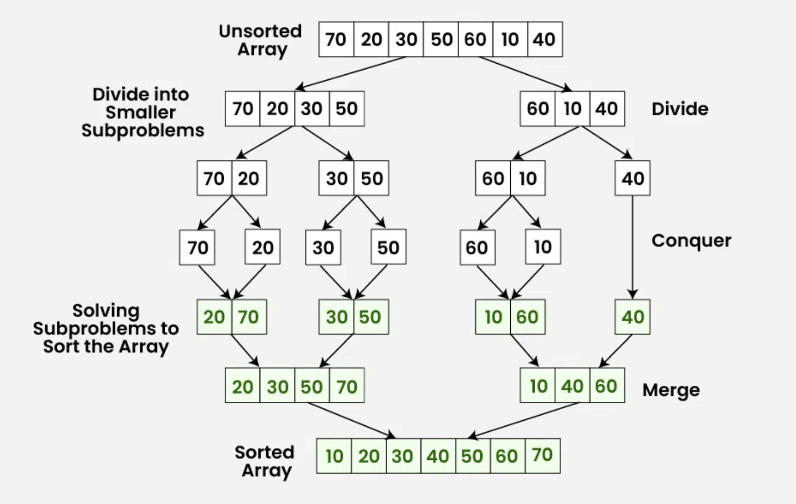

# Diseño de Algoritmos
En este capítulo se exploran algunos paradigmas de diseño de algoritmos utilizados en muchos de los algoritmos conocidos y utilizados en la actualidad. Analizar estos paradigmas, permitirá utilizar técnicas similares para nuevos problemas de ingeniería de software.

## Divide y conquista
Divide y conquista es uno de los paradigmas introducidos en muchos de los cursos de programación introductorios. En términos generales, se divide el problema recursivamente en sub-problemas más pequeños, se resuelven de forma recursiva y se combinan las soluciones para obtener la solución final. Cuando la combinación toma menos tiempo que la resolución de los sub-problemas, se obtiene una mejora en la eficiencia.

La **fase de división** incluye:

- Divide el problema en sub-problemas más pequeños
- Los sub-problemas deben ser de la misma forma que el problema original, pero más pequeños
- Se divide hasta llegar al caso base

La **fase de conquista** incluye:

- Resolver cada sub-problema individualmente
- Si el sub-problema es lo suficientemente pequeño, se resuelve de forma directa
- El objetivo es resolver los sub-problemas independientemente

La **fase de combinación** incluye:

- Combinar las soluciones de los sub-problemas para obtener la solución del problema original
- Una vez que los sub-problemas se resuelven, se combinan para obtener la solución final
- El objetivo es obtener la solución del problema original

### Ejemplos de algoritmos de divide y conquista
#### Merge Sort
Merge Sort es un algoritmo de ordenamiento que utiliza el paradigma de divide y conquista. La idea es dividir el arreglo en dos mitades, ordenar cada mitad y luego combinar las dos mitades ordenadas.

Visualmente, el algoritmo se ve de la siguiente manera:



En este algoritmo, en **la fase de división**, se generan `log2(n)` niveles. En la **fase de merge**, combinar cada nivel toma `O(n)` tiempo. Por lo tanto, la complejidad de tiempo de Merge Sort es `O(n log n)`.

#### Búsqueda binaria
Búsqueda binario, tal y como lo hemos visto en cursos anteriores, es un algoritmo de búsqueda que utiliza el paradigma de divide y conquista. La idea es dividir el arreglo en dos mitades, comparar el elemento con el valor medio y decidir en qué mitad continuar la búsqueda.

```c
 int binary_search(item_type s[], item_type key, int low, int high) {
    int middle;
    if (low > high) {
        return (-1);
     }
    middle = (low + high) /2;
    if (s[middle] == key) {
       return(middle);
    }
    if (s[middle] > key) {
        return(binary_search(s, key, low, middle-1));
    } else {
        return(binary_search(s, key, middle +1, high));
    }
 }
 ```
La complejidad de tiempo de la búsqueda binaria es `O(log n)`. En cada paso, el tamaño del problema se reduce a la mitad y no hay necesidad de mezclar los resultados.

#### Encontrar el máximo de un arreglo
Para encontrar el máximo de un arreglo, la solución trivial sería recorrer el arreglo y comparar cada elemento con el máximo actual. La complejidad de tiempo de esta solución es `O(n)`:

```c
int findMax(int[] a, int n)
{
    int max = Integer.MIN_VALUE;
    for (int i = 0; i < n; i++)
    {
        if (a[i] > max)
        {
            max = a[i];
        }
    }
    return max;
}
```

Utilizando divide y conquista, se puede resolver de la siguiente manera:


```c
static int findMax(int[] a, int lo, int hi)
{
    if (lo > hi) 
    {
        return Integer.MIN_VALUE;
    }
    if (lo == hi)
    {
        return a[lo];
    }
    int mid = (lo + hi) / 2;
    int leftMax = findMax(a, lo, mid);
    int rightMax = findMax(a, mid + 1, hi);
    return Math.max(leftMax, rightMax);
}
```

La complejidad de tiempo de este algoritmo es `O(n)`. El análisis refleja que aunque sea O(n), realiza menos comparaciones que la solución trivial.

> Investigar: ¿Por qué la complejidad de tiempo de este algoritmo es `O(n)`? ¿Por qué no es `O(log n)`?

#### Paralelismo en divide y conquista
Computación paralela es una técnica que permite realizar múltiples tareas simultáneamente aprovechando múltiples núcleos de procesamiento. Cada partición del problema se puede asignar a un núcleo de procesamiento, lo que permite reducir el tiempo de ejecución.

> Investigar: ¿Cómo se puede implementar paralelismo en el algoritmo de búsqueda binaria y en _merge sort_?

## Programación dinámica (DP)
Aunque tiene el término _programación_ en su nombre, no se refiere a escritura de código fuente. Acuñado por Richard Bellman en los años 50, _programar_ se referiere a _planificar_, es decir, planificar óptimamente procesos de múltiples etapas.
- Comparte similutudes con la técnica de _divide y vencerás_.
- DP divide problemas en sub-problemas y _memoiza_ las soluciones de los sub-problemas para resolverlos una *sola vez*.
- En DP, los sub-problemas se translapan, es decir, el resultado de uno puede ayudar a resolver otro.

> **Memoización vs Memorización <br/>**
> Memoización se refiere a una técnica para optimizar recordando. Memorizar se refiere a poner algo en la memoria.

Por ejemplo, para calcular _fibonacci(4)_ utilizando un enfoque tradicional:


Se puede notar un claro traslape de sub-problemas, lo que implica un desperdicio de recursos computacionales. Utilizando un enfoque de DP, el problema se puede resolver de la siguiente manera:

```java
int fib(n) {
    mem[n + 2]; // ------------------> En caso que N sea 0 o 1
    mem[0] = 0;
    mem[1] = 1;

    for (i = 2; i < n + 1; i++) {
        mem[i] = mem[i - 1] + mem[i - 2];
    }
    return mem[n];
}
```

El código anterior utilizaría internamente, un arreglo que se vería de la siguiente manera:

```
mem[0] = 0
mem[1] = 1
mem[2] = 1
mem[3] = 2
mem[4] = 3
```

En el enfoque divide y conquista, el algoritmo de Fibonacci tiene una complejidad de tiempo de `O(2^n)`. En cambio, con DP, la complejidad de tiempo se reduce a `O(n)`.

El siguiente diagrama ilustra el enfoque DP vs Divide y Vencerás de forma general:


### Ejemplo de programación dinámica: Longest Common Subsequence (LCS)
Cadena más larga común entre dos strings, no necesariamente contigua. Por ejemplo,

```
S1 = "BCDAACD"
S2 = "ACDBAC"
```

Tiene las cadenas comunes: `BC`, `CDAC`, `DAC`, ...

Implementándolo usando el enforque tradicional:"

```java
// Returns length of LCS for X[0..m-1], Y[0..n-1] 
int lcs(String X, String Y, int m, int n) 
{ 
    if (m == 0 || n == 0) 
        return 0; 
    if (X.charAt(m - 1) == Y.charAt(n - 1)) 
        return 1 + lcs(X, Y, m - 1, n - 1); 
    else
        return max(lcs(X, Y, m, n - 1), 
                    lcs(X, Y, m - 1, n)); 
} 
```

Para las cadenas `BCDA` y `ACDB`, se generaría un árbol de recursión de la siguiente manera:

```
                    (BCDA, ACDB)
                 /               \
     MAX[(BCD, ACDB)            (BCDA, ACD)]
        /           \           /           \
MAX[(BC, ACDB) (BCD, ACD)  (BCD, ACD)  (BCDA, AC)]

```
Claramente vemos como se resolvería varias veces el mismo sub-problema, siendo O (2^nm). Utilizando DP, se puede resolver de la siguiente manera:

Se crea una matriz de tamaño `(m+1) x (n+1)` y se llena de la siguiente manera:

```java
static int lcs(String X, String Y, int m, int n) 
{ 
    int[, ] L = new int[m + 1, n + 1]; 

    for (int i = 0; i <= m; i++) { 
        for (int j = 0; j <= n; j++) { 
            if (i == 0 || j == 0) 
                L[i, j] = 0; 
            else if (X[i - 1] == Y[j - 1]) 
                L[i, j] = L[i - 1, j - 1] + 1; 
            else
                L[i, j] = max(L[i - 1, j], L[i, j - 1]); 
        } 
    } 
    return L[m, n]; 
} 
```

|  |   | A | C | D | B | 
|---|---|---|---|---|---|
|   | 0 | 0 | 0 | 0 | 0 |
| B | 0 | 0 | 0 | 0 | 1 |
| C | 0 | 0 | 1 | 1 | 1 |
| D | 0 | 0 | 1 | 2 | 2 |
| A | 0 | 1 | 1 | 2 | 2 |

Esto resulta en complejidad temporal `O(nm)`

## Backtracking
- Popularizado por Henry Lehmer, matemático estadounidense.
- Es una forma metódica de probar distintas secuencias de decisiones hasta encontrar una que funcione
- Se puede conceptualizar como un árbol de decisiones
    - Cada nodo del árbol solo puede ver sus hijos directos
    - Si un nodo conduce a error, se regresa al anterior y se prueba con otro hijo

La estructura general en código se puede resumir como:

```java
backtrack(x) {
    if (x == solucion) {
        return true;
    }
    for (nodo in x.nodos) {
        if (nodo == solution) {
            return true;
        } else {
            return backtrack(nodo);
        }
        
    }
}
```    

### Ejemplo: el problema de las N-reinas
Dado un tablero de ajedrez de NxN, colocar N reinas de tal forma que no se ataquen entre sí. Una reina puede atacar a otra si están en la misma fila, columna o diagonal.

```java
bool solve(board[][] col) {
    if (col == N) {
        return true;
    }
    for (int i = 0; i < N; i++) {
        if (isSafe(board, i, col)) {
            board[i][col] = 1;
            if (solve(board, col + 1)) {
                return true;
            }
            board[i][col] = 0;
        }
    }
    return false;
}
```
}

## Algoritmos Probabilísticos

Son algoritmos que utilizan aleatoriedad para tener una mejora en desempeño sacrificando la confiabilidad de los resultados obtenidos:

- No se produce ningun resultado
- Se produce un resultado incorrecto
- Se produce una respuesta aproximada

Ejecuciones distintas pueden producir respuestas distintas.

### Clasificación

- **Monte Carlo**: Algoritmos que **siempre** retornan un resultado, pero puede no ser correcto. Se intenta minimizar la probabilidad de error. Multiples ejecuciones reducen dicha probabilidad.
- **Las Vegas**: Algoritmos que **siempre** retornan un resultado correcto, pero pueden producir ningún resultado. Múltiples ejecuciones reducen la probabilidad de no obtener un resultado.

### Aleatoriedad

- Provisto por un generador de números random. Estos generadores son pseudo-aleatorios, ya que generan una secuencia de números que parecen ser aleatorios, pero son deterministas. El único valor random que existe en nuestra realidad es la decadencia radioactiva.
- Los generadores de pseudo-random generan números en una secuencia dentro de un rango y requieren un elemento inicial llamado semilla (seed). Cada número en la secuencia se genera a partir del anterior.
- Hay posibilidad de ciclos dado que un número puede repetirse en la secuencia.


#### Ejemplo de pseudo-random: Método de cuadrado medio

Eleve el número inicial (seed) al cuadrado y tome los dígitos del medio como el nuevo número. Por ejemplo, si el seed es 1234, el cuadrado es 1522756 y el número medio es 2275.

Una secuencia sería:

- 1234 (semilla)
- 2275 (1234^2)
- 5180 (2275^2)
- 6884 (5180^2)

y así sucesivamente. Dependiento de la semilla, la secuencia puede ser cíclica muy rápido.

### Algoritmos de Monte Carlo

Considere el siguiente requerimiento: "Dado un array de N elementos, determinar si hay un elemento que sea mayoritario, es decir que aparezca más de N/2 veces"

La solución trivial sería:

1. Recorra el array y cuente cuántas veces aparece cada elemento.
2. Si encuentra un elemento que aparece más de N/2 veces, retorne verdadero.

El problema es que la complejidad de este algoritmo es O(N^2) y no es eficiente.

Utilizando un algoritmo de Monte Carlo, tendríamos:

```java
boolean tieneElementoMayoritario(array, lenght) {
    i = random(0, n - 1);
    x = array[i];
    k = 0;
    for (j = 0; j < n; j++) {
        if (array[j] == x) {
            k++;
        }
    }
    return k > n / 2;
}
```

Como se puede notar, podría devolver `false` aún cuando no haya un elemento mayoritario. La probabilidad de error es de 1/2.

Ejecutar varias veces el algoritmo reduce la probabilidad de error (si el psuedo-random es bueno). Después de k ejecuciones, la probabilidad de error es de 1/2^k.

### Algoritmos de Las Vegas

Características:

- No garantizan un resultado y no tiene un uppber-bound en tiempo de ejecución. Siempre se obtiene un resultado correcto, pero no siempre se obtiene un resultado.

- Utilizados para explorar un espacio de soluciones de las cuales algunas son las correctas. Usan random para moversen en dicho espacio de soluciones. Si hay muchas soluciones correctas, la probabilidad de encontrar una es alta en poco tiempo.

Considere el problema de las n-reinas. La solución clásica es mediante backtracking. Sin embargo, un algoritmo de Las Vegas podría ser:

1. Colocar las reinas en posiciones aleatorias, una en cada columna
2. Verificar si hay colisiones
3. Si no hay colisiones, retornar la solución
4. Si hay colisiones, repetir el proceso

### Estructuras de datos probabilísticas

- Proveen respuestas aproximadas a consultas sobre grandes sets de datos.
- Sacrifican precisión para fomentar eficiencia temporal.
- Utilizan _hashing_ y _randomness_ para reducir la complejidad espacial y temporal.

> Una diferencia clave de las estructuras probabilísticas con respecto a los algoritmos probabilísticos, es que estos últimos no necesariamente se comportan de forma impredecible para el usuario. Es decir, pueden devolver resultados correctos. Las estructuras de datos probabilisticas, no dan respuestas definitivas.

#### Filtros de Bloom

Considere el siguiente escenario:

> La página de regitro de usuarios de un sitio web, permite al usuario especificar un _username_. No se permiten _username_ duplicados. ¿Cómo se puede verificar si un _username_ ya existe?

Algunas posible soluciones serían:

- Aplicar búsqueda secuencial, pero el problema es que la complejidad es O(N) y si tenemos millones de usuarios, la búsqueda sería muy lenta.
- Búsqueda binaria, que es mucho mejor, pero requeriría tener ordenados los usuarios y cargados en memoria.

Un filtro de Bloom permite determinar si un elemento pertenece a un set o no. Al ser probabilístico, puede dar falsos positivos (sí está), pero no falsos negativos.

- Utiliza un array de bits de tamaño fijo para representar todo el set de datos
- Agregar un element set nunca falla, pero los falsos positivos aumentan conforme el set se llea
- Nunca genera falsos negativos
- No se pueden eliminar elementos del set

**Implementación**

Se utiliza un arreglo de bits de largo m.


Se necesitan k funciones de hash. Para agregar un elemento, se calculan las k funciones de hash y se setean los bits correspondientes a 1. Por ejemplo, si se define que se van a usar 3 funciones de hash, y se va a insertar la palabra "TEC" en el set:

h1(TEC) % m = 1
h2(TEC) % m = 3
h3(TEC) % m = 5


Ahora agregamos la palabra "QUIZ":

h1(QUIZ) % m = 3
h2(QUIZ) % m = 5
h3(QUIZ) % m = 4


Como se puede notar, en este caso, TEC y QUIZ tuvieron algunos resultados similares. El set se comienza a llenar, activando bits que no necesariamente corresponden a elementos diferentes.

Supongamos que se busca la palabra "PERRO", la cual no se ha insertado aún, y que las funciones de hash generan los siguientes valores:

h1(PERRO) % m = 1
h2(PERRO) % m = 4
h3(PERRO) % m = 5

Estos índices ya están en 1, por lo que el filtro de Bloom dirá que el elemento está en el set, cuando en realidad no lo está. Esto es un falso positivo.

Depende del tipo de aplicación, puede ser que esto sea aceptable. Por ejemplo, en el caso de la verificación de _username_, si el filtro de Bloom dice que el _username_ ya existe, se puede hacer una verificación adicional para confirmar. Pero si el filtro dice que no existe, entonces no se necesita hacer nada más y se ahorra tiempo considerable.

> Probabilidad de un falso positivo: `P(1 - [1 - 1/m]^kn)^k`

##### Complejidad:

- Tiempo de inserción: O(k)
- Tiempo de búsqueda: O(k)
- Espacio requerido: O(m)

##### Selección de la función de hash

- Deben ser funciones rápidas
- Usar hash criptográfico proveerá una mayor estabilidad pero tiene un hit de performance muy importante

##### Aplicaciones conocidas de filtros de bloom

- Medium.com lo utiliza para identificar los post ya vistos por el usuario
- Cloudflare lo utiliza para identificar IPs maliciosas
- Google Chrome lo utiliza para identificar URLs maliciosas
- Apache Cassandra lo utiliza para buscar registros inexistentes en disco

## Algoritmos Genéticos

Se fundamentan en el trabajo de John Holland en 1962, quien luego publica en 1975 su libro "Adaptation in Natural and Artificial Systems". Los algoritmos genéticos son una técnica de optimización y búsqueda basada en la teoría de la evolución de Darwin.

En 1980 se aplican en problemas de optimización y en 1989 en problemas de aprendizaje automático.

Se pueden definir como una técnica de búsqueda para problemas de optimización y aprendizaje automático que simula el proceso de selección natural.

Se consideran como algoritmos heurísticos, ya que no garantizan la obtención de la solución óptima, pero sí una solución aceptable en un tiempo razonable.

> Heurística significa "encontrar" en griego. Se refiere a la búsqueda de soluciones a problemas de forma rápida y eficiente, pero no necesariamente óptima. Es el pasado de _eureka_.

Utilizan técnicas inspiradas en la biología evolutiva, como la selección natural, la reproducción y la mutación.

### Definiciones esenciales

- **Individuo**: Representa una solución al problema. Puede ser una cadena de bits, un vector de números, una estructura de datos, etc.
- **Población**: Conjunto de individuos/posibles soluciones.
- **Fitness**: Función que evalúa la calidad de una solución/individuos
- **Características**: Representan las propiedades de un individuo. Pueden ser los genes de un individuo.
- **Genoma**: Conjunto de características de un individuo.

> Dependiendo del problema se pueden usar multiples cromosomas para representar un individuo.

### Representación de un individuo

El objetivo es optimizar el espacio de búsqueda escogiendo uan representación adecuada para el problema. Usualmente se recomienda el uso de bit-vectors, donde cada entrada indica si cierta característica está presente o no.

### Funcionamiento general

Inician con una población de individuos aleatorios. En cada generación, se evalúa el fitness de cada individuo, se seleccionan los mejores y se reproducen para generar una nueva generación.

La nueva población reemplaza a la anterior y se repite el proceso hasta que se cumple un criterio de parada.

> ¿Cuando se detiene el algoritmo? Puede ser cuando se alcanza un número máximo de generaciones, cuando se alcanza un fitness mínimo, cuando se alcanza un fitness máximo, etc.


### ¿Cómo seleccionar los padres?

Después de aplicar la función de fitness, se obtiene un grupo de posibles padres:

- Secuencia: 1 - 2, 3 - 4...
- Random

### Introducir variabilidad

Después de seleccionar los padres, se aplica recombinación y mutaciones.

### Recombinación

Se mezclan los genes de los padres para generar nuevos individuos. Suponiendo que los siguientes bit-vectors representan los padres:

```
    | 0 | 1 | 2 | 3 | 4 | 5 |
P1: | 0 | 0 | 0 | 0 | 0 | 0 |
P2: | 1 | 1 | 1 | 1 | 1 | 1 |
                ^
                Cross-over point
```

Se generan los siguientes hijos:

```
    | 0 | 1 | 2 | 3 | 4 | 5 |
H1: | 0 | 0 | 0 | 1 | 1 | 1 |
H2: | 1 | 1 | 1 | 0 | 0 | 0 |
```

### Mutación

Con base en alguna probabilidad determinada, se hace flig a agunos bits aleatorios de cada bit-vector de los hijos generados.

## Referencias
- https://www.geeksforgeeks.org/introduction-to-divide-and-conquer-algorithm/