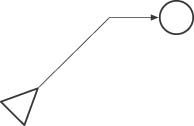
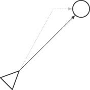
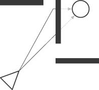
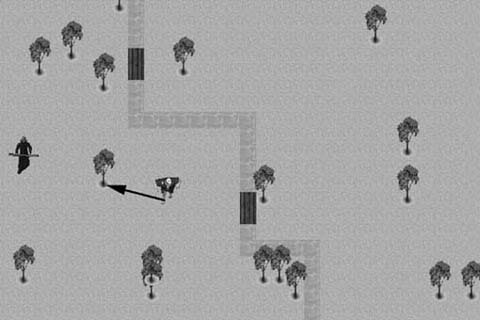
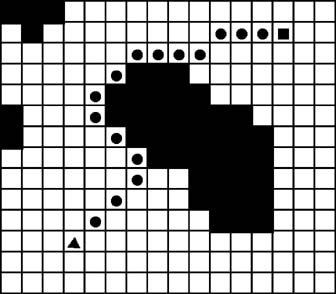
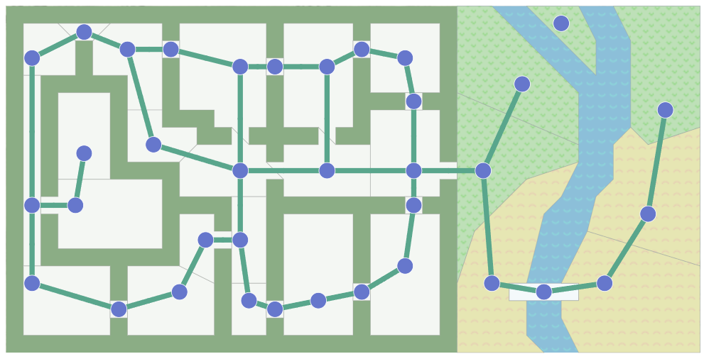
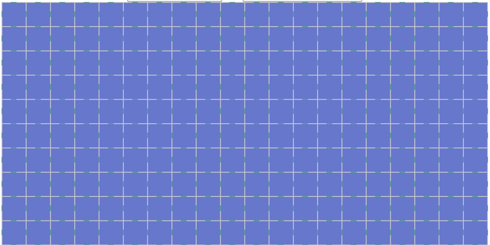
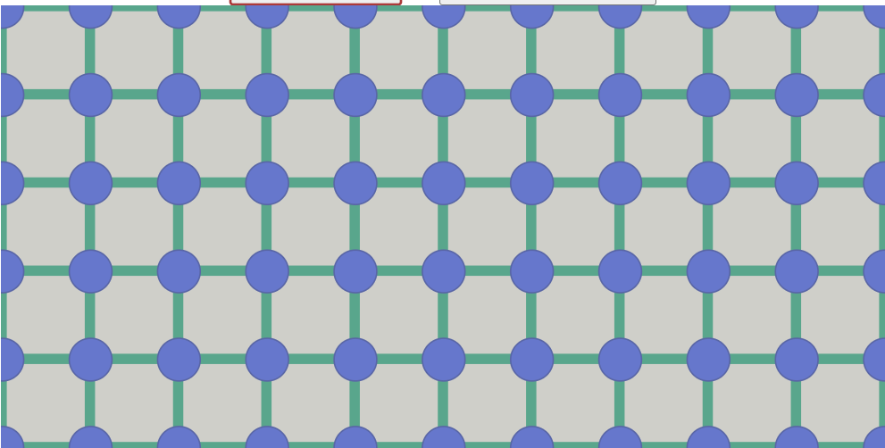
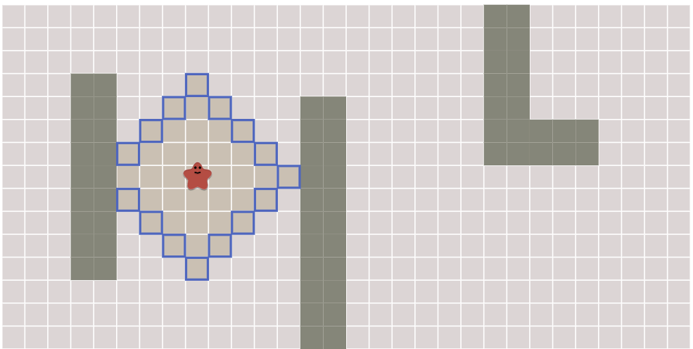
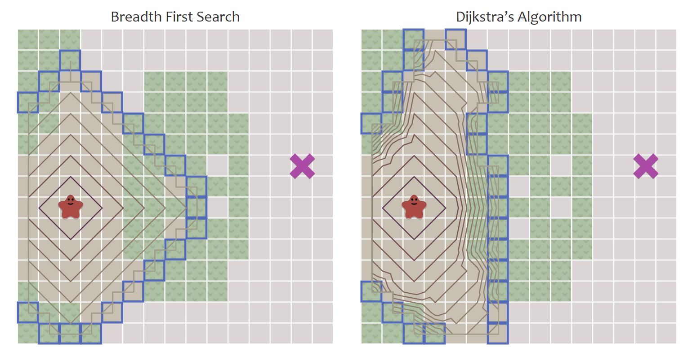

# Algoritmos de búsqueda
Este tema abarca los algoritmos de búsqueda en estructuras de datos como _arrays_ y expande para incluir búsquedas en planos (aplicables a juegos por ejemplo). No incluye motores de búsqueda textuales.

## Búsqueda en arrays
### Búsqueda secuencial
Búsqueda secuencial es la solución trivial para buscar en una colección de elementos. Cuando la colección está desordenada, es la única opción. Revisa/procesa cada elemento hasta encontrar el elemento deseado.

- En el peor caso, cada elemento de la colección es comparado contra la llave de búsqueda
- Si hay un _match_, la búsqueda termina y se retorna el índice del elemento
- Si no hay _match_, se retorna -1 (u otro índice negativo)

Por ejemplo, dado el siguiente array, para buscar el elemento `20`, se seguiría el siguiente proceso:


#### Implementación

```java
public class SequentialSearch {
    public static int search(int[] arr, int x) {
        for (int i = 0; i < arr.length; i++) {
            if (arr[i] == x) {
                return i;
            }
        }
        return -1;
    }
}
```
#### Consideraciones importantes
- Tiene una complejidad temporal de O(n) para el peor caso y O(1) para el mejor caso.
- Es ineficiente para colecciones grandes
- Si el array no está ordenado o se quiere evitar ordenar, es la única opción

### Búsqueda binaria
Búsqueda binaria es un algoritmo de búsqueda que encuentra la posición de un valor en un arreglo **ordenado**. A diferencia de la búsqueda lineal, que recorre el arreglo desde el primer elemento hasta el último, la búsqueda binaria divide el arreglo en dos mitades y compara el valor buscado con el elemento en el medio. 

- Si el valor buscado _es menor que el elemento en el medio_, la búsqueda continúa en la mitad izquierda del arreglo. 

- Si el valor buscado _es mayor que el elemento en el medio_, la búsqueda continúa en la mitad derecha del arreglo. 

Este proceso se repite hasta que el valor buscado sea encontrado o hasta que el subarreglo de búsqueda sea vacío.

#### Ejecución de búsqueda binaria
Dado el siguiente arreglo:

```
| Indices   | 0 | 1 | 2 | 3 | 4 | 5 | 6 | 7 | 8 |
| Elementos | 1 | 2 | 3 | 4 | 5 | 6 | 7 | 8 | 9 |
```
Para buscar el número 9:

- Comenzamos comparando el número 9 con el elemento en el medio del arreglo, que es 5.

- Como 9 es mayor que 5, la búsqueda continúa en la mitad derecha del arreglo.

- Ahora comparamos el número 9 con el elemento en el medio de la mitad derecha del arreglo, que es 8.

- Como 9 es mayor que 8, la búsqueda continúa en la mitad derecha de la mitad derecha del arreglo.

- Ahora comparamos el número 9 con el elemento en el medio de la mitad derecha de la mitad derecha del arreglo, que es 9.

- Como 9 es igual a 9, hemos encontrado el número que buscábamos.

Visualmente, se puede representar de la siguiente manera:
```
| Indices   | 0 | 1 | 2 | 3 | 4 | 5 | 6 | 7 | 8 |
| Elementos | 1 | 2 | 3 | 4 | 5 | 6 | 7 | 8 | 9 |
            |-----------------------------------|
    5 < 9                     ^
                                |---------------|
    7 < 9                             ^  
                                        |-------|  
    8 < 9                                 ^
                                             |--|
    9 == 9                                    ^
```

#### Implementación en Java
```java	
public static int binarySearch(int[] arr, int target) {
    int left = 0;
    int right = arr.length - 1;

    while (left <= right) {
        int mid = left + (right - left) / 2;

        if (arr[mid] == target) {
            return mid;
        }

        if (arr[mid] < target) {
            left = mid + 1;
        } else {
            right = mid - 1;
        }
    }

    return -1;
}
```

### Búsqueda por interpolación

- Es una mejora sobre `búsqueda binaria`, especificamente si los valores en el array están distribuídos uniformemente. La búsqueda por interpolación calcula la posición de la mitad del array basado en el valor del elemento buscado y los valores en los extremos del array.

- Búsqueda binaria siempre compara contra el elemento central del array, mientras que búsqueda por interpolación considera la llave de búsqueda antes de decidir contra cual elemento del array comparar.

- El código es igual al de búsqueda binaria, con la diferencia de que la posición del elemento medio se calcula de manera diferente:

```
mid = low + ((x - arr[low]) * (high - low)) / (arr[high] - arr[low])
```

> Low y high se refieren a los índices del array, y arr[low] y arr[high] a los valores en esos índices.

La mejora en rendimiento con respecto a búsqueda binaria se da en el caso promedio (que depende de la distribución uniforme de los elementos en el array), con una complejidad de tiempo de `O(log log n)`. En el peor caso (datos no uniformemente distribuidos), la complejidad degrada a `O(n)`.

### Búsqueda por salto (Jump Search)
Aplicable para arrays ordenados, comparandos menos elementos que búsqueda lineal avanzando en bloques de tamaño _√n_ (un número fijo de elementos por salto). Determinar el tamaño del bloque de saltos es crucial para el rendimiento del algoritmo.

Normalmente se utiliza sqrt(n) como tamaño de bloque, donde n es el tamaño del array


> Complejidad temporal: O(sqrt(n))

## Pathfinding
_Pathfinding_ se refiere a búsqueda de caminos entre dos puntos en un plano, especialmente útil para video juegos y simulaciones. Incluye una amplia variedad de algoritmos y no hay una solución única para todos los casos. Por ejemplo, la elección del algoritmo depende de:

- ¿És el destino estacionario o móvil?
- ¿Hay obstáculos en el mapa?
- ¿Hay diferente tipos de terreno en el mapa?

### Pathfinding básico
Se refiere a encontrar el camino más corto entre dos puntos en un plano sin obstáculos. Por ejemplo, cómo se mueve a un personaje de un punto A a un punto B en un mapa de videojuego.

```pseudo
if(positionX > destinationX)
       positionX--;
else if(positionX < destinationX)
       positionX++;
if(positionY > destinationY)
       positionY--;
else if(positionY < destinationY)
       positionY++;
```
Esta es una solución simple, pero no es óptima. No considera obstáculos, terreno, o la distancia real entre los puntos. Además de esto, el movimiento resultante no es "natural":



Utilizandio algoritmos de línea de visión, se puede mejorar el movimiento del personaje:



Los métodos de línea de visión (y enfoques más sofisticados) producen resultados más precisos. Por eso, se deben preferir cuando sea posible, mientras que el método simple es solo una aproximación. _Pathfinding_ no es un problema que se resuelve con un solo algoritmo, sino con una combinación de algoritmos. Al encontrarse obstáculos, estos enfoques no son suficientes.



### Movimiento aleatorio ante obstáculos
Aunque parezca poco eficiente, el movimiento aleatorio es una solución simple y efectiva para evitar obstáculos, especialmente en ambientes con relativamente pocos obstáculos. 



Como se aprecia en la figura anterior, un movimiento aleatorio para evitar al enemigo puede ser sufiente y evita caer en un gasto computacional innecesario.

```pseudo
if Player In Line of Sight
{
    Follow Straight Path to Player
}
else
{
    Move in Random Direction
}
``` 

### Rodear obstáculos
En lugar de moverse en línea recta hacia el destino, se puede rodear los obstáculos. Es relativamente simple y útil para evitar obstáculos grandes en el plano, tales como montañas o masas de agua. El proceso sería:

1. El personaje intenta un _pathfinding básico_ hasta el objetivo. 
2. Si encuentra un obstáculo, se cambia a modo de rodeo.
3. Sigue el borde del obstáculo hasta que pueda volver a intentar el _pathfinding básico_ con éxito.

El problema del rodeo es que puede ser difícil de determinar cuando salir de dicho modo. Una forma puede ser determinar antes de entrar al modo de rodeo, cual es la ruta donde se puede salir de este.


Para hacer el movimiento más natural, se puede intentar línea de visión en cada paso. Si el personaje puede ver el objetivo, se mueve en línea recta hacia él. Si no, se sigue rodeando el obstáculo.



### Pathfinding basado en grafos
En este enfoque, el mapa se representa como un grafo, donde los nodos son las posiciones en el mapa y las aristas son las conexiones entre las posiciones. Cada arista tiene un costo asociado, que puede ser la distancia entre los nodos o el tiempo que toma recorrerla.



Si el mapa se modela como una rejilla, se puede ver como un tipo de grafo especial, como se muestra en la siguiente imagen:





#### Breadth-first search (BFS)
El algoritmo BFS (búsqueda en amplitud) es un algoritmo de búsqueda de grafos que comienza en un nodo raíz y explora todos los nodos vecinos a la raíz antes de avanzar a los nodos vecinos de estos. Visualmente, se puede ver como una expansión en todas las direcciones:



El algoritmo es tal y como se vio en el curso de Estructuras de Datos 1. A manera de recordatorio, se presenta el pseudocódigo:

```java
frontier = Queue()
frontier.put(start )
came_from = dict()
came_from[start] = None

while not frontier.empty():
   current = frontier.get()

      if current == goal: 
         break           

   for next in graph.neighbors(current):
      if next not in came_from:
         frontier.put(next)
         came_from[next] = current
```         

#### Dijkstra
BFS considera el movimiento hacia cualquier nodo como igual. Sin embargo, en muchos escenarios, distintas posiciones en el mapa tienen distintos costos o pesos. Por ejemplo, en algunos juegos de estrategia, distintos tipos de terreno (bosque, agua, desierto, entre otros) tienen diferentes efectos en la velocidad de los personajes. En estos casos, el algoritmo de _Dijkstra_ es más adecuado.

Dijkstra lleva el rastro del costo acumulado y utiliza una cola de prioridad para escoger el siguiente paso. El código es similar al siguiente pseudocódigo:

```java
frontier = PriorityQueue()
frontier.put(start, 0)
came_from = {}
cost_so_far = {}
came_from[start] = None
cost_so_far[start] = 0
while not frontier.empty() {
    current = frontier.get()
    if current == goal {
        break
    }
    for next in graph.neighbors(current) {
        new_cost = cost_so_far[current] + graph.cost(current, next)
        if next not in cost_so_far or new_cost < cost_so_far[next] {
            cost_so_far[next] = new_cost
            priority = new_cost
            frontier.put(next, priority)
            came_from[next] = current
        }
    }
}
```
Visualmente, se puede entender la diferencia entre BFS y Dijkstra en esta [animación](https://www.redblobgames.com/pathfinding/a-star/introduction.html#breadth-first-search). A continuación se incluyen una captura de pantalla de la animación:



#### A\*

Considera el costo real (similar a Dijkstra) y una heurística que estima el costo restante. La heurística es una función que estima el costo de llegar al destino desde un nodo dado. La heurística debe ser admisible, es decir, nunca sobreestimar el costo real.

Se utiliza con ciertas mejoras, en game engines modernos, como Unity.

```java
frontier = PriorityQueue()
frontier.put(start, 0)
came_from = {}
cost_so_far = {}
came_from[start] = None
cost_so_far[start] = 0
while not frontier.empty() {
    current = frontier.get()
    if current == goal {
        break
    }
    for next in graph.neighbors(current) {
        new_cost = cost_so_far[current] + graph.cost(current, next)
        if next not in cost_so_far or new_cost < cost_so_far[next] {
            cost_so_far[next] = new_cost
            priority = new_cost + heuristic(goal, next)
            frontier.put(next, priority)
            came_from[next] = current
        }
    }
}
```

Para calcular la heurística, se puede utilizar la distancia Manhattan o la distancia Euclidiana. La distancia Manhattan es la suma de las diferencias en las coordenadas x y y, mientras que la distancia Euclidiana es la distancia en línea recta.

```java
// Manhattan distance
function heuristic(a, b) {
    return abs(a.x - b.x) + abs(a.y - b.y)
}
```

Dependiendo del escenario, la heurística puede ser precalculada y almacenada en una tabla de búsqueda.

A* y Dijkstra son similares, pero A* es más rápido porque la heurística guía la búsqueda hacia el destino. La visualización [aquí](https://www.redblobgames.com/pathfinding/a-star/introduction.html#astar) permite compararlas.

Aunque A* y Dijkstra encuentran el camino, la cantidad de comparaciones realizadas por A* es mucho menor. En el peor caso, A* es igual a Dijkstra, pero en el mejor caso, A* es mucho más rápido.

### Referencias

- https://iq.opengenus.org/time-complexity-of-interpolation-search/

- https://www.geeksforgeeks.org/jump-search/

- [Pathfinding](https://en.wikipedia.org/wiki/Pathfinding)

- [Pathfinding on Grids](https://www.redblobgames.com/pathfinding/a-star/introduction.html)

- Bourg, David M. (2004). AI for Game Developers. O'Reilly Media. ISBN 978-0-596-00555-2.