# Estructuras de almacenamiento externo

La jerarquía de memoria se puede representar con la siguiente pirámide:


Conforme se "sube" en la jerarquía, la cantidad de memoria disminuye pero el costo y velocidad de la misma aumentan. Conforme se desciende, el costo y velocidad disminuyen pero la cantidad de memoria aumenta. Es por eso que el cache es una memoria muy rápida pero de poca capacidad, mientras que el disco duro es una memoria lenta pero de gran capacidad.

## Conceptos esenciales

- **Dato**: Sucesión de símbolos representados con números o letras. No contienen ninguna información en sí mismo, sino que representan un _hecho_ con algún significado dado por una unidad y su magnitud. Requieren organización y procesamiento para extraer información. Por ejemplo: _$10, 20 años, 3 kg, 10 metros, 22 km_.

- **Información**: Es la interpretación significativa de los datos

- **Sistemas de almacenamiento**: Sistemas para almacenar datos en formato binario sin importar la información que se pueda extraer de dichos datos. Solo ven bloques crudos de bits.

## Discos Duros (Hard-disk drives)

> No deben confundirse con discos de estado sólido (SSD).

Son dispositivos de almacenamiento persistente que mantienen la información almacenada incluso cuando no están siendo alimentados con electricidad.

- Los datos se almacenan mediante magnetización de partículas dentro del material magnético de los discos.

- El disco es capaz de leer los datos al detectar los patrones de magnetización creados al escribir los datos.

### Componentes

- _Platos_: Discos circulares de material magnético en ambas caras
- _Eje_: sostiene uno o más platos conectados a un motor que gira los platos a un RPM constante.
- _Brazo actuador_: Mueve las cabezas de lectura/escritura a lo largo de los platos.
- _Cabezales_: Dispositivos electromagnéticos que leen y escriben datos en los platos.
- _Hard disk assembly_: Combinación de los platos, eje, brazo actuador y cabezales.

### Funcionamiento

La velocidad del giro influye directamente en la velocidad de I/O. A mayor velocidad, mayor consumo energético y mayor costo.

- Velocidades para uso general (consumidor):

  - 5400 RPM
  - 7200 RPM

- Velocidades para uso profesional (servidores):
  - 10000 RPM
  - 15000 RPM

Los datos se escriben en círculos concéntricos llamados _pistas_ y se dividen en _sectores_. Un sector es la unidad mínima de almacenamiento en un disco duro y generalmente tiene un tamaño de 512 bytes.


### Tiempos de acceso

El tiempo de búsqueda (_seek time_) es el tiempo que tarda el brazo actuador en moverse a la pista deseada (8 - 10ms en discos de 7200 RPM). El tiempo de latencia es el tiempo que tarda el sector deseado en pasar por debajo de la cabeza de lectura/escritura (4 - 5ms en discos de 7200 RPM).

El tiempo de acceso total es la suma del tiempo de búsqueda y el tiempo de latencia.

### Tiempo de transferencia

Los discos duros tienen un tiempo de transferencia que es el tiempo que tarda en leer o escribir un bloque de datos. Este tiempo no es fijo por RPM: depende del tamaño del bloque y de la tasa de transferencia (tiempo de transferencia = tamaño del bloque / tasa de transferencia); la velocidad de rotación y la densidad de los datos influyen sobre esa tasa. Por ejemplo, para un bloque concreto en un disco de 7200 RPM el tiempo de transferencia podría rondar los 0.5ms.

El _external data rate_ es la cantidad de datos que se pueden transferir por segundo. Por ejemplo, un disco de 7200 RPM con un external data rate de 300MB/s puede transferir 300MB de datos por segundo.

### Interfaces

El HDD se conecta a otros componentes de la computadora a través de una interfaz. Las interfaces más comunes son:

- PATA (Parallel Advanced Technology Attachment)

  - Interfaz de 40 pines que se conecta a la placa madre.
  - Velocidad de transferencia de 133MB/s.
  - No es hot-swappable.
  - No se usa en la actualidad.
  - Solo para discos internos

- SATA (Serial Advanced Technology Attachment)

  - Evolución de PATA.
  - Estándar en computación moderna.
  - Velocidad de transferencia de 600MB/s.
  - Bajo consumo energético.
  - Hot-swappable.

- SCSI (Small Computer System Interface)

  - Interfaz de alta velocidad.
  - Se usa en servidores y estaciones de trabajo.
  - Hot-swappable.

- SAS (Serial Attached SCSI)
  - Evolución de SCSI.
  - Velocidad de transferencia de 12Gb/s (≈ 1.5 GB/s).
  - Hot-swappable.
  - Se usa en servidores y estaciones de trabajo.

## Discos de Estado Sólido (SSD)

No son discos duros, sino dispositivos de almacenamiento de estado sólido que utilizan memoria flash para almacenar datos. No tienen partes móviles, lo que los hace más rápidos y menos propensos a fallas que los discos duros.

- Utiliza memoria flash para almacenar datos.

- Menor latencia de acceso aleatorio (acceso aleatorio mucho más rápido) que los discos duros.

- No tiene latencia de búsqueda.

- Writes limitados (menor tiempo de vida útil).

- El precio es más alto que los discos duros.

### Componentes

- **Controlador**: Procesador que ejecuta el firmware y es responsable de la gestión de la memoria, la corrección de errores y la interfaz con el sistema operativo.

- **Memoria NAND**: Memoria flash que almacena los datos. Se divide en celdas que pueden ser de tipo SLC, MLC, TLC o QLC.

- **DRAM**: Memoria volátil que se utiliza para almacenar datos temporales y mejorar el rendimiento.

- **Firmware**: Software que controla el funcionamiento del SSD.

- **Conector**: Interfaz que conecta el SSD a la placa madre. Los conectores más comunes son SATA y PCIE (utilizando el protocolo NVMe).

- **Form factor**: Tamaño y forma del SSD. Los form factors más comunes son 2.5", M.2 y U.2. También existen SSDs en formato de tarjeta de expansión PCIe.

### Desempeño

La transferencia de datos de un SSD es mucho más rápida que la de un disco duro. Los SSDs modernos pueden alcanzar velocidades de lectura de hasta 550 MB/s y velocidades de escritura de hasta 520 MB/s. Un SSD PCIe NVMe puede alcanzar velocidades de lectura de hasta 3500 MB/s y velocidades de escritura de hasta 3300 MB/s.

## Particionamiento de discos

Un solo disco físico puede ser dividido en varias particiones, cada una de las cuales se comporta como un disco independiente (lógico). Las particiones se pueden formatear con diferentes sistemas de archivos y se pueden montar en diferentes puntos de montaje.

El enlace entre lo físico y lo lógico se hace a través de la _metadata_ almacenada en la tabla de particiones. La tabla de particiones es un registro que contiene información sobre las particiones del disco, como su tamaño, ubicación y tipo de sistema de archivos. En el esquema MBR esta tabla se encuentra en el primer sector del disco (MBR) y es leída por el sistema operativo al arrancar. Los discos modernos suelen usar en su lugar el esquema GPT (GUID Partition Table), que distribuye la información de particiones de forma distinta (incluyendo copias redundantes) y supera las limitaciones de MBR.

Una partición puede existir sin inicializarse.

### Volumen

Es una partición inicializada con un _sistema de archivos_. Es la interfaz lógica que utiliza el sistema operativo para acceder a los datos almacenados en el disco.

## Sistemas de archivos
El sistema de archivos se puede entender como la abstracción que provee el Sistema Operativo para acceder a los datos almacenados en el disco (interfaz lógica entre usuario y la capa física de almacenamiento). Determina la forma en que los archivos son nombrados, organizados y almacenados en el disco. Almacena metadata/atributos de los archivos. Por ejemplo, el nombre, tamaño, fecha de creación, etc.

Hay distintos sistemas de archivos conocidos y usualmente se asocian con uno u otro Sistema Operativo.  Por ejemplo, Windows utiliza _NTFS_, Linux utiliza _ext3_ o _ext4_, MacOS utiliza _HFS+_, y así por el estilo.

El sistema de archivos requiere espacio en disco para almacenar la metadata. Por ejemplo, si se tiene un archivo de 1 KB, el sistema de archivos necesita espacio adicional para almacenar la metadata del archivo (nombre, tamaño, fecha de creación, etc.). Por tal motivo, posterior a formatear un disco, el espacio disponible es menor al espacio total del disco.

### Propósito
Algunas de las funcionalidades principales del sistema de archivo incluyen:

- Nombrar y organizar archivos.
- Proveer un API para el acceso a los archivos: Creación, lectura, escritura, eliminación, etc.
- Almacenar un índice de archivos y directorios.
- Gestionar permisos y restricciones de acceso para mantener la integridad y seguridad de los datos.
- Funciones avanzadas como compresión, cifrado, cuotas de disco, etc.

## Archivos

Se puede definir como el mecanismo de abstracción para hacer transparente al usuario los detalles complejos del disco. Dicha abstracción provee un "canal de comunicación" para poder ejecutar operaciones como:

- Leer bytes
- Escribir bytes
- Desplazarse a una posición específica en el disco

Un archivo se puede procesar de varias formas:

- **Acceso secuencial**: byte por byte desde el principio hasta el final según el orden en que fueron escritos.

- **Acceso aleatorio**: acceso directo a cualquier parte del archivo (conocido como acceso directo) independientemente del orden de escritura.

> Acceso secuencial es más rápido que el acceso aleatorio, pero el acceso aleatorio es más flexible.

- **Acceso indexado**: acceso a través de un índice que contiene la ubicación de los datos. Depende de la estructura y propósito del archivo. Por ejemplo, si es un archivo que contiene registros de clientes, un índice puede mapear el identificador de cada cliente, a la posición de su registro en el archivo. Precursor de las bases de datos.

### Estructura de un archivo

Las estructuras más comunes de archivos son:

- Secuencia de bytes
- Registros de tamaño fijo
- Árboles de registros

#### Secuencia de bytes

En este caso, se trata de archivos planos que contienen una secuencia de bytes. No tienen estructura interna y se pueden leer o escribir byte por byte. El sistema operativo no tiene conocimiento de la estructura interna del archivo, por lo que no puede realizar operaciones avanzadas como búsqueda o indexación.

Los archivos se reducen a ser "cubetas" de bytes, maximizando la flexibilidad. Windows/Linux/MacOS utilizan este tipo de archivos.

#### Registros de tamaño fijo

En este caso, el archivo se organiza en registros de tamaño fijo. Cada registro contiene una estructura de datos con campos de tamaño fijo. Los registros se pueden leer o escribir de forma secuencial o aleatoria. Este tipo de archivos permite realizar operaciones de búsqueda y ordenamiento.

Al crear un archivo de registros de tamaño fijo, se debe especificar la estructura de cada registro. Por ejemplo, si se tiene un archivo de registros de empleados, cada registro puede contener los campos: nombre, apellido, edad, salario, etc.

Muy utilizados en mainframes y bases de datos.

#### Árboles de registros

Similar al caso anterior, pero en lugar de almacenar los registros de forma secuencial, se almacenan en una estructura de árbol. Cada nodo del árbol contiene un registro y apunta a otros nodos. Este tipo de archivos permite realizar operaciones de búsqueda y ordenamiento de forma eficiente.

### Tipos de archivos

- **Archivos regulares**: Contienen datos de usuario. Pueden ser de texto o binarios.
- **Directorios**: Archivos que contienen una lista de archivos y directorios. Son partes esenciales del sistema de archivos.
- **Character special files**: Representan dispositivos de caracteres, como terminales y puertos serie.
- **Block special files**: Representan dispositivos de bloques, como discos duros y unidades flash.
- **Sockets**: Archivos que permiten la comunicación entre procesos.
- **Pipes**: Archivos que permiten la comunicación entre procesos.
- **Symbolic links**: Archivos que apuntan a otros archivos.
- **Binary files**: Archivos que contienen datos binarios, como imágenes, videos, etc.

## Cache

- El cache se basa en el principio de localidad, que establece que los programas tienden a acceder a un conjunto reducido de direcciones de memoria en un corto periodo de tiempo.
- El concepto de caching puede ser aplicado en cualquier capa de computación, como CPU, disco, red, etc
- Se puede aplicar en distintas capas de la arquitectura de un sistema de información.
- Busca mantener datos usados frecuentemente en una ubicación óptima: cercano al usuario, cercano a la aplicación, en memoria más rápida, etc.

### Funcionamiento general

1. Se solicita un dato
2. Se busca en el cache
3. Si se encuentra, se devuelve al usuario (cache hit)
4. Si no se encuentra, se busca en la fuente original (cache miss) y se almacena en el cache para futuras solicitudes.

### Operaciones en el cache

Dado que la capacidad de un cache es limitada, usarlo de forma eficiente es crucial. Las operaciones más comunes son:

- **Hit**: Cuando la información solicitada se encuentra en el cache.
- **Miss**: Cuando la información solicitada no se encuentra en el cache.

Cada vez que se produce un _miss_, se debe decidir qué información se debe eliminar del cache para hacer espacio para la nueva información. Existen diferentes políticas de reemplazo, como _Least Recently Used_ (LRU), _First In First Out_ (FIFO), _Least Frequently Used_ (LFU), _Most Recently Used_ (MRU), etc. Veamos algunas de estas

#### Least Recently Used (LRU)

La política LRU reemplaza la entrada que no ha sido utilizada por más tiempo. Es la política más común y se basa en la idea de que si un elemento no ha sido utilizado recientemente, es menos probable que se utilice en el futuro.

#### First In First Out (FIFO)

La política FIFO reemplaza la entrada que ha estado en el cache por más tiempo. Es la política más simple y se basa en la idea de que los elementos que han estado en el cache por más tiempo son menos probables de ser utilizados en el futuro.

#### Least Frequently Used (LFU)

La política LFU reemplaza la entrada que ha sido utilizada menos veces. Se basa en la idea de que los elementos que han sido utilizados menos veces son menos probables de ser utilizados en el futuro.

#### Most Recently Used (MRU)

La política MRU reemplaza la entrada que ha sido utilizada más recientemente. Se basa en la idea de que los elementos que han sido utilizados más recientemente son más probables de ser utilizados en el futuro.

### Tipos de cache a nivel general

#### En memoria

Se almacena en la memoria RAM. Se utiliza para almacenar datos que se acceden con frecuencia a nivel del proceso.

#### Cache de disco

Se almacena en el disco duro. Se utiliza para almacenar datos que se acceden con frecuencia a nivel del disco. Por ejemplo, los datos de un archivo que se accede con frecuencia.

#### Cache distribuido

Se almacena en varios servidores. Se utiliza para almacenar datos que se acceden con frecuencia a nivel de la red. Por ejemplo, los datos de un sitio web que se accede con frecuencia.

### Tipos de cache a nivel específicos

#### Application server cache

Es una especialización del cache en memoria. Se almacena en la memoria RAM del servidor de aplicaciones. Se utiliza para almacenar datos que se acceden con frecuencia a nivel de la aplicación.

#### Cache global

Se almacena en varios servidores. Se utiliza para almacenar datos que se acceden con frecuencia a nivel global. Por ejemplo, los datos de un sitio web que se accede con frecuencia en todo el mundo.

## Algoritmos de ordenamiento externo

Los algoritmos de ordenamiento externo son algoritmos que se utilizan para ordenar grandes conjuntos de datos que no caben en la memoria principal. Usualmente utilizan un enfoque híbrido que combina la memoria principal y la memoria secundaria para ordenar los datos.

Algunos de estos algoritmos incluyen:
- External merge
- External merge-sort

### External merge
Suponga que se necesitan unir dos archivos **ordenados** que no caben en memoria. El algoritmo de _external merge_ divide los archivos en bloques que caben en memoria, los ordena y los guarda en un archivo temporal. Luego, combina los bloques ordenados en un solo archivo ordenado. Si cada bloque es de tamaño _n_, en memoria se mantendrán tres frames de tamaño _n_. 

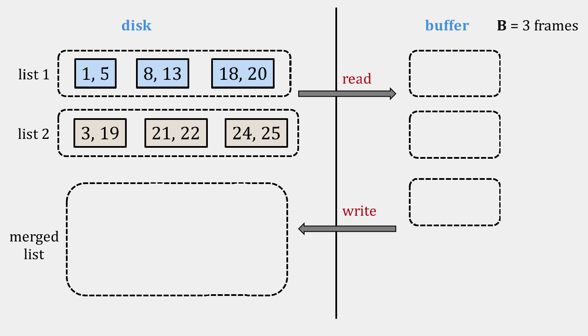

Se leen los primeros bloques de ambos archivos en memoria

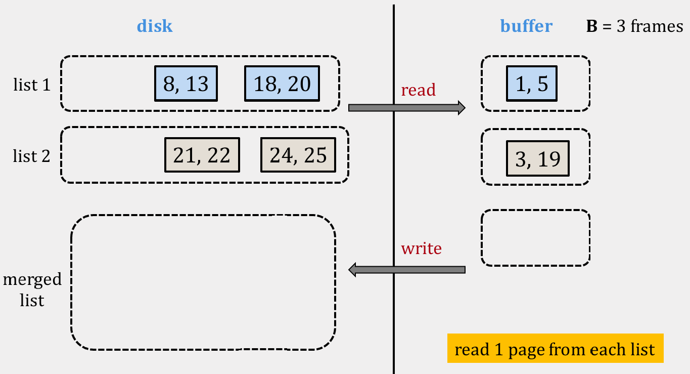

Usando el frame temporal, se van comparando los elementos de ambos bloques y se ordena en dicho frame. Cuando el frame temporal se llena, se escribe en el archivo de salida.

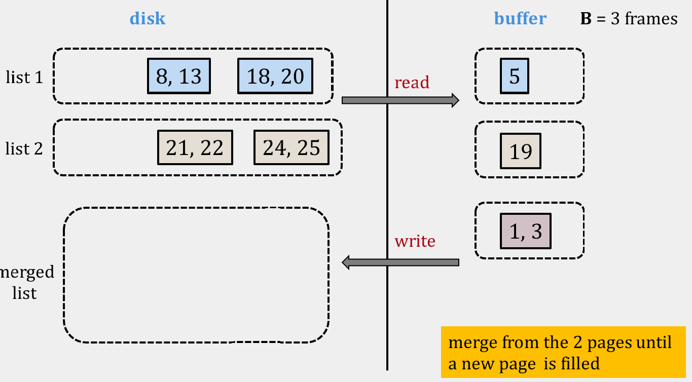

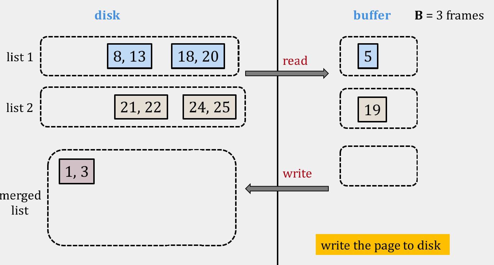

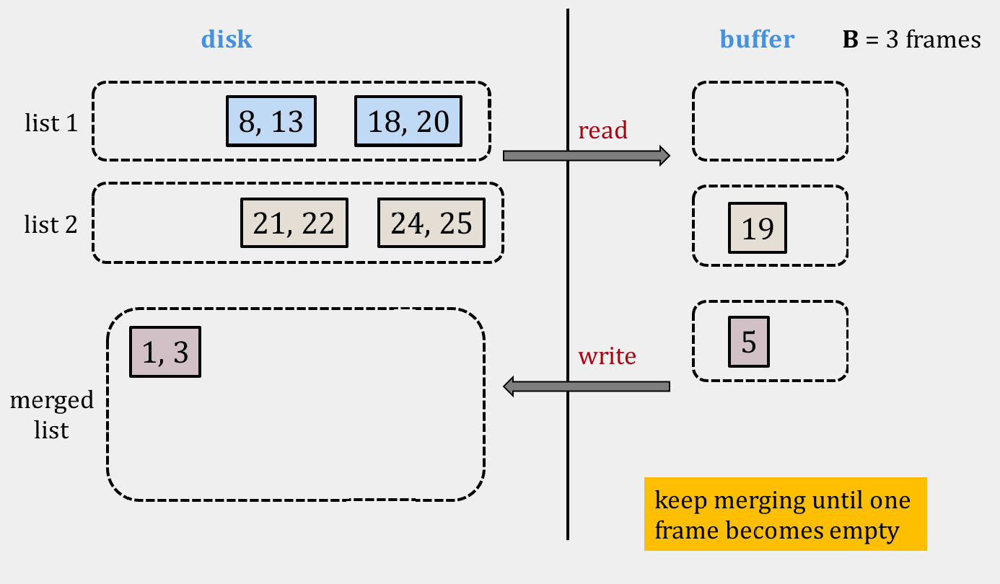

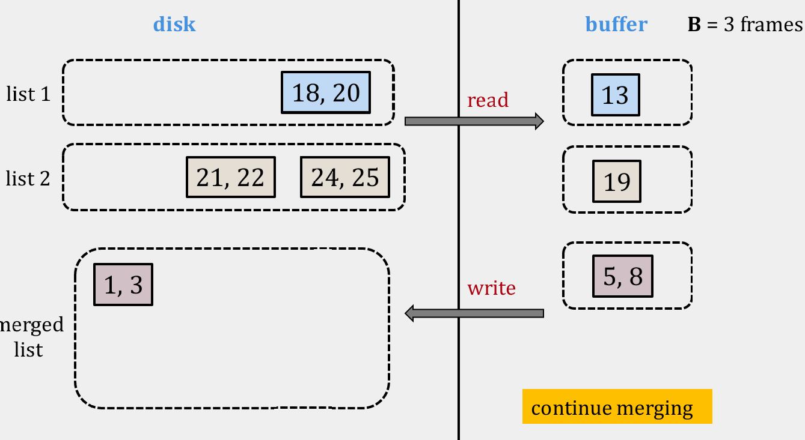

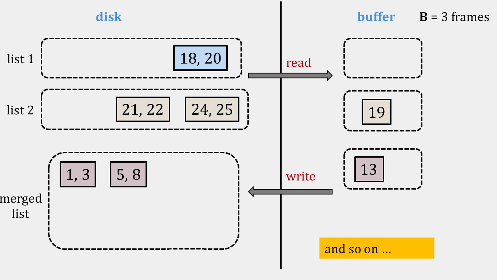

### External merge-sort
Para ordenar un archivo cuyos elementos están desordenados, podemos aplicar una forma del algoritmo tradicional de merge-sort. En merge-sort en memoria, el array se divide en subarray en memoria. En el caso de _external merge-sort_, en vez de crear subarray en memoria se crean *archivos temporales en disco* de tamaño incremental que actúen como dichos subarrays. Cada archivo temporal se llama _run_.

El algoritmo irá creando runs de tamaño 1, tamaño 2 y así sucesivamente hasta que se logre ordenar el archivo completo. Un _run de tamaño 1_ es el bloque mínimo de datos (_pages_) que se puede tener en memoria. La cantidad de elementos de dicho bloque dependerá de la naturaleza de los datos en el archivo.

En memoria únicamente se mantienen tres frames. En cada frame cabe un run de tamaño 1. Estos frames se ordenan aplicando el algoritmo de _external merge_ como veremos más adelante.

El proceso es el siguiente para la _etapa de división_:

1. Se realiza una pasada inicial para leer página por página del archivo.
2. Se ordena cada página y se escribe en un archivo temporal (_run_ de tamaño 1). Se generan n archivos temporales, donde _n_ es la cantidad de páginas del archivo original

Para la _etapa de mezcla_, se sigue el siguiente proceso:

1. Por cada página de cada run i, se carga una página de cada uno en memoria y se ordenan en un nuevo frame. Dicho frame se escribe en un nuevo run de tamaño 2·i (al mezclar dos runs de tamaño i, el resultado tiene tamaño i+i).
2. Se repite el proceso por cada set de _runs_

La visualización del algoritmo en [este enlace](https://valeriodiste.github.io/ExternalMergeSortVisualizer/External%20Merge%20Sort%20Visualizer/index.html) es sumamente útil. A continuación se adjuntan algunas capturas de la misma.

Por ejemplo, el estado inicial es el siguiente:

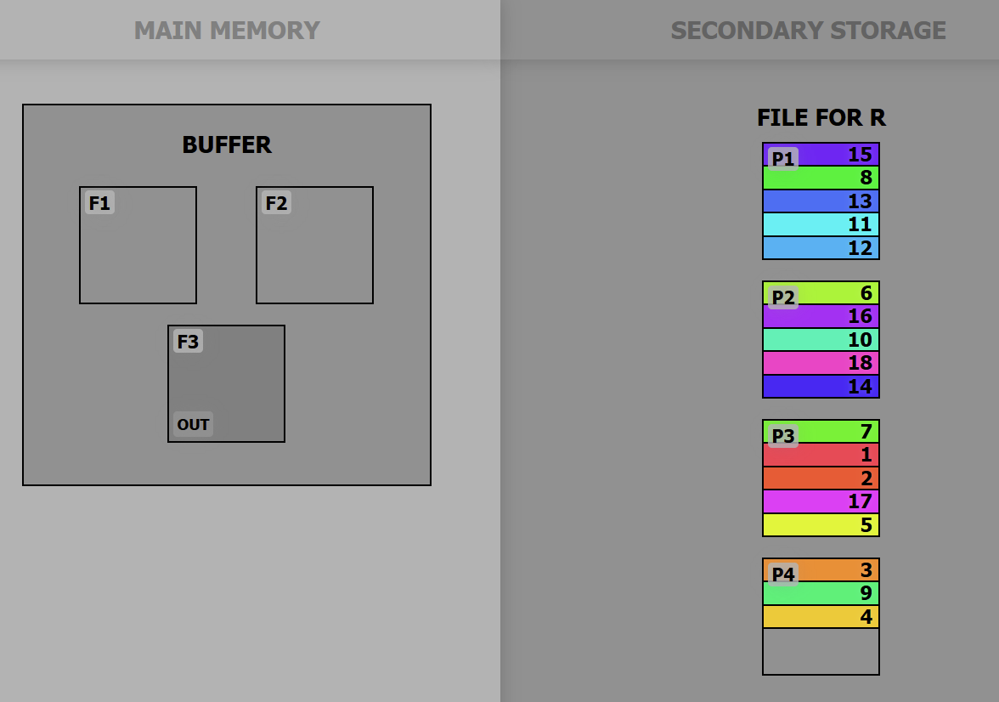

Posterior a la etapa de división, tenemos 4 runs de tamaño 1:

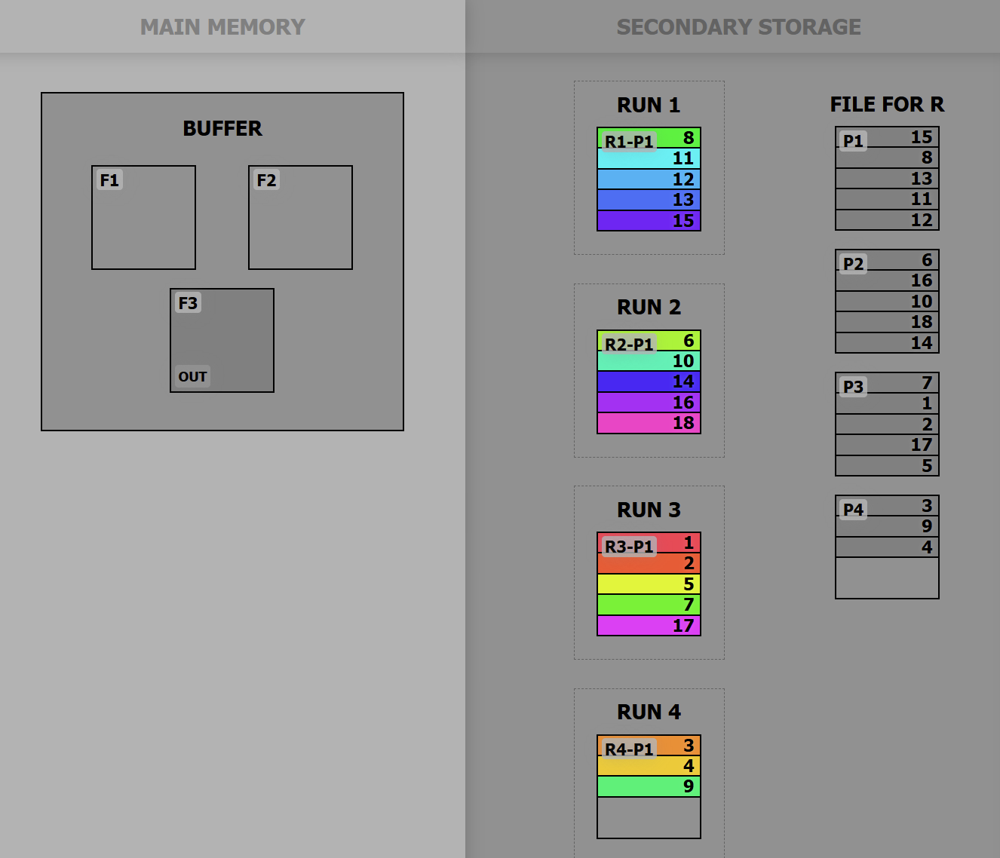

En la etapa de mezcla, observe cómo se mezclan las primeras páginas (y únicas en este caso) de los primeros dos runs de tamaño 1:


Cada vez que el buffer se llena, se escribe en un nuevo run de tamaño 2:

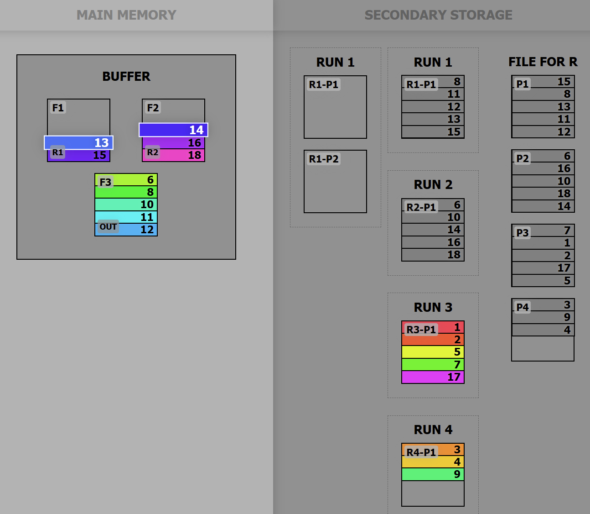

Se repite el proceso con los runs de tamaño dos. Y así sucesivamente hasta que se logre ordenar el archivo completo.

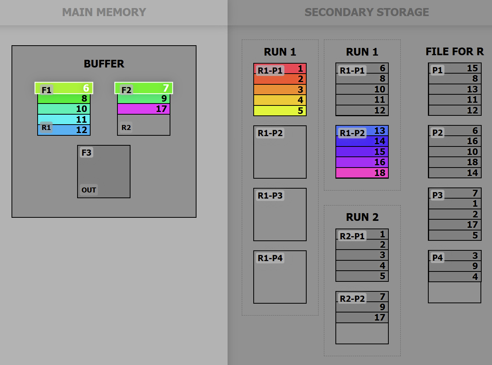

> Se pueden hacer mejoras sobre el algoritmo de _external merge-sort_ como el uso de _multiway merge_ para reducir el número de pasadas sobre el archivo.

## Árboles B y árboles B+

Hasta ahora hemos visto cómo se ordenan grandes volúmenes de datos en disco. La pregunta natural es: ¿cómo los **buscamos** eficientemente sin cargar todo en memoria? La respuesta clásica de los sistemas de bases de datos y sistemas de archivos son los **árboles B** (_B-trees_) y su variante **árboles B+** (_B+ trees_).

### Motivación: ¿por qué no basta con un BST balanceado?

Para datos en memoria, un árbol binario de búsqueda (BST) balanceado (AVL, rojo-negro) ofrece búsqueda, inserción y eliminación en `O(log n)`. Sin embargo, cuando los datos no caben en memoria y viven en **memoria secundaria** (disco), el análisis cambia por completo:

- En memoria, el costo dominante son las **comparaciones**.
- En disco, el costo dominante es la **E/S** (_I/O_, _input/output_): cada acceso a disco implica un _seek time_ y una latencia rotacional (recuerde que estos tiempos se miden en **milisegundos**, mientras que una comparación en CPU toma **nanosegundos**). Una sola lectura de disco puede costar tanto como millones de comparaciones.

Un BST balanceado con `n` nodos tiene altura `O(log_2 n)`. Si cada nodo vive en una posición arbitraria del disco, **cada paso del descenso es un acceso a disco distinto**. Para un millón de elementos eso son `log_2(1 000 000) ≈ 20` accesos a disco por búsqueda. Eso es inaceptable.

La idea clave es: **minimizar la cantidad de accesos a disco maximizando el factor de ramificación** (_branching factor_). En lugar de nodos con 1 clave y 2 hijos, usamos nodos "gordos" con cientos o miles de claves. La unidad natural de transferencia entre disco y memoria es la **página** (_page_) o **bloque** (_block_); por eso se diseña cada nodo del árbol para que **ocupe exactamente una página de disco**. Así, una sola lectura de E/S trae a memoria un nodo completo con muchísimas claves, y cada acceso a disco "decide" entre muchos hijos en vez de solo dos.

> Regla de diseño: **un nodo = una página de disco**. Leer un nodo cuesta exactamente una operación de E/S.

### Árbol B

Un **árbol B** es un árbol de búsqueda balanceado, ordenado y multi-vía (cada nodo tiene muchas claves e hijos), diseñado para minimizar accesos a disco.

#### Definición por grado mínimo `t`

Existen dos formas comunes de parametrizar un árbol B: por **orden** (máximo número de hijos) o por **grado mínimo** `t` (con `t ≥ 2`). Usaremos el grado mínimo, que es el más limpio para razonar sobre _splits_. Un árbol B de grado mínimo `t` cumple:

- Cada nodo, **salvo la raíz**, tiene al menos `t − 1` claves y por tanto al menos `t` hijos.
- Cada nodo tiene **a lo sumo** `2t − 1` claves y por tanto a lo sumo `2t` hijos. Un nodo con `2t − 1` claves se dice **lleno** (_full_).
- La **raíz** tiene al menos 1 clave (a menos que el árbol esté vacío).
- Las claves dentro de un nodo se mantienen **ordenadas**; entre dos claves consecutivas hay un puntero al subárbol cuyas claves están entre ambas.
- **Todas las hojas están a la misma profundidad**: el árbol está perfectamente balanceado por construcción.

Un nodo interno con `k` claves `c_1 < c_2 < ... < c_k` tiene `k + 1` hijos `h_0, h_1, ..., h_k`, donde todas las claves de `h_0` son menores que `c_1`, las de `h_i` están entre `c_i` y `c_{i+1}`, y las de `h_k` son mayores que `c_k`.

```text
Nodo interno con k = 3 claves y 4 hijos:

          [ 10 | 20 | 30 ]
          /    |    |     \
       h0     h1   h2      h3
     (<10) (10..20)(20..30) (>30)
```

#### Altura y costo

Como cada nodo tiene al menos `t` hijos (salvo la raíz), un árbol B con `n` claves tiene altura `O(log_t n)`. El factor `t` puede ser de cientos o miles en la práctica (porque cada nodo ocupa una página y una página entra muchas claves), de modo que la altura suele ser de apenas **2 a 4 niveles** incluso para millones de registros.

- **Búsqueda**: dentro de cada nodo se hace una búsqueda (lineal o binaria) entre sus claves: en total `O(log n)` **comparaciones**. Pero lo que realmente cuenta es que solo se visitan `O(log_t n)` nodos, es decir **`O(log_t n)` accesos a disco**. Esa es la métrica que importa.

> Para `n = 1 000 000` y `t = 500`, la altura es `log_500(1 000 000) ≈ 2.2`: tres lecturas de disco bastan para encontrar cualquier clave, frente a las ~20 de un BST.

#### Inserción y _split_

La inserción siempre ocurre en una **hoja**. El procedimiento desciende desde la raíz buscando la hoja correcta e inserta la clave en orden. El problema aparece cuando un nodo está **lleno** (`2t − 1` claves): no cabe una clave más. La solución es el **_split_** (división del nodo):

1. Se toma el nodo lleno con sus `2t − 1` claves.
2. La **clave mediana** sube al nodo padre.
3. Las `t − 1` claves a la izquierda de la mediana forman un nuevo nodo; las `t − 1` claves a la derecha forman otro nodo.

Para evitar tener que retroceder, la mayoría de implementaciones hacen _split_ **de forma proactiva durante el descenso**: cada vez que se va a bajar a un hijo lleno, primero se hace _split_ de ese hijo. Si la **raíz** está llena, se crea una nueva raíz vacía y se hace _split_ de la antigua: **es la única forma en que un árbol B crece en altura** (crece por la raíz, no por las hojas).

#### Ejemplo trabajado de inserción (`t = 2`)

Con `t = 2` (árbol B también llamado **2-3-4**), cada nodo tiene entre `1` y `3` claves, y entre `2` y `4` hijos. Un nodo lleno tiene `2t − 1 = 3` claves. Insertaremos la secuencia: **10, 20, 30, 40, 50, 25**.

Insertamos 10, 20, 30 en la raíz (aún cabe, máximo 3 claves):

```text
[ 10 | 20 | 30 ]      <- raíz llena (3 = 2t-1 claves)
```

Insertamos **40**. La raíz está llena, así que primero se hace _split_: la mediana (20) sube a una nueva raíz, y el nodo se parte en `[10]` y `[30]`. Luego 40 baja al hijo derecho:

```text
              [ 20 ]
             /      \
        [ 10 ]    [ 30 | 40 ]
```

Insertamos **50**. Desciende al hijo derecho `[30 | 40]`, que aún tiene espacio:

```text
              [ 20 ]
             /      \
        [ 10 ]    [ 30 | 40 | 50 ]   <- ahora lleno
```

Insertamos **25**. Hay que bajar al hijo derecho, pero está lleno: se hace _split_ proactivo. La mediana (40) sube a la raíz, y el nodo se parte en `[30]` y `[50]`. Luego 25 baja al hijo correcto (`[30]`, porque `20 < 25 < 40`) y se inserta en orden:

```text
              [ 20 | 40 ]
             /     |     \
        [ 10 ] [25|30]  [ 50 ]
```

Observe cómo el árbol permanece **perfectamente balanceado** (todas las hojas al mismo nivel) y cómo creció en altura **únicamente por la raíz** cuando esta se llenó.

#### Eliminación (conceptual)

La eliminación es la operación más delicada porque debe preservar el invariante de que cada nodo (salvo la raíz) tenga al menos `t − 1` claves. La idea general:

- Si se elimina una clave de una hoja con más de `t − 1` claves, basta quitarla.
- Si la clave está en un nodo interno, se reemplaza por su **predecesor o sucesor** (la clave más a la derecha del subárbol izquierdo o la más a la izquierda del derecho) y se elimina recursivamente esa clave de la hoja.
- Si un nodo quedaría con muy pocas claves (_underflow_), se recurre a:
  - **Préstamo** (_borrow_/rotación): tomar prestada una clave de un hermano adyacente que tenga de sobra, pasando por el padre.
  - **Fusión** (_merge_): si ningún hermano puede prestar, se fusionan dos nodos hermanos junto con la clave separadora del padre en un solo nodo. La fusión puede propagar el _underflow_ hacia arriba y, en el caso límite, reducir la altura del árbol.

No desarrollamos aquí el pseudocódigo completo; lo importante es retener que la eliminación mantiene el balanceo mediante **préstamo o fusión** de nodos.

### Árbol B+

El **árbol B+** es la variante que en la práctica usan casi todos los sistemas de bases de datos (_DBMS_) y muchos sistemas de archivos. Conserva todas las propiedades de balanceo del árbol B, pero con dos diferencias estructurales clave:

1. **Todos los datos/registros viven en las hojas.** Los nodos internos **no** almacenan datos: solo guardan **claves de ruteo** (_routing keys_), que son **copias** de claves usadas únicamente para dirigir la búsqueda hacia la hoja correcta. Por eso una misma clave puede aparecer dos veces: como copia de ruteo en un nodo interno y como dato real en una hoja.
2. **Las hojas están enlazadas** entre sí formando una **lista enlazada** (normalmente doblemente enlazada). Esto convierte el recorrido secuencial de todos los datos en orden en un simple recorrido de la lista de hojas, sin tener que volver a subir por el árbol.

```text
Árbol B+ (las claves internas son solo guías; los datos están en las hojas):

                 [ 20 |  40 ]                  <- nodos internos: solo ruteo
                /     |     \
   [10|15]  <-> [20|30]  <-> [40|50|60]        <- hojas enlazadas con datos
   (datos)      (datos)      (datos)
```

#### Ventajas para rangos y escaneos secuenciales

- **Consultas por rango** (_range queries_), p. ej. "todos los clientes con id entre 100 y 500": se busca el límite inferior en `O(log_t n)` accesos de disco hasta llegar a la hoja, y luego **se sigue la lista enlazada de hojas** leyendo registros consecutivos hasta el límite superior. Esto es muy eficiente porque las hojas tienden a estar contiguas en disco.
- **Escaneo secuencial** (_full scan_ ordenado): recorrer todos los datos en orden equivale a recorrer la lista de hojas de inicio a fin; nunca se vuelve a tocar un nodo interno.
- **Nodos internos más "delgados" en datos**: como no guardan registros completos sino solo claves de ruteo, **caben más claves por página**, lo que aumenta el factor de ramificación y reduce aún más la altura del árbol.
- **Búsquedas con tiempo más uniforme**: como los datos siempre están en las hojas, toda búsqueda recorre exactamente la altura del árbol (a diferencia del árbol B, donde una clave podría encontrarse antes, en un nodo interno).

Por estas razones, los **DBMS** (índices de tablas) y muchos **sistemas de archivos** modernos prefieren el árbol B+ sobre el árbol B clásico.

### Comparación B vs B+

| Aspecto | Árbol B | Árbol B+ |
| --- | --- | --- |
| Ubicación de los datos | En nodos internos **y** hojas | **Solo** en las hojas |
| Claves en nodos internos | Datos reales | Solo claves de ruteo (copias) |
| Hojas enlazadas | No | Sí (lista enlazada) |
| Consultas por rango / escaneo secuencial | Menos eficientes (hay que volver a subir) | Muy eficientes (se recorre la lista de hojas) |
| Factor de ramificación | Menor (los nodos guardan datos) | Mayor (nodos internos solo guardan claves) |
| Duplicación de claves | No | Sí (clave de ruteo + dato en hoja) |
| Búsqueda exitosa | Puede terminar en un nodo interno | Siempre llega hasta una hoja |
| Uso típico | Algunos índices, propósito general | DBMS, sistemas de archivos |

#### Relación con el resto de la lección

Estos árboles son la pieza que une los conceptos anteriores de la lección. Cada **nodo es una página/bloque** de disco (ver _Discos Duros_ y _Sistemas de archivos_), por lo que su tamaño se ajusta al de la página para que leer un nodo cueste **una sola operación de E/S**. El **cache** (visto antes) se usa para mantener en memoria los nodos superiores del árbol —en especial la raíz—, que se acceden en toda búsqueda; así muchas consultas evitan E/S a disco para los primeros niveles. Y los datos en las hojas suelen ser **registros de tamaño fijo** o secuencias de bytes, como vimos en _Estructura de un archivo_. En conjunto, el árbol B/B+ es la materialización del concepto de _árboles de registros_ y de _acceso indexado_ mencionados previamente.

#### Esbozo en C++ de un nodo de árbol B y su búsqueda

El siguiente esbozo en **C++17** muestra la estructura de un nodo de árbol B y la idea de la búsqueda. No es una implementación completa de inserción/eliminación, pero es conceptualmente compilable.

```cpp
#include <vector>
#include <memory>
#include <optional>

// Esbozo de un nodo de arbol B parametrizado por el grado minimo t.
// En un sistema real cada nodo corresponderia a una pagina (page) de
// disco; aqui usamos punteros en memoria solo para ilustrar la idea.
template <typename Key, int T>
struct BTreeNode {
    // Claves ordenadas: entre t-1 y 2t-1 elementos (la raiz puede tener menos).
    std::vector<Key> keys;

    // Hijos: si el nodo tiene k claves y NO es hoja, tiene k+1 hijos.
    // Para una hoja, 'children' queda vacio.
    std::vector<std::unique_ptr<BTreeNode>> children;

    bool isLeaf = true;

    bool isFull() const {
        return keys.size() == static_cast<std::size_t>(2 * T - 1);
    }
};

// Busqueda de una clave a partir de un nodo dado.
// Devuelve un puntero al nodo que contiene la clave (y se podria
// devolver tambien la posicion) o nullopt si no existe.
// Coste: O(log_t n) accesos a disco; O(log n) comparaciones.
template <typename Key, int T>
const BTreeNode<Key, T>* search(const BTreeNode<Key, T>* node, const Key& k) {
    if (node == nullptr) {
        return nullptr;
    }

    // Avanzar dentro del nodo mientras k sea mayor que la clave actual.
    // (Una busqueda binaria seria preferible para nodos grandes.)
    std::size_t i = 0;
    while (i < node->keys.size() && k > node->keys[i]) {
        ++i;
    }

    // Clave encontrada en este nodo.
    if (i < node->keys.size() && k == node->keys[i]) {
        return node;
    }

    // Si es hoja y no se encontro, la clave no existe.
    if (node->isLeaf) {
        return nullptr;
    }

    // Descender al hijo i (cada descenso = una lectura de pagina de disco).
    return search(node->children[i].get(), k);
}
```

> En un árbol B+ la búsqueda anterior **siempre** descendería hasta una hoja (donde residen los datos), y las hojas mantendrían además punteros a la hoja siguiente para soportar consultas por rango.

## Referencias
- https://www.geeksforgeeks.org/external-sorting/
- Koutris. P. CS 564 [Spring 2018]. https://pages.cs.wisc.edu/~paris/cs564-s18/lectures/lecture-16.pdf
- https://valeriodiste.github.io/ExternalMergeSortVisualizer/External%20Merge%20Sort%20Visualizer/index.html
- Cormen, T. H. et al. _Introduction to Algorithms_ (CLRS), capítulo "B-Trees".
- https://www.geeksforgeeks.org/introduction-of-b-tree/
- https://www.geeksforgeeks.org/introduction-of-b-tree-2/ (árboles B+)