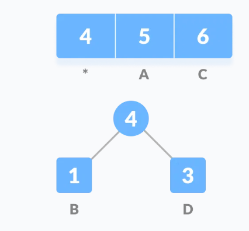
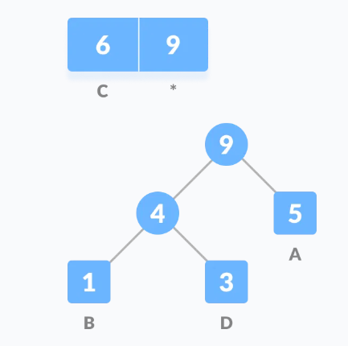
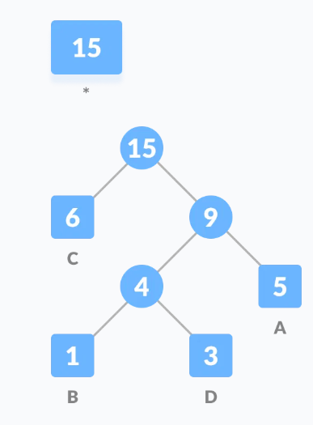
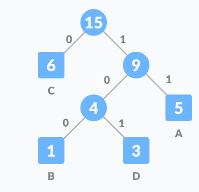
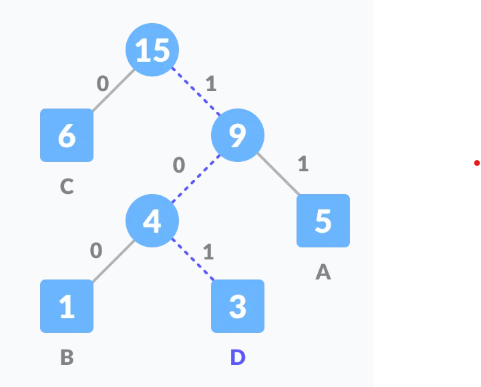
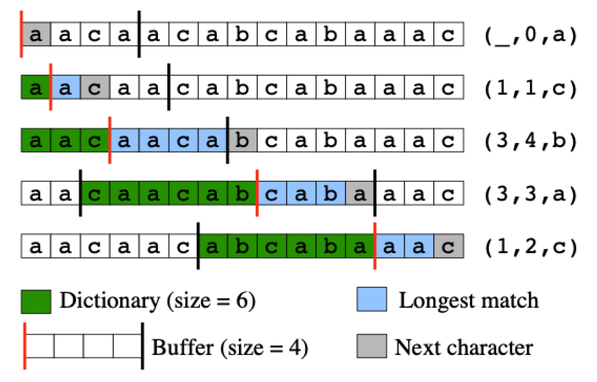
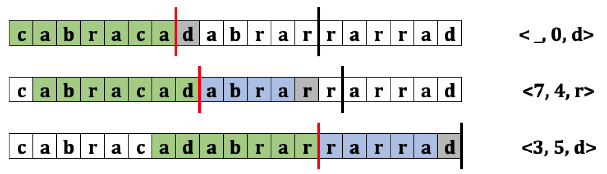
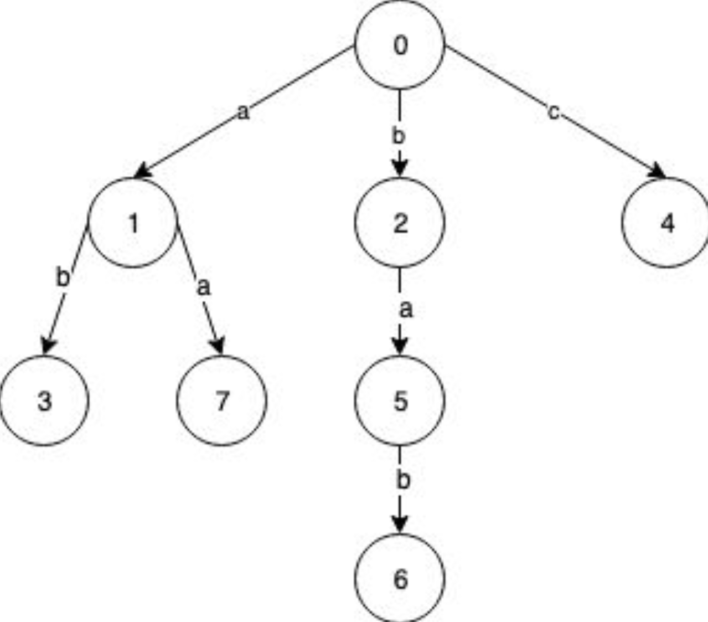

# Algoritmos de Compresión
Comprimir se refiere a reducir la cantidad de bits requeridos para representar un conjunto de datos. Los algoritmos de compresión se utilizan para reducir el tamaño de los archivos y, por lo tanto, ahorrar espacio en disco y acelerar la transferencia de datos a través de la red.

En este capítulo veremos conceptos fundamentales de compresión junto con algoritmos comunes.

## Tipos de compresión
Comúnmente, los algoritmos de compresión se dividen en dos categorías principales: compresión sin pérdida y compresión con pérdida.

### Compresión con pérdida (lossy)
Reduce el tamaño de los datos identificando información innecesaria y eliminándola. Este tipo de compresión se utiliza comúnmente en archivos de audio, video e imágenes. La compresión con pérdida es irreversible, lo que significa que los datos originales no se pueden recuperar después de la compresión.

Utiliza métodos de codificación que generan representaciones inexactas de los datos originales. La calidad de los datos comprimidos se mide en términos de la cantidad de información que se pierde durante la compresión. Los algoritmos _lossy_ normalmente exponen parámetros de calidad, lo que permite ajustar el balance entre tasa de compresión y degradación de calidad evidente para el usuario final.


La compresión con pérdida se utiliza comúnmente en aplicaciones donde la calidad de los datos no es crítica, como la transmisión de video en línea y la transmisión de audio. Los formatos de alta fidelidad o _raw_ tienden a ser de tamaño muy grande y sin compresión _lossy_ streaming de audio y video no sería posible para la gran mayoría de los usuarios.


#### Percepción de la calidad
La distorsión es la diferencia entre los datos originales y los datos comprimidos. La distorsión se mide en términos de la calidad de los datos comprimidos en comparación con los datos originales.

Aunque se puede definir modelos matemáticos para medir la distorsión, la percepción de la calidad es subjetiva y depende de la sensibilidad del observador. La percepción de la calidad se mide en términos de la cantidad de distorsión que un observador puede tolerar antes de que la calidad de los datos comprimidos se considere inaceptable. Por ejemplo, para un archivo de audio, un audiófilo puede ser más sensible a la distorsión que una persona promedio.

Los algoritmos de compresión con pérdida, buscan optimizar la percepción de calidad según los atributos fisio-psicológicos del ser humano. Por ejemplo, en el caso de la compresión de imágenes, la compresión JPEG se basa en la percepción visual humana y elimina los detalles menos perceptibles para el ojo humano. En el caso de la compresión de audio, la compresión MP3 se basa en la percepción auditiva humana y elimina los sonidos menos perceptibles para el oído humano (mediante un modelo psicoacústico de enmascaramiento frecuencial y temporal).

> Para aprender más sobre JPEG, vea el video en este [enlace](https://www.youtube.com/watch?v=0me3guauqOU&t=1976s).

### Compresión sin pérdida (lossless)
Son algoritmos de compresión que reducen el tamaño de los datos sin perder información. La compresión sin pérdida es reversible, lo que significa que los datos originales se pueden recuperar después de la compresión. Este tipo de compresión se utiliza comúnmente en archivos de texto, documentos y bases de datos.

Generalmente utilizan información estadística para identificar patrones repetitivos en los datos y reemplazarlos por códigos más cortos. Por ejemplo, frecuencia de caracteres en un texto o frecuencia de colores en una imagen.

Algunos de los algoritmos de compresión sin pérdida más comunes son:

- Huffman
- LZW (Lempel-Ziv-Welch)
- LZ77
- LZ78
- Run-Length Encoding (RLE)
- Deflate (utilizado en ZIP)
- Burrows-Wheeler Transform (BWT)

#### Huffman
Desarrollado por David A. Huffman en 1952, es un algoritmo de compresión sin pérdida que utiliza códigos de longitud variable para representar datos. Los códigos de longitud variable asignan códigos más cortos a los símbolos más frecuentes y códigos más largos a los símbolos menos frecuentes.

El algoritmo de Huffman construye un árbol binario que se utiliza para asignar códigos a cada símbolo. La tabla de conversión se almacena en el archivo comprimido, puesto que será esencial para poder descomprimir el archivo.

El proceso que sigue el algoritmo es:

1. Calcular la frecuencia de cada símbolo en el archivo.
2. Crear un nodo hoja para cada símbolo y ordenarlos por frecuencia de menor a mayor.
3. Unir los dos nodos con menor frecuencia en un nuevo nodo padre. Este nuevo nodo debe ordenarse en la lista de nodos.
4. Repetir el paso 3 hasta que quede un solo nodo.
5. Recorrer el árbol binario asignando 0 a las ramas izquierdas y 1 a las ramas derechas.
6. Crear la tabla de conversión y comprimir el archivo.

Por ejemplo, si tenemos el siguiente texto `bcaadddccacacac`, cada carácter en ASCII se representa con 8 bits, por lo que ocuparía 120 bits en total (8 * 15). Si aplicamos Huffman, se calculan las frecuencias:

| Símbolo | Frecuencia |
|---------|------------|
| b       | 1          |
| c       | 6          |
| a       | 5          |
| d       | 3          |

Se crea un nodo por cada símbolo y se ordenan por frecuencia:

`(b, 1), (d, 3), (a, 5), (c, 6)`

Se forma el árbol agrupando siempre los nodos menores:



Nótese que el nodo 4, se inserta en el orden correspondiente según frecuencia y se vuelve a aplicar el agrupamiento:



Nótese que nodo 9 queda al final dado que tiene la mayor frecuencia total. Se repite el proceso y se obtiene el árbol completo:



Se asignan códigos a cada símbolo recorriendo el árbol (0 a la izquierda y 1 a la derecha):



La tabla de conversión final sería:

| Símbolo | Frecuencia | Código |
|---------|------------|--------|
| a       | 5          | 11     |
| b       | 1          | 100    |
| c       | 6          | 0      |
| d       | 3          | 101    |

Aplicando la tabla de conversión al texto original, se obtiene la siguiente secuencia de bits:

`1000111110110110100110110110`

Lo que corresponde a 28 bits.

> El tamaño de la tabla, debe considerarse como parte del archivo comprimido.

Para realizar el proceso inverso y obtener el mensaje original, se sigue el árbol de Huffman y se va recorriendo según los bits de la secuencia. Por ejemplo, se considera la cadena como un _stream_ de datos y carácter por carácter se va recorriendo el árbol hasta llegar a una hoja. Se repite el proceso hasta llegar al final de la secuencia.

Por ejemplo, para los primeros tres caracteres de la cadena comprimida:



#### Entropía y el límite de Shannon
Hasta ahora vimos _cómo_ Huffman asigna códigos más cortos a los símbolos más frecuentes, pero no _cuánto_ se puede comprimir en el mejor de los casos. La respuesta a esta pregunta proviene de la teoría de la información formulada por Claude Shannon en 1948 y constituye el fundamento teórico de toda la compresión sin pérdida.

##### Entropía de Shannon
Dada una fuente que emite símbolos de un alfabeto, donde cada símbolo `i` aparece con probabilidad `p_i`, la **entropía** de la fuente se define como:

`H = -Σ p_i · log2(p_i)`   (bits por símbolo)

La entropía `H` se interpreta como la **cantidad promedio mínima de bits por símbolo** necesaria para representar la fuente sin pérdida. Intuitivamente:

- Un símbolo muy probable (`p_i` cercano a 1) aporta poca información: `log2(p_i)` es cercano a 0, por lo que "cuesta" pocos bits.
- Un símbolo poco probable aporta mucha información: `log2(p_i)` es un número negativo grande en magnitud, por lo que "cuesta" muchos bits.
- La entropía es máxima cuando todos los símbolos son equiprobables (no hay patrón estadístico que explotar) y mínima cuando un símbolo domina (la fuente es muy predecible).

> Nótese que `log2(p_i)` es negativo porque `0 < p_i ≤ 1`; el signo menos al frente de la sumatoria deja a `H` como un valor positivo.

##### Teorema de codificación de la fuente
El **teorema de codificación de la fuente** (_source coding theorem_) de Shannon establece el límite inferior fundamental de la compresión sin pérdida:

> Ninguna codificación sin pérdida que asigne un código a cada símbolo de forma independiente puede usar, en promedio, menos de `H` bits por símbolo.

Formalmente, si `L` es la **longitud media de código** (el promedio ponderado por frecuencia de la longitud en bits de cada código), entonces:

`L ≥ H`

Este resultado es independiente del algoritmo: por más ingenioso que sea, ningún esquema de codificación símbolo a símbolo puede bajar de la barrera impuesta por la entropía de la fuente. La entropía es, por tanto, el "límite de Shannon" para la compresión sin pérdida.

##### Relación con Huffman
La codificación de Huffman es **óptima** dentro de la familia de los **códigos prefijo** (_prefix codes_) que asignan un código entero de bits a cada símbolo: ningún otro código prefijo por símbolo logra una longitud media menor para una distribución de probabilidad dada. Sin embargo, como cada código debe tener un número **entero** de bits, Huffman no siempre puede igualar exactamente la entropía. Lo que sí garantiza es que su longitud media `L` queda acotada por:

`H ≤ L < H + 1`

Es decir, Huffman nunca usa menos que la entropía (cumple el teorema de Shannon) y nunca se desvía más de 1 bit por símbolo por encima de ella. Esa diferencia `L - H` se conoce como **redundancia** del código.

En el ejemplo de Huffman visto antes con el texto `bcaadddccacacac`, la representación original en ASCII usaba 8 bits por símbolo, mientras que el código de Huffman logró una longitud media mucho menor (28 bits para 15 símbolos, es decir, unos 1.87 bits por símbolo). Esa reducción es precisamente lo que la teoría de la información predice: el código se acerca a la entropía de la distribución de frecuencias de esos cuatro símbolos.

##### Ejemplo numérico
Consideremos una fuente con cuatro símbolos `A`, `B`, `C`, `D` cuyas probabilidades son potencias de dos, un caso en el que Huffman alcanza exactamente la entropía:

| Símbolo | Probabilidad `p_i` | `log2(p_i)` | `-p_i · log2(p_i)` |
|---------|--------------------|-------------|--------------------|
| A       | 1/2 = 0.5          | -1          | 0.500              |
| B       | 1/4 = 0.25         | -2          | 0.500              |
| C       | 1/8 = 0.125        | -3          | 0.375              |
| D       | 1/8 = 0.125        | -3          | 0.375              |

Calculando la entropía paso a paso:

`H = -(0.5·(-1) + 0.25·(-2) + 0.125·(-3) + 0.125·(-3))`

`H = (0.5 + 0.5 + 0.375 + 0.375)`

`H = 1.75 bits/símbolo`

Ahora construimos el código de Huffman para esta distribución. Agrupando siempre los dos nodos de menor probabilidad (C y D, luego ese par con B, y finalmente con A) se obtiene:

| Símbolo | Probabilidad | Código de Huffman | Longitud (bits) |
|---------|--------------|-------------------|-----------------|
| A       | 0.5          | `0`               | 1               |
| B       | 0.25         | `10`              | 2               |
| C       | 0.125        | `110`             | 3               |
| D       | 0.125        | `111`             | 3               |

La longitud media del código de Huffman se calcula ponderando la longitud de cada código por su probabilidad:

`L = 0.5·1 + 0.25·2 + 0.125·3 + 0.125·3`

`L = 0.5 + 0.5 + 0.375 + 0.375`

`L = 1.75 bits/símbolo`

En este caso `L = H = 1.75`, por lo que el código de Huffman es **óptimo y alcanza exactamente el límite de Shannon**, sin redundancia (`L - H = 0`). Esto ocurre porque todas las probabilidades son potencias de `1/2`, de modo que la longitud ideal `-log2(p_i)` resulta ser un número entero de bits para cada símbolo y Huffman puede ajustarse perfectamente.

> Cuando las probabilidades **no** son potencias de dos, las longitudes ideales no son enteras y Huffman queda estrictamente por encima de la entropía (`H < L < H + 1`). Para acercarse aún más al límite se emplean técnicas como la **codificación aritmética** o la **codificación por rangos** (_range coding_), que no exigen un número entero de bits por símbolo.

#### LZ77
Desarrollado por Abraham Lempel y Jacob Ziv en 1977, es un algoritmo de compresión sin pérdida que utiliza la repetición de secuencias de datos para reducir el tamaño de los datos. El algoritmo LZ77 utiliza una ventana deslizante para buscar secuencias repetidas en los datos y reemplazarlas por referencias a secuencias anteriores.

El algoritmo funciona de la siguiente manera:

1. Busca la secuencia más larga que coincida con la secuencia que inicia en la posición actual.
1. Genera una tripleta `(o, l, c)` donde:
   1. `o` (offset) representa el número de caracteres hacia atrás que se encuentra la secuencia que coincida.
   1. `l` (length) representa la longitud de la secuencia que coincida.
   1. `c` (character) representa el siguiente carácter que no coincide con la secuencia.
1. Se avanza la ventana deslizante y se repite el proceso.

Por ejemplo, para comprimir la cadena `a b a b c b a b a b a a`, el buffer inicial (o diccionario) estará vacío, por lo que no hay ningún _match_ para la primera letra _a_. Se genera la primera tripleta `(0, 0, a)` dado que no hay coincidencias y el siguiente carácter que "rompe" la secuencia es _a_.

`a [b] a b c b a b a b a a -> (0, 0, a)`

Dado que no hay ningún _match_ con la letra b,

`a b [a] b c b a b a b a a -> (0, 0, b)`

En la posición actual, se encuentra la secuencia `a b` que coincide con la secuencia que inicia en la posición 0. Por lo que se genera la tripleta `(2, 2, c)`.

`a b a b c [b] a b a b a a -> (2, 2, c)`

Se repite el proceso hasta llegar al final de la cadena.

`a b a b c [b] a b a b a a -> (4, 3, a)`

`a b a b c b a b a [b] a a -> (2, 2, a)`

El resultado de la compresión no requiere una tabla de compresión, sino que sería:

`(0, 0, a) (0, 0, b) (2, 2, c) (4, 3, a) (2, 2, a)`

El proceso de descompresión es muy sencillo:

1. Se toma la tripleta `(o, l, c)` y se copian los `l` caracteres desde la posición `o` en el buffer.
1. Se añade el carácter `c` al final del buffer.
1. Se repite hasta que se acaben las tripletas.

Entonces:

`(0, 0, a) -> a`

`(0, 0, b) -> ab`

`(2, 2, c) -> ababc`

`(4, 3, a) -> ababcbaba`

`(2, 2, a) -> ababcbababaa`

> Una clara ventaja de LZ77 es que no requiere una pasada inicial por los datos para generar información estadística, sino que se va generando a medida que se avanza en la cadena. Por ejemplo, si se quiere comprimir un archivo grande, se puede considerar como un _stream_ de datos y conforme se va leyendo, se va comprimiendo.

Otro ejemplo de la compresión LZ77 sería:



> La tripleta (3, 4, b) tiende a generar confusión. ¿Puede explicar por qué hay 4 coincidencias?

Utilizando un diccionario inicial se tiene el siguiente ejemplo:



#### LZ78
LZ78 es un enfoque alternativo a LZ77 propuesto por Abraham Lempel y Jacob Ziv en 1978. La principal diferencia entre LZ77 y LZ78 es que LZ78 construye incrementalmente un diccionario explícito para almacenar las secuencias repetidas, en lugar de utilizar una ventana deslizante. La motivación de los autores fue evitar la parametrización requerida en LZ77 para optimizar el desempeño.

LZ78 utiliza una estructura de datos _trie_ para almacenar los prefijos conocidos, tal y como se vio en el [capítulo de estructuras de datos jerárquicas](../ce-1103/03-estructuras-de-datos-jerarquicas.md#el-tda-trie).

Supongamos que se desea comprimir la cadena `a b a b c b a b a b a a` con LZ78. Inicialmente, el trie solo tendrá la raíz que representa el string vacío. Cada vez que se procese un carácter, se buscará en el trie si existe una secuencia que coincida con la secuencia actual. Si no existe, se añade al trie y se genera una nueva secuencia. Si existe, se avanza al siguiente carácter. Cada vez que se agrega un nodo al trie, se genera la tupla `(o, c)i` donde `o` es el índice del nodo padre, `c` es el carácter que no coincide con la secuencia e `i` es el índice del nodo actual.

`a [b] a b c b a b a b a a -> (0, a)1`

Nótese que en este caso, al procesar el carácter `a` no se encuentra en el trie. Se agrega un nodo a partir de la raíz (nodo 0) y se incrementa el índice para el nuevo nodo. Al procesar el nodo `b`, se vuelve a crear un nuevo nodo `b` a partir de la raíz y se genera la tupla `(0, b)2`.

`a b [a] b c b a b a b a a -> (0, b)2`

Al procesar el carácter `a` a partir de la raíz, se encuentra dicho carácter. Se sigue con el siguiente carácter `b` y no se encuentra dicho carácter a partir de `a`. Se añade un nuevo nodo a partir de `a` y se genera la tupla `(1, b)3`.

`a b a b [c] b a b a b a a -> (1, b)3`

El procesamiento sigue de la siguiente forma:

`a b a b c [b] a b a b a a -> (0,c)4`

`a b a b c b a [b] a b a a -> (2,a)5`

`a b a b c b a b a b [a] a -> (5,b)6`

`a b a b c b a b a b a a -> (1,a)7`

Visualmente, el árbol completo es:



Para descomprimir, simplemente se accede cada tupla y se recorre el nodo hasta encontrar la raíz. Por ejemplo, para el resultado anterior `(0,a)1, (0,b)2, (1,b)3, (0,c)4, (2,a)5, (5,b)6, (1,a)7`:

| Tupla    | Resultado         |
|----------|-------------------|
| `(0,a)1` | a                 |
| `(0,b)2` | b                 |
| `(1,b)3` | `(0,a)1` + b = ab |
| `(0,c)4` | c                 |
| `(2,a)5` | `(0,b)2` + a = ba |
| `(5,b)6` | `(2,a)5`+ b = bab |
| `(1,a)7` | `(0,a)1` + a = aa |

El resultado final sería `ababcbababaa`.

#### LZW
El algoritmo LZW (Lempel-Ziv-Welch) es una mejora a LZ78 desarrollada por Terry Welch en 1984. LZW utiliza un diccionario para almacenar las secuencias repetidas y asignarles un código. Es uno de los algoritmos de compresión sin pérdida más utilizados y se utiliza en formatos de archivo como GIF y TIFF.

Utiliza una tabla de códigos, con los primeros 0 a 255 para representar los caracteres ASCII. LZW identifica secuencias repetidas y crea nuevos códigos para estas.

El pseudo-código del algoritmo es:

```pseudo
Initialize table with single character strings
P = first input character
WHILE not end of input stream
    C = next input character    
    IF P + C is in the string table
        P = P + C
    ELSE
        output the code for P    
        add P + C to the string table
        P = C
END WHILE
output code for P 
```

En el siguiente ejemplo, comprimiremos la cadena `a b a c a b a c a` inicializando la tabla solo con los caracteres `a b c` dado que son los únicos presentes en la cadena, esto para efectos de simplicidad didáctica. El resultado de la compresión sería `97 98 97 99 256 258 97` y la tabla generada:

| Diccionario | Código |
|-------------|--------|
| a           | 97     |
| b           | 98     |
| c           | 99     |
| ab          | 256    |
| ba          | 257    |
| ac          | 258    |
| ca          | 259    |
| aba         | 260    |
| aca         | 261    |

Paso a paso se realizaría de la siguiente forma:

| Índice                | Explicación      | P  | C  |  P + C | Output                  |
|--------               |-------------     |--- |--- |--------|--------                 |
| `[a] b a c a b a c a` | `P+C` está       | '' | a  |   a    |                         |
| `a [b] a c a b a c a` | `P+C` no está    | a  | b  |   ab   | 97                      |
| `a b [a] c a b a c a` | `P+C` no está    | b  | a  |   ba   | 97 98                   |
| `a b a [c] a b a c a` | `P+C` no está    | a  | c  |   ac   | 97 98 97                |
| `a b a c [a] b a c a` | `P+C` no está    | c  | a  |   ca   | 97 98 97 99             |
| `a b a c a [b] a c a` | `P+C` está       | a  | b  |   ab   | 97 98 97 99             |
| `a b a c a b [a] c a` | `P+C` no está    | ab | a  |   aba  | 97 98 97 99 256         |
| `a b a c a b a [c] a` | `P+C` está       | a  | c  |   ac   | 97 98 97 99 256         |
| `a b a c a b a c [a]` | `P+C` no está    | ac | a  |   aca  | 97 98 97 99 256 258     |
| `a b a c a b a c [a]` | Final            | a  |    |        | 97 98 97 99 256 258 97  |

La descompresión se reduce a buscar cada uno de los códigos generados en la tabla y hacer el output del valor en el diccionario:

```
97 98 97 99 256 258 97 
^  ^  ^  ^  ^   ^   ^
a  b  a  c  ab  ac  a 

```

## Referencias
- https://www.geeksforgeeks.org/what-are-data-compression-techniques/
- https://www.programiz.com/dsa/huffman-coding
- https://hackernoon.com/how-lz77-data-compression-works-yk113te0
- https://hackernoon.com/how-lz78-compression-algorithm-works-x7103tlm
- https://www.geeksforgeeks.org/lzw-lempel-ziv-welch-compression-technique/