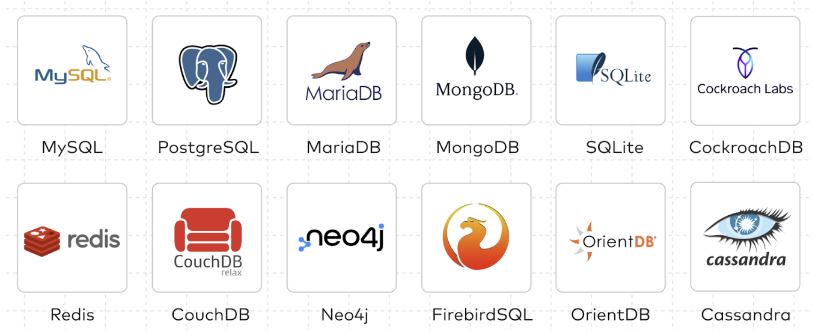
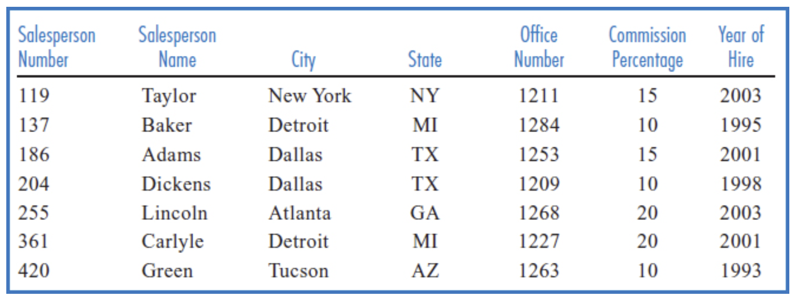
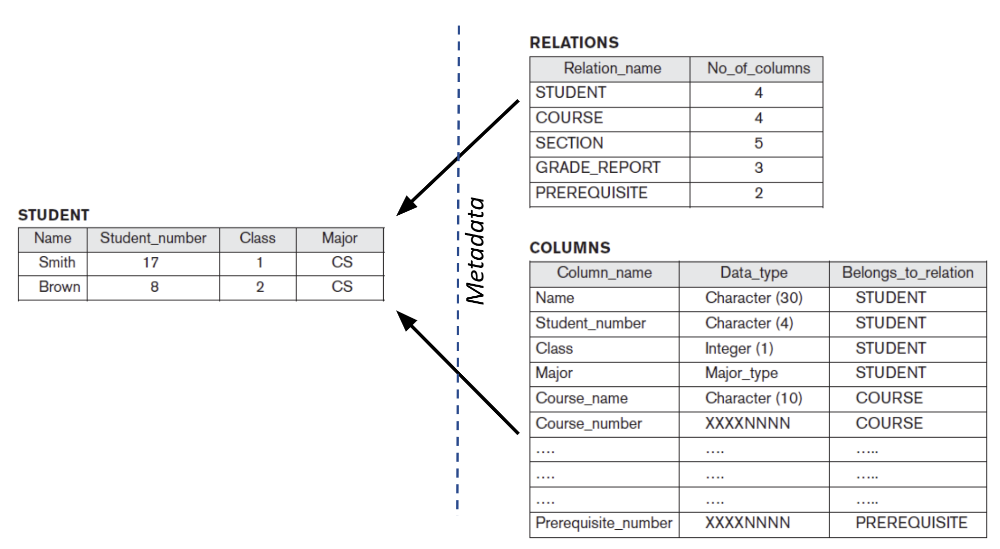
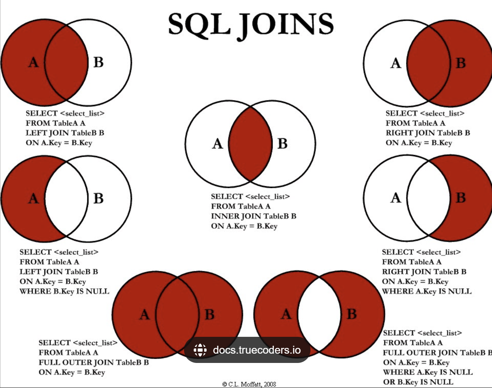
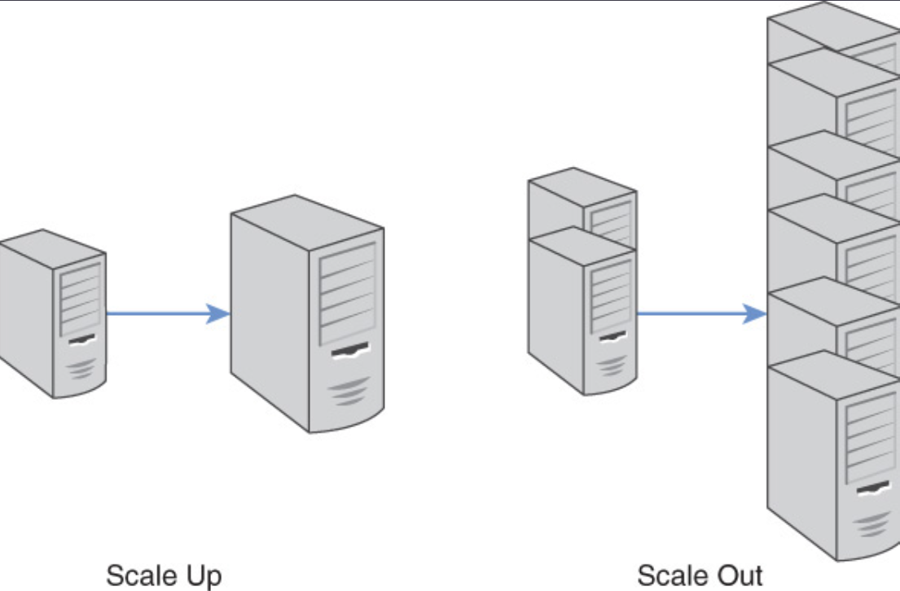

# Bases de Datos
En este capítulo, se introducen conceptos fundamentales de bases de datos relacionales y NoSQL. Dicho conocimiento proveerá una conclusión al tema de almacenamiento externo y funcionará como base para los cursos posteriores centrados en bases de datos.

## Definiciones fundamentales
Un **dato** es una representación simbólica (numérica, alfabética, algorítmica, etc.) de un atributo o variable cuantitativa o cualitativa. Los datos describen hechos, entidades o relaciones entre ellos. Por ejemplo, un dato puede ser la edad de una persona, el nombre de un producto o la fecha de un evento.

Una **base de datos** es una colección de datos organizada para un propósito específico. Las bases de datos puede ser almancenadas en medios no electrónicos, como la base de datos de una biblioteca, donde cada tarjeta de papel, tiene datos de un libro específicos. Para efectos de este capítulos, consideramos las bases de datos dentro del contexto de Tecnologías de la Información, donde los datos son almacenados y gestionados electrónicamente.

Las bases de datos tiene un _dominio_ o universo de discurso específico, que describe el tipo de datos que almacenan. **No hay bases de datos genéricas**.

Un sistema administrador de bases de datos (DBMS) es un software que permite a los usuarios crear, leer, actualizar y eliminar datos en una base de datos. Ejemplos de DMBS comunes son MySQL, PostgreSQL, Oracle, SQL Server, SQLite, DB2, MongoDB, entre otras.



## Enfoques en el manejo de la información
### Enfoque orientado a archivos
Antes de la era de los DBMS, los datos generados por los sistemas de información se almacenaban en archivos simples. El programa o el sistema que los accediera, era responsable de interpretar el formato de cada registro y asegurar la consistencia del archivo completo. Usualmente, un programa accedía a un único archivo con información diseñada para este. Sin embargo, conforme la complejidad de los sistemas crece, surgen problemas como:

- Formatos inconsistentes
- Redundancia (duplicación) de datos en archivos separados
- Diseño de datos ineficiente
- Inseguridad en el manejo de los datos
- Cambios en los archivos requerían cambios en los programas (acoplamiento alto)
- Fragilidad en la integridad de los datos, un error en un programa podía corromper los datos

Bajo el enfoque de archivos, los datos se almacenaban secuencialmente en los archivos, en registros compuestos de campos por ejemplo:



En los DBMS modernos, los datos estructurados, se almacenan _lógicamente_ con una estructura igual, es decir, registros y campos.

### Enfoque orientado a bases de datos
Tal y como se mencionó en secciones anteriores, el DBMS es un software que permite a los usuarios crear, leer, actualizar y eliminar datos en una base de datos. Bajo este enfoque, se crea una capa de indirección entre los programas y los datos, delegando la responsabilidad de la gestión de los datos al DBMS. Los programas acceden a los datos a través de consultas y comandos, sin necesidad de conocer la estructura interna de la base de datos.

Las ventajas de este enfoque son:

- **Independencia de los datos**: Los programas no necesitan conocer la estructura interna de la base de datos. Los DBMS son auto-descriptivos, es decir, pueden describir su estructura interna.



- **Integridad de los datos**: Los DBMS pueden aplicar reglas de integridad para garantizar la precisión y consistencia de los datos.

- **Seguridad**: Los DBMS pueden controlar el acceso a los datos y protegerlos contra accesos no autorizados.

- **Concurrencia**: Los DBMS pueden gestionar el acceso simultáneo a los datos por múltiples usuarios.

- **Escalabilidad**: Los DBMS pueden manejar grandes volúmenes de datos y crecer con las necesidades de la organización.

- **Facilidad para compartir datos**: Los DBMS permiten compartir datos entre  múltiples usuarios y aplicaciones, sin necesidad de duplicarlos.

Algunos de los componentes de un DBMS incluyen: 

- **Datos**: La información almacenada en la base de datos.

- **Motor de base de datos**: Interpreta y ejecuta las consultas y comandos enviados por los usuarios.

- **Lenguaje de consulta**: Permite a los usuarios interactuar con la base de datos mediante consultas y comandos.

- **Gestor de transacciones**: Controla las operaciones de inserción, actualización y eliminación de datos para garantizar la consistencia y la integridad.

- **Gestor de almacenamiento**: Administra el almacenamiento físico de los datos en el disco.

- **Gestor de seguridad**: Controla el acceso a los datos y protege la base de datos contra accesos no autorizados.

## Tipos de bases de datos
De forma análoga a los lenguajes de programación en los que se adopta un paradigma que determina sus características, las bases de datos pueden adoptar un enfoque:

1. **Relacional**: Las bases de datos relacionales almacenan datos en tablas, donde cada fila representa un registro y cada columna un campo. Las relaciones entre las tablas se establecen mediante claves primarias y claves foráneas. Se fundamentan en el modelo relacional propuesto por Edgar Codd en 1970.

1. **Orientadas a objetos**: los datos se modelan como objetos, con atributos y métodos. Las bases de datos orientadas a objetos permiten almacenar objetos complejos y sus relaciones de manera eficiente.

1. **NoSQL**: Las bases de datos NoSQL (Not Only SQL) son una alternativa a las bases de datos relacionales, diseñadas para manejar grandes volúmenes de datos no estructurados o semi-estructurados de manera flexible y escalable. NoSQL se refiere a una amplia gama de tecnologías de bases de datos que no utilizan el modelo relacional tradicional basado en tablas.

Algunos DBMS pueden soportar más de un enfoque, por ejemplo, Oracle Database soporta bases de datos relacionales y objetos. Por eso, decimos que la base de datos sigue un enfoque específico en vez de referirse al DBMS como tal.

> Los tipos de bases de datos listadas en esta sección excluyen tipos utilizados en el pasado. Podrá aprender más sobre esto en el curso de bases de datos.

### Bases de datos relacionales
Se fundamentan en el modelo relacional propuesto por Edgar Codd en 1970. En este modelo, los datos se almacenan en tablas, donde cada fila representa un registro y cada columna un campo. Cada fila tiene un identificador único llamado clave primaria, que permite identificar de manera única cada registro en la tabla. Considere la siguiente tabla llamada `ESTUDIANTE`:

| ID | NOMBRE | EDAD | CARRERA |
|----|--------|------|---------|
| 1  | Juan   | 20   | Ingeniería en Sistemas |
| 2  | María  | 22   | Ingeniería Civil |
| 3  | Pedro  | 21   | Ingeniería Industrial |

La columna ID es la clave primaria de la tabla ESTUDIANTE. No pueden haber dos o más registros con el mismo ID. 

Las relaciones entre las tablas se establecen mediante claves foráneas, que son campos en una tabla que hacen referencia a la clave primaria de otra tabla. Por ejemplo, considere la tabla `CURSO`:

| ID | NOMBRE |
|----|--------|
| 1  | Matemáticas |
| 2  | Física |
| 3  | Química |

Un estudiante puede matricular muchos cursos y un curso puede tener muchos estudiantes, por lo que se trata de una relación de muchos-a-muchos. Este tipo de relación no se puede representar con una sola clave foránea; se modela mediante una **tabla intermedia** (también llamada tabla de unión) que combina las claves primarias de ambas tablas. Por ejemplo, la tabla `MATRICULA`:

| ESTUDIANTE_ID | CURSO_ID |
|---------------|----------|
| 1 | 1 |
| 1 | 2 |
| 2 | 1 |

Las columnas `ESTUDIANTE_ID` y `CURSO_ID` son claves foráneas que hacen referencia a las claves primarias de las tablas `ESTUDIANTE` y `CURSO`, respectivamente. Esta relación permite asociar cualquier número de cursos con cualquier número de estudiantes. No hace falta duplicar la información del estudiante ni del curso en la tabla `MATRICULA` (tener todos los campos de `ESTUDIANTE` o `CURSO` de nuevo en ella).

#### Terminología clave
Algunos de los conceptos clave en las bases de datos relacionales son:

- _Relación_: Una tabla que almacena datos relacionados.
- _Atributo_: Una columna en una tabla que representa un campo de datos.
- _Esquema de la relación_: La estructura de una tabla, que incluye los atributos y las restricciones. Puede verse como una clase en Orientación a Objetos que define la estructura pero no es un objeto en sí.
- _Tuplas_: Una fila o registro en una tabla que representa una instancia en particular de dicha relación. 
- _Clave primaria_: Un atributo o conjunto de atributos que identifica de manera única cada tupla en una tabla.
- _Clave foránea_: Un atributo en una tabla que hace referencia a la clave primaria de otra tabla.
- _Clave candidata_: Un atributo o conjunto de atributos que pueden ser claves primarias.

#### Integridad referencial
La integridad referencial es una restricción que garantiza que las referencias entre las tablas sean válidas. En una relación entre dos tablas, la clave foránea en la tabla secundaria debe hacer referencia a una clave primaria existente en la tabla principal. Por ejemplo, en la tabla `MATRICULA`, el campo `ESTUDIANTE_ID` debe hacer referencia a un `ID` existente en la tabla `ESTUDIANTE`.

La integridad referencial garantiza la consistencia de las referencias, pero no debe confundirse con la normalización. La **normalización** es un proceso de diseño del esquema, basado en las formas normales, que organiza las tablas para reducir la redundancia de datos. La **integridad referencial**, en cambio, es una restricción que valida que cada clave foránea apunte a una clave primaria existente. La normalización no es una consecuencia de la integridad referencial; son conceptos distintos que se complementan.

#### Transaccionalidad ACID
ACID es un acrónimo que describe las propiedades de las transacciones en una base de datos relacional. Las transacciones son operaciones que modifican los datos en una base de datos y deben cumplir con las siguientes propiedades:

- _Atomic_: Una transacción es atómica si se ejecuta completamente o no se ejecuta en absoluto. Si una parte de la transacción falla, se deshace la transacción completa.
- _Consistent_: Una transacción es consistente si lleva la base de datos de un estado consistente a otro estado consistente. La base de datos debe cumplir con todas las restricciones de integridad antes y después de la transacción.
- _Isolated_: Una transacción es aislada si su ejecución es independiente de otras transacciones. Las transacciones concurrentes no deben interferir entre sí
- _Durable_: Una transacción es duradera si los cambios realizados por la transacción persisten en la base de datos incluso después de un fallo del sistema.

#### El lenguaje SQL (Structured Query Language)
Es un lenguaje estandarizado para interactuar con bases de datos relacionales. SQL permite realizar diversas operaciones para gestionar datos de manera eficiente y precisa. Las operaciones SQL se puede clasificar en dos tipos:

- **DDL (Data Definition Language)**: Utilizado para definir y modificar estructuras de bases de datos (`CREATE`, `ALTER`, `DROP`).
- **DML (Data Manipulation Language)**: Utilizado para manipular datos dentro de objetos de la base de datos (`SELECT`, `INSERT`, `UPDATE`, `DELETE`).

A continuación, se presentan algunas operaciones SQL de ejemplo sobre las tablas `ESTUDIANTE` y `CURSO`.

1. **Creación de tablas**:
Para crear tablas, la instrucción SQL `CREATE TABLE` se utiliza y tiene la siguiente estructura:

```sql
CREATE TABLE nombre_tabla (
    columna1 tipo_dato1,
    columna2 tipo_dato2,
    ...
);
```
Nótese que los tipos de datos pueden variar dependiendo del DBMS utilizado y son diferentes a los tipos tradicionales en la programación. Un resumen de la jerarquía de tipos de datos en SQL se puede visualizar en [este enlace](https://learn.microsoft.com/en-us/sql/t-sql/data-types/data-types-transact-sql?view=sql-server-ver16).

Para crear la tabla `ESTUDIANTE`, se puede utilizar una instrucción SQL similar a la siguiente:

```sql
CREATE TABLE ESTUDIANTE (
    ID INT PRIMARY KEY,
    NOMBRE VARCHAR(50),
    EDAD INT,
    CARRERA VARCHAR(50)
);
```
De igual forma, para crear la tabla `CURSO`:

```sql
CREATE TABLE CURSO (
    ID INT PRIMARY KEY,
    NOMBRE VARCHAR(50)
);
```
Para modelar la relación muchos-a-muchos entre estudiantes y cursos, se crea la tabla intermedia `MATRICULA`:

```sql
CREATE TABLE MATRICULA (
    ESTUDIANTE_ID INT,
    CURSO_ID INT,
    PRIMARY KEY (ESTUDIANTE_ID, CURSO_ID),
    FOREIGN KEY (ESTUDIANTE_ID) REFERENCES ESTUDIANTE(ID),
    FOREIGN KEY (CURSO_ID) REFERENCES CURSO(ID)
);
```
En este ejemplo, durante la creación de la tabla `MATRICULA`, se establecen dos claves foráneas (`FOREIGN KEY`) que hacen referencia a las claves primarias de las tablas `ESTUDIANTE` y `CURSO`. No es necesario definir la integridad durante la creación de la tabla, puesto que se puede usar la instrucción `ALTER TABLE` para agregar restricciones de integridad después de la creación de la tabla.

2. **Inserción de datos**:
Para insertar datos en una tabla, se utiliza la instrucción SQL `INSERT INTO` con la siguiente estructura:

```sql
INSERT INTO nombre_tabla (columna1, columna2, ...)
VALUES (valor1, valor2, ...);
```
Por ejemplo, para insertar un nuevo estudiante en la tabla `ESTUDIANTE`:

```sql
INSERT INTO ESTUDIANTE (ID, NOMBRE, EDAD, CARRERA)
VALUES (1, 'Juan', 20, 'Ingeniería en Sistemas');
```
De igual forma, para insertar un nuevo curso en la tabla `CURSO`:

```sql
INSERT INTO CURSO (ID, NOMBRE)
VALUES (1, 'Matemáticas');
```
Y para matricular al estudiante 1 en el curso 1, se inserta un registro en la tabla `MATRICULA`:

```sql
INSERT INTO MATRICULA (ESTUDIANTE_ID, CURSO_ID)
VALUES (1, 1);
```

3. **Actualización de datos**:
Para actualizar registros existentes en una tabla, se utiliza la instrucción SQL `UPDATE` con la siguiente estructura:

```sql
UPDATE nombre_tabla
SET columna1 = nuevo_valor
WHERE condición;
```
> Ignorar la cláusula `WHERE` en una instrucción `UPDATE` puede resultar en la actualización de todos los registros en la tabla. Es importante recalcar que los nuevos valores serán revisados contra las restricciones de integridad de la tabla.

Por ejemplo, para actualizar la edad de un estudiante en la tabla `ESTUDIANTE`:

```sql
UPDATE ESTUDIANTE
SET EDAD = 21
WHERE ID = 1;
```

4. **Eliminación de datos**:
Para eliminar registros de una tabla, se utiliza la instrucción SQL `DELETE FROM` con la siguiente estructura:

```sql
DELETE FROM nombre_tabla
WHERE condición;
```
> Al igual que con la instrucción `UPDATE`, ignorar la cláusula `WHERE` en una instrucción `DELETE` puede resultar en la eliminación de todos los registros en la tabla.

Por ejemplo, para eliminar un curso de la tabla `CURSO`:

```sql
DELETE FROM CURSO
WHERE ID = 1;
```
Cuando se eliminan datos de una tabla "padre", los registros relacionados en las tablas "hijas" deben ser eliminados o actualizados para mantener la integridad referencial. Esto se puede lograr mediante la definición de restricciones de integridad en la base de datos. Esto se conoce como "acción en cascada" y es una característica común en los DBMS.

5. **Consultar los datos**:
La operación más común en SQL es la consulta SELECT, que se utiliza para recuperar datos de una o más tablas. Dicha operación tiene la siguiente estructura:

```sql
SELECT columna1, columna2
FROM tabla
WHERE condición;
```

Por ejemplo, para consultar los estudiantes de la tabla `ESTUDIANTE`:

```sql
SELECT *
FROM ESTUDIANTE;
```
Para consultar los cursos de la tabla `CURSO`:

```sql
SELECT *
FROM CURSO;
```
Para consultar los cursos de un estudiante específico:

```sql
SELECT C.*
FROM CURSO C
JOIN MATRICULA M ON C.ID = M.CURSO_ID
WHERE M.ESTUDIANTE_ID = 1;
```

Para unir la información de las tablas `ESTUDIANTE` y `CURSO` a través de la tabla intermedia `MATRICULA`:

```sql
SELECT E.NOMBRE, C.NOMBRE
FROM ESTUDIANTE E
JOIN MATRICULA M ON E.ID = M.ESTUDIANTE_ID
JOIN CURSO C ON C.ID = M.CURSO_ID;
```
La sentencia `JOIN` y sus variantes, puede entenderse visualmente mediante el siguiente diagrama:



### Bases de Datos NoSQL

NoSQL (Not Only SQL) es un término utilizado para describir bases de datos que no utilizan el modelo relacional tradicional basado en tablas. Estas bases de datos están diseñadas para manejar grandes volúmenes de datos no estructurados o semi-estructurados de manera flexible y escalable.

El término _NoSQL_ fue usado por Carl Strozzi en 1998 cuando lanzó su base de datos "NoSQL", que era un sistema de bases de datos que no usaba SQL. En ese contexto original, "NoSQL" significaba literalmente que la base de datos no utilizaba el lenguaje SQL; su base de datos estaba más centrada en ser ligera y simple para aplicaciones específicas, en lugar de seguir los principios y características de las bases de datos relacionales.

Más adelante, hacia 2009, el término fue reutilizado y reinterpretado para nombrar a una nueva generación de bases de datos no relacionales. Bajo este sentido moderno, NoSQL se entiende como "Not Only SQL" (No solo SQL), lo que indica que no se trata de bases de datos exclusivamente relacionales, sino que existen alternativas. En otras palabras, en su acepción actual NoSQL sugiere que las bases de datos pueden usar otros modelos de datos y lenguajes de consulta, o no requerir de SQL en absoluto.

### Características de NoSQL

- **Estructura Flexible**: Permite almacenar datos con estructuras flexibles sin necesidad de un esquema fijo.
  
- **Escalabilidad Horizontal**: Capacidad para manejar grandes volúmenes de datos distribuyendo la carga en múltiples servidores o nodos.

- **Modelos de Datos Diversos**: Soporta varios modelos de datos como documentos, grafos, columnas y clave-valor, optimizados para diferentes tipos de aplicaciones y cargas de trabajo.

### Tipos de Bases de Datos NoSQL

1. **Bases de Datos de Documentos**
Son bases de datos que almacenan datos en documentos JSON o BSON (una representación binaria de JSON). Cada documento es una entidad independiente que contiene datos y metadatos. Los documentos se pueden agrupar en colecciones, que son similares a las tablas en una base de datos relacional. Ejemplos de bases de datos de documentos incluyen MongoDB, Couchbase y CouchDB. 

2. **Bases de Datos de Grafos**
Son bases de datos que modelan datos como nodos y relaciones entre ellos. Son útiles para representar relaciones complejas entre entidades. Ejemplos de bases de datos de grafos incluyen Neo4j, Amazon Neptune y ArangoDB.

3. **Bases de Datos de Columnas**
Son bases de datos que almacenan datos en columnas en lugar de filas. Son eficientes para consultas analíticas y agregaciones. Ejemplos de bases de datos de columnas incluyen Apache Cassandra, HBase y Google Bigtable.

4. **Bases de Datos Clave-Valor**
Las bases de datos clave-valor almacenan datos en pares clave-valor, donde cada clave es única y se asocia con un valor. Son eficientes para operaciones de lectura y escritura rápidas. Ejemplos de bases de datos clave-valor incluyen Redis, Amazon DynamoDB y Riak.

### Casos de Uso de NoSQL

- **Aplicaciones Web Escalables**: Ideal para aplicaciones web que requieren escalabilidad horizontal y manejo eficiente de grandes volúmenes de datos.

- **Análisis de Datos en Tiempo Real**: Utilizado en bases de datos como Elasticsearch para análisis de datos en tiempo real y búsqueda de texto completo. Plataformas de streaming como Apache Kafka suelen integrarse en estos escenarios para la ingesta de datos, aunque Kafka es una plataforma de streaming y cola de mensajes, no una base de datos NoSQL.

### Consideraciones y Limitaciones

- **Consistencia**: Algunas bases de datos NoSQL pueden sacrificar consistencia eventualmente consistente.
  
- **Herramientas y Ecosistema**: Aunque cada vez más robusto, el ecosistema y las herramientas de NoSQL pueden ser menos maduras en comparación con las bases de datos relacionales establecidas.

### Ventajas de las bases de datos NoSQL

- Esquema más flexible: A diferencia del modelo relacional, que exige un esquema rígido, las bases de datos NoSQL permiten una mayor libertad en la estructura de los datos.

- Escalabilidad horizontal: Pueden crecer fácilmente agregando más servidores.


- Rendimiento: Algunas bases de datos NoSQL (por ejemplo, Redis) operan principalmente en memoria, lo que reduce los tiempos de lectura y escritura. Otras, como MongoDB, Cassandra o HBase, persisten los datos en disco.

## Referencias
Gillenson. M. (2012). Fundamentals of Database Management Systems. John Wiley & Sons.
Sullivan M. (2019). NoSQL for Mere Mortals. Addison-Wesley.